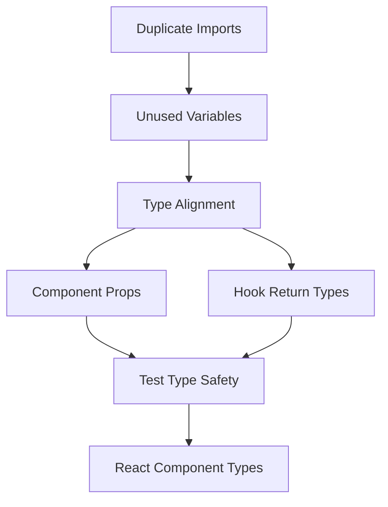

# Design Document

## Overview

This design outlines a systematic approach to fix all 97 TypeScript errors in the blog platform project. The errors fall into seven main categories that need to be addressed in a specific order to avoid cascading issues. The solution involves cleaning up imports, aligning type definitions, fixing component props, and ensuring proper type safety throughout the codebase.

## Architecture

### Error Categories and Dependencies



The fix order is critical because:
1. Duplicate imports must be resolved first to avoid compilation conflicts
2. Unused variables should be cleaned up before type alignment to see actual usage
3. Type alignment between GraphQL and custom types is foundational for other fixes
4. Component and hook fixes depend on proper type definitions
5. Test fixes require all other types to be stable
6. React component type fixes are the final layer

## Components and Interfaces

### 1. Import Cleanup System

**Purpose**: Resolve duplicate imports and remove unused declarations

**Key Files**:
- All test files (`src/__tests__/*.test.tsx`)
- Component files with unused imports
- Hook files with unused type imports

**Strategy**:
- Consolidate duplicate vitest imports into single import statements
- Remove unused React imports where JSX is not used
- Clean up unused icon imports and component imports
- Remove unused type imports

### 2. Type Alignment System

**Purpose**: Ensure GraphQL generated types align with custom type definitions

**Key Components**:
- `BlogPost` type compatibility
- `BlogPostComment` type structure
- `AccessLevel` enum handling
- API response type matching

**Critical Alignments**:
```typescript
// Current Issue: AccessLevel as string vs enum
accessLevel: string // Generated
accessLevel: AccessLevel // Expected

// Current Issue: Missing required fields in mock objects
// Generated BlogPost requires all fields, mocks are incomplete

// Current Issue: Hook return types don't match GraphQL responses
// GraphQL returns optional data, hooks expect guaranteed data
```

### 3. Component Prop Validation System

**Purpose**: Ensure all component props match their expected interfaces

**Key Areas**:
- ArticleCard BlogPost prop requirements
- Tag component size prop compatibility
- Select component placeholder prop types
- Modal mock function types

### 4. Hook Type Safety System

**Purpose**: Align hook return types with actual GraphQL responses

**Critical Hooks**:
- `useComment` - Handle optional GraphQL responses
- `useBlog` - Ensure proper return type matching
- Comment action hooks - Handle undefined responses appropriately

## Data Models

### BlogPost Type Reconciliation

```typescript
// Current Generated Type (partial)
export type BlogPost = {
  __typename?: 'BlogPost';
  accessLevel: AccessLevel; // Enum, not string
  author: User;
  categories: Array<string>;
  content: string;
  // ... all required fields
}

// Test Mock Requirements
const mockPost: BlogPost = {
  // Must include ALL required fields
  // accessLevel must be AccessLevel enum value
  // All nested objects must be complete
}
```

### Comment Type Structure

```typescript
// GraphQL Response Structure
type CommentResponse = {
  comment?: BlogPostComment; // Optional
  comments?: {
    comments: BlogPostComment[];
    total: number;
  };
}

// Hook Return Type Adjustment
interface UseCommentReturn {
  comment: BlogPostComment | null; // Handle undefined
  loading: boolean;
  error?: Error;
}
```

## Error Handling

### Type Safety Strategy

1. **Strict Type Checking**: Ensure all types are properly defined and used
2. **Null Safety**: Handle optional GraphQL responses appropriately
3. **Enum Validation**: Use proper enum values instead of strings
4. **Mock Completeness**: Ensure test mocks include all required properties

### Validation Approach

1. **Compile-time Validation**: Fix all TypeScript compiler errors
2. **Runtime Safety**: Ensure type assertions are safe and accurate
3. **Test Compatibility**: Ensure test mocks match production types

## Testing Strategy

### Test File Fixes

1. **Import Consolidation**: Single import statement per testing library
2. **Mock Completeness**: All mock objects must satisfy interface requirements
3. **Type Assertions**: Proper typing for mock functions and responses
4. **Component Testing**: Ensure test components receive properly typed props

### Mock Data Strategy

```typescript
// Complete Mock Objects
const createMockBlogPost = (): BlogPost => ({
  id: 'test-id',
  title: 'Test Title',
  slug: 'test-slug',
  content: 'Test content',
  excerpt: 'Test excerpt',
  tags: ['tag1', 'tag2'],
  categories: ['category1'],
  accessLevel: AccessLevel.PUBLIC, // Proper enum value
  status: PostStatus.PUBLISHED,
  author: createMockUser(),
  stats: createMockStats(),
  // ... all required fields
});
```

### Component Testing Approach

1. **Prop Validation**: Ensure all component props are properly typed
2. **Mock Functions**: Use proper vi.fn() typing for mock functions
3. **Render Testing**: Ensure rendered components handle all prop types
4. **Event Testing**: Properly type event handlers and callbacks

## Implementation Phases

### Phase 1: Foundation Cleanup
- Fix duplicate imports in all test files
- Remove unused variables and imports
- Clean up React imports where not needed

### Phase 2: Type System Alignment
- Align BlogPost types between generated and custom definitions
- Fix AccessLevel enum usage
- Ensure GraphQL response types match hook expectations

### Phase 3: Component Integration
- Fix ArticleCard prop type issues
- Resolve Tag component prop compatibility
- Fix Select component prop types
- Address Modal mock typing issues

### Phase 4: Hook Type Safety
- Fix useComment hook return types
- Handle optional GraphQL responses
- Ensure proper error handling types
- Fix comment action return types

### Phase 5: Test Stabilization
- Complete all test mock objects
- Fix mock function typing
- Ensure test data matches production interfaces
- Validate component test prop passing

### Phase 6: React Type Completion
- Fix ReactNode type issues in SearchPage
- Ensure proper conditional rendering types
- Validate component prop interfaces
- Complete type safety validation
