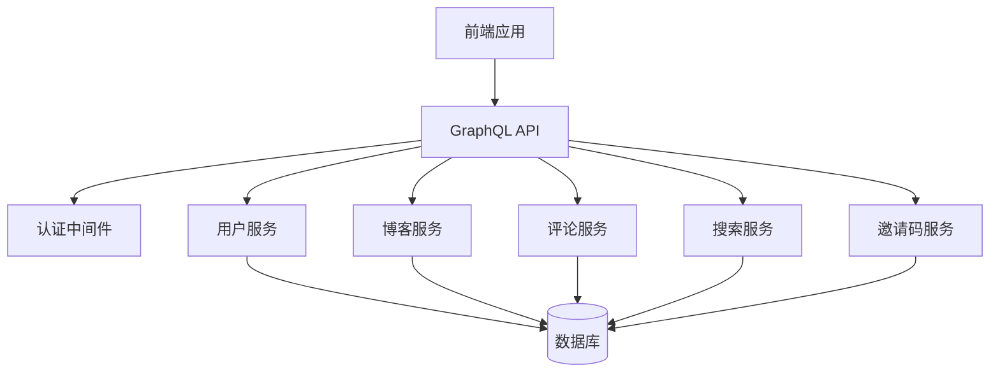
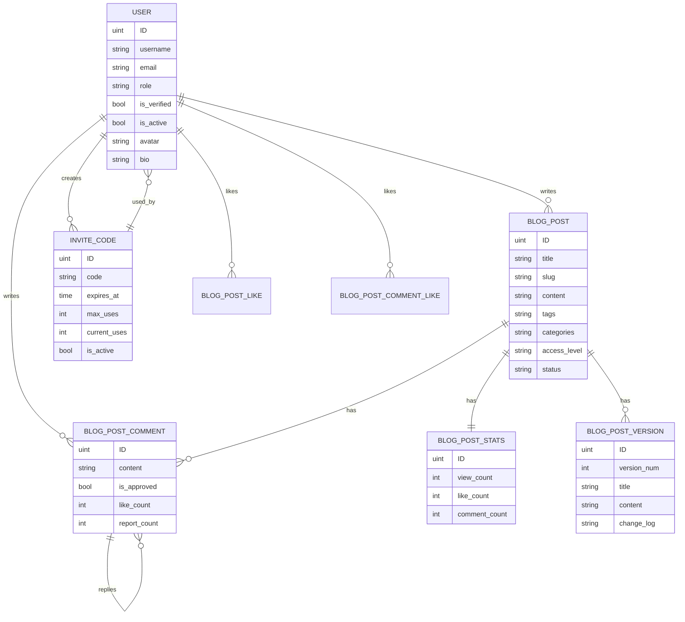

# 后端能力分析报告

## 1. 概述

本报告旨在全面分析当前后端系统提供的全部功能和服务能力。该系统是一个基于Go语言开发的全栈博客平台，采用GraphQL API接口，提供了用户管理、博客文章管理、评论系统、搜索功能、邀请码机制等核心功能模块。

## 2. 系统架构

## 3. 核心功能模块

### 3.1 认证与授权系统

#### 用户认证
- 用户注册（支持邀请码机制）
- 用户登录（支持邮箱/用户名登录）
- JWT Token认证机制
- 邮箱验证码登录
- 密码重置功能
- 用户会话管理

#### 权限控制
- 用户角色管理（普通用户/管理员）
- 基于角色的访问控制（RBAC）
- 文章访问权限控制（公开/私有/受限）
- 管理员专用功能

### 3.2 用户管理系统

#### 用户基本功能
- 用户信息查看与更新
- 用户个人资料管理
- 密码修改
- 用户状态管理（激活/禁用）

#### 管理员功能
- 用户创建、更新、删除
- 用户角色分配
- 用户权限管理
- 用户状态控制

### 3.3 博客文章管理系统

#### 文章创作与管理
- 文章创建、编辑、删除
- 文章状态管理（草稿/发布/归档）
- 文章版本历史记录
- 文章标签和分类管理
- 文章封面图片管理
- 文章访问权限设置

#### 文章互动功能
- 文章点赞/取消点赞
- 文章浏览量统计
- 文章评论数统计

#### 文章查询功能
- 文章列表查询（支持分页）
- 文章详情查询（支持ID或Slug）
- 文章搜索（按作者、状态、标签、分类等条件）
- 热门文章查询
- 最新文章查询

### 3.4 评论系统

#### 评论基本功能
- 评论创建（支持回复功能）
- 评论查看（支持分页）
- 评论更新
- 评论删除

#### 评论互动功能
- 评论点赞/取消点赞
- 评论举报机制
- 评论审核机制

### 3.5 搜索系统

#### 基础搜索
- 文章内容搜索
- 搜索结果分页
- 搜索性能统计

#### 高级搜索
- 多字段搜索（标题、内容、标签、分类）
- 搜索结果相关性排序
- 搜索缓存机制
- 搜索建议功能
- 热门搜索词统计

#### 搜索聚合
- 标签聚合统计
- 分类聚合统计
- 作者聚合统计

### 3.6 邀请码系统

#### 邀请码管理
- 邀请码生成（支持自定义过期时间和使用次数）
- 邀请码状态管理
- 邀请码使用统计
- 邀请码停用

#### 邀请码使用
- 用户注册时验证邀请码
- 邀请码使用次数跟踪
- 邀请码有效期控制

### 3.7 系统管理功能

#### 服务器监控
- 服务器状态信息查看
- 用户统计信息
- 文章统计信息
- 实时性能监控

#### 系统维护
- 缓存清理
- 搜索索引重建

## 4. 数据模型设计

### 4.1 核心数据实体

## 5. API接口能力

### 5.1 GraphQL查询能力

#### 用户相关查询
- `me`: 获取当前登录用户信息
- `user(id: ID!)`: 获取指定用户信息
- `users`: 用户列表查询（支持分页和筛选）

#### 文章相关查询
- `post(id: ID, slug: String)`: 获取指定文章
- `posts`: 文章列表查询（支持分页、筛选和排序）
- `postVersions(postId: ID!)`: 文章版本历史查询
- `getPopularPosts`: 热门文章查询
- `getRecentPosts`: 最新文章查询
- `getTrendingTags`: 热门标签查询

#### 搜索相关查询
- `searchPosts`: 基础文章搜索
- `enhancedSearch`: 增强搜索（支持聚合信息）
- `getSearchSuggestions`: 搜索建议
- `getTrendingSearches`: 热门搜索词
- `getSearchStats`: 搜索统计信息

#### 评论相关查询
- `comments(blogPostId: ID!)`: 文章评论列表
- `comment(id: ID!)`: 单个评论详情

#### 邀请码相关查询
- `inviteCodes`: 邀请码列表查询

#### 系统管理查询
- `serverDashboard`: 服务器仪表盘信息

### 5.2 GraphQL变更能力

#### 认证相关变更
- `register`: 用户注册
- `login`: 用户登录
- `emailLogin`: 邮箱登录验证码发送
- `verifyEmailAndLogin`: 验证邮箱并登录
- `logout`: 用户登出
- `refreshToken`: 刷新访问令牌
- `sendVerificationCode`: 发送验证码
- `verifyEmail`: 验证邮箱
- `requestPasswordReset`: 请求密码重置
- `confirmPasswordReset`: 确认密码重置

#### 用户相关变更
- `updateProfile`: 更新用户个人资料
- `changePassword`: 修改密码

#### 文章相关变更
- `createPost`: 创建文章
- `updatePost`: 更新文章
- `deletePost`: 删除文章
- `publishPost`: 发布文章
- `archivePost`: 归档文章
- `likePost`: 点赞文章
- `unlikePost`: 取消点赞文章
- `uploadImage`: 上传图片

#### 管理员相关变更
- `adminCreateUser`: 管理员创建用户
- `adminUpdateUser`: 管理员更新用户
- `adminDeleteUser`: 管理员删除用户
- `clearCache`: 清理缓存
- `rebuildSearchIndex`: 重建搜索索引

#### 评论相关变更
- `createComment`: 创建评论
- `updateComment`: 更新评论
- `deleteComment`: 删除评论
- `likeComment`: 点赞评论
- `unlikeComment`: 取消点赞评论
- `reportComment`: 举报评论

#### 邀请码相关变更
- `createInviteCode`: 创建邀请码
- `deactivateInviteCode`: 停用邀请码

## 6. 安全机制

### 6.1 认证安全
- JWT Token认证
- 密码加密存储（bcrypt）
- 登录尝试次数限制
- 账户锁定机制

### 6.2 数据安全
- SQL注入防护
- XSS防护
- 数据访问权限控制
- 敏感信息保护

### 6.3 通信安全
- HTTPS支持
- 敏感数据传输加密

## 7. 性能优化

### 7.1 数据库优化
- 索引优化
- 查询优化
- 连接池管理

### 7.2 缓存机制
- 搜索结果缓存
- 用户会话缓存
- 文章统计信息缓存

### 7.3 搜索优化
- 全文搜索
- 相关性排序
- 搜索建议

## 8. 扩展性设计

### 8.1 模块化架构
- 服务层分离
- 功能模块独立
- 易于扩展和维护

### 8.2 中间件机制
- 认证中间件
- 日志中间件
- 限流中间件

### 8.3 插件化设计
- 可插拔的功能模块
- 灵活的配置机制
