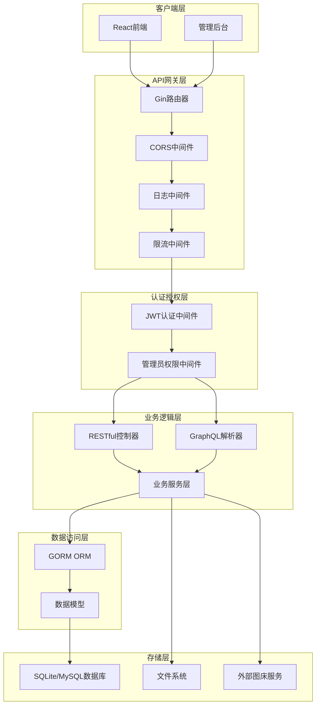
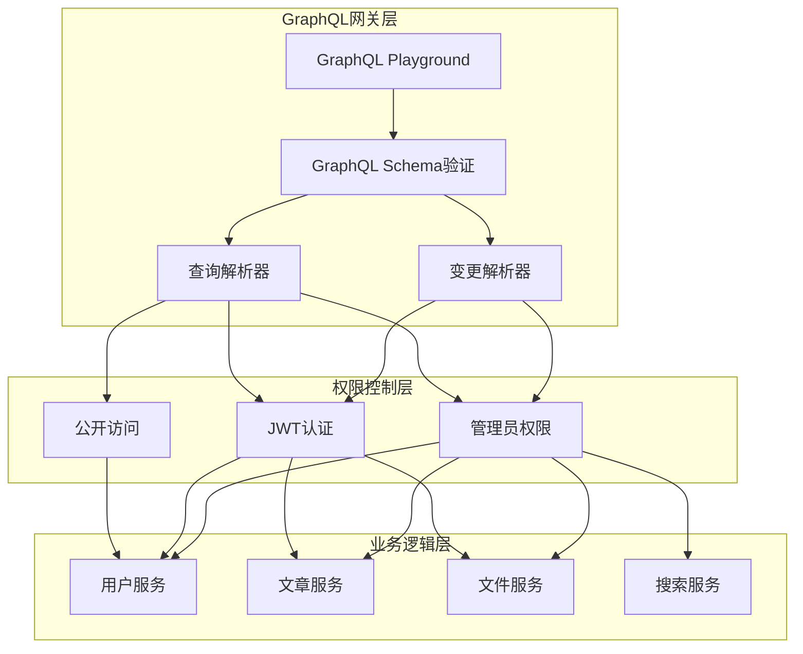
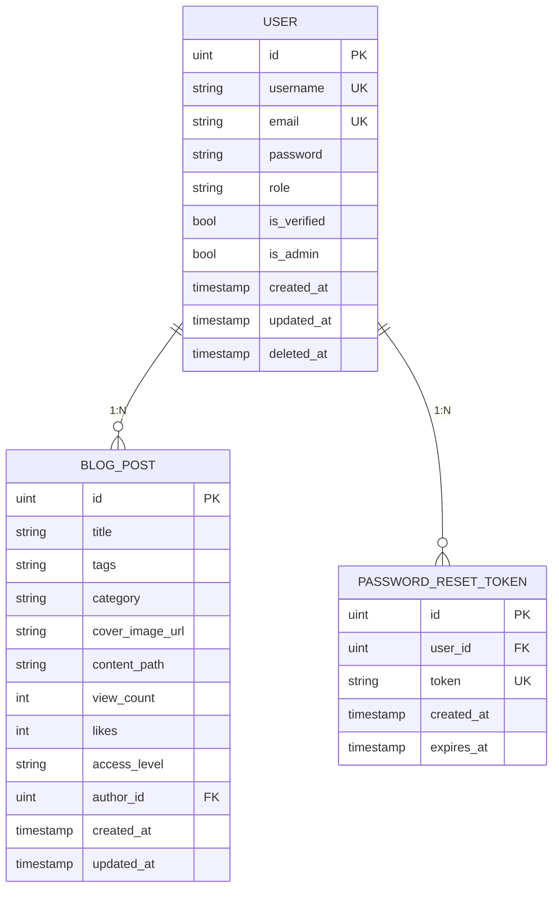
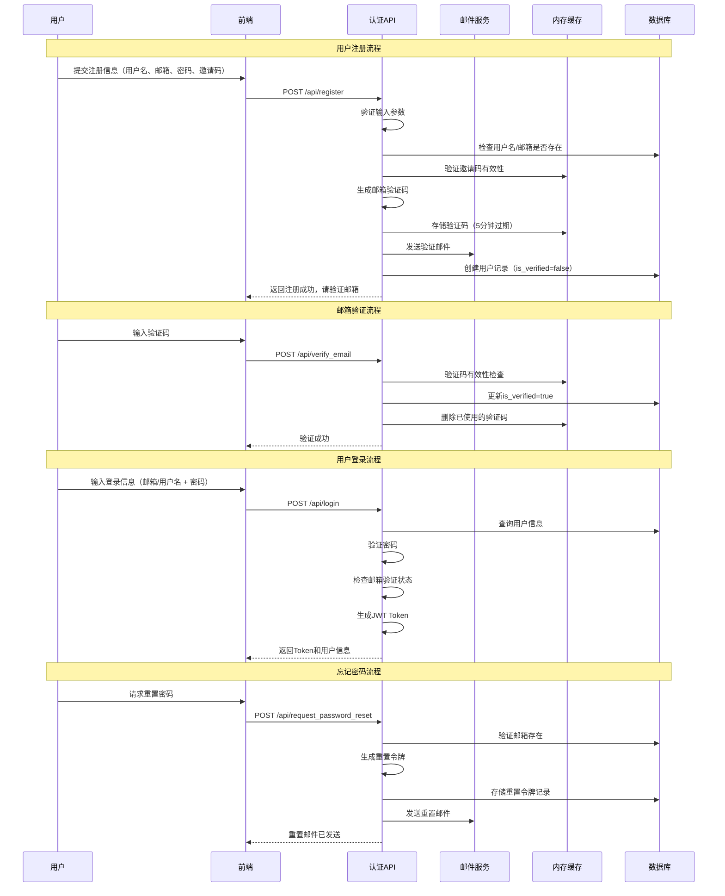
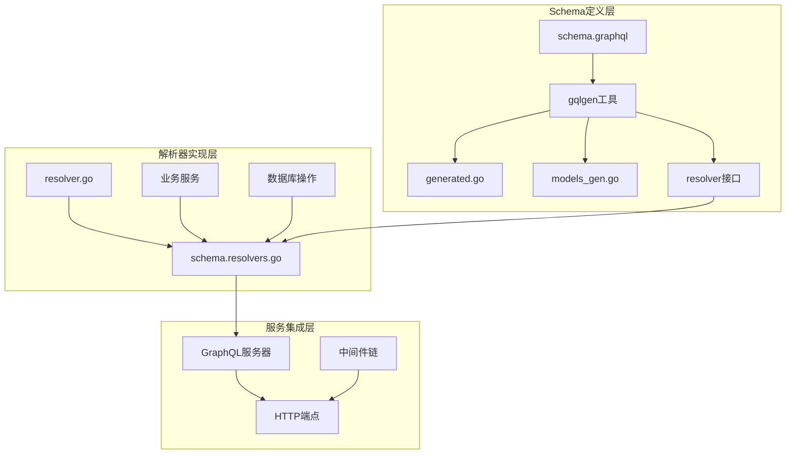
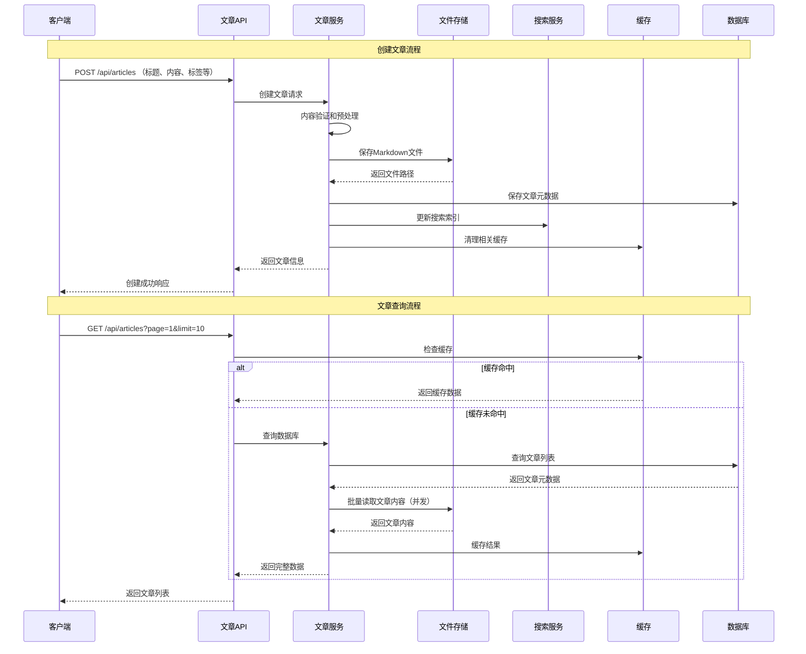
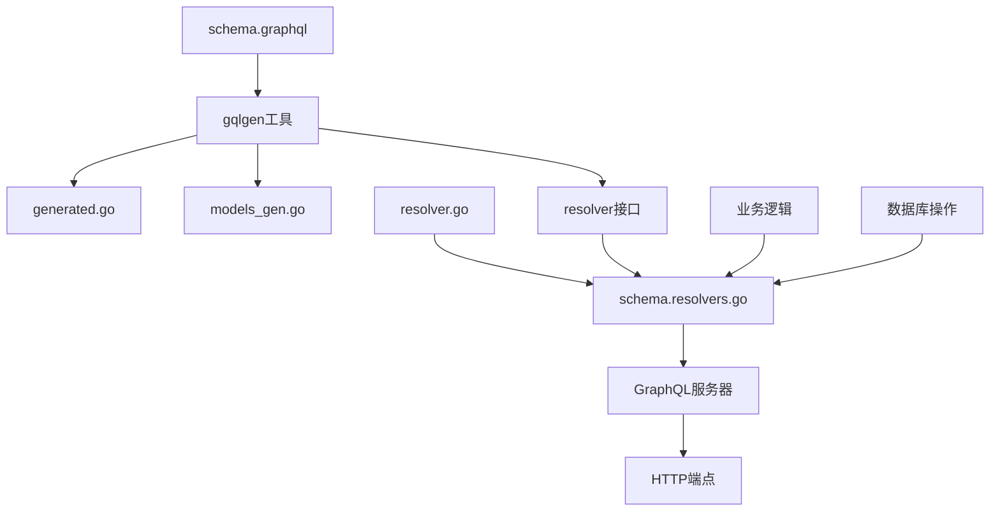
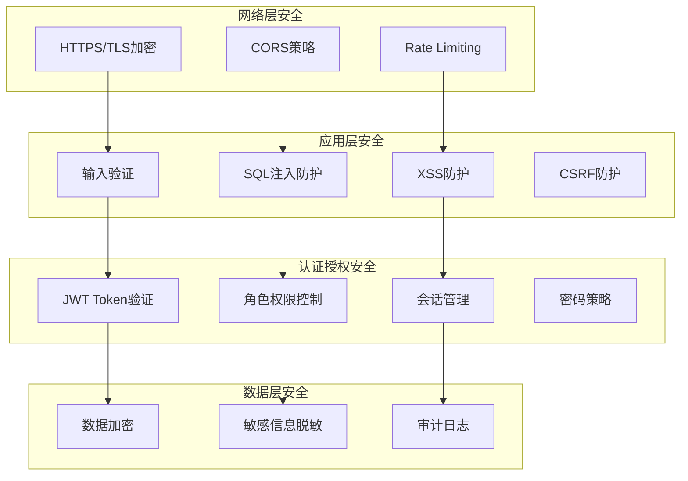
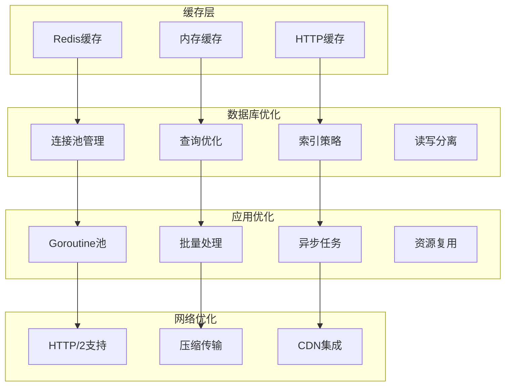

# 博客系统后端架构设计

## 概述

本设计文档基于现有的Go + Gin + GORM + GraphQL技术栈，为博客系统后端提供完善的架构设计。系统采用前后端分离架构，支持RESTful API和GraphQL双接口模式，具备用户认证、内容管理、权限控制等核心功能。

### 核心价值
- **灵活的内容管理**：支持Markdown格式的博客文章创建、编辑和管理
- **安全的权限体系**：基于JWT的认证机制，支持用户和管理员角色
- **双接口支持**：RESTful API用于传统操作，GraphQL提供更灵活的数据查询
- **可扩展的架构**：分层设计，便于功能扩展和维护

## 技术栈

### 核心框架
- **Go 1.24+**：主要开发语言
- **Gin**：HTTP Web框架，提供路由和中间件支持
- **GORM**：ORM框架，处理数据库操作
- **gqlgen**：GraphQL代码生成器和服务器

### 数据库与存储
- **SQLite**：默认数据库（开发环境）
- **支持MySQL/PostgreSQL**：生产环境推荐

### 安全与认证
- **JWT**：用户身份认证
- **bcrypt**：密码加密
- **CORS**：跨域资源共享配置

## 架构设计

### 整体架构图



### 分层架构设计

#### 1. 表现层 (Presentation Layer)
- **RESTful API**：传统HTTP接口，适用于标准CRUD操作
- **GraphQL API**：灵活查询接口，支持复杂数据获取需求
- **路由分组**：公开路由、认证路由、管理员路由

#### 2. 业务逻辑层 (Business Logic Layer)
- **控制器 (Controllers)**：处理HTTP请求，参数验证，响应格式化
- **GraphQL解析器 (Resolvers)**：处理GraphQL查询和变更操作
- **服务层 (Services)**：封装业务逻辑，可复用的业务操作

#### 3. 数据访问层 (Data Access Layer)
- **GORM模型**：数据库表结构定义和关系映射
- **数据库操作**：增删改查，事务处理

#### 4. 基础设施层 (Infrastructure Layer)
- **中间件**：认证、授权、日志、限流等横切关注点
- **外部服务**：邮件服务、图床服务、文件存储

## API接口设计（全面GraphQL化）

### GraphQL优先架构

基于项目使用github.com/99designs/gqlgen框架的Schema First设计模式，完全弃用RESTful API，采用纯GraphQL接口架构。



### GraphQL端点配置

| 端点 | 访问权限 | 功能 | 限流策略 |
|------|----------|------|----------|
| `/graphql` | 公开 | 基础查询（注册、登录等） | 标准限流 |
| `/graphql/auth` | JWT认证 | 用户相关操作 | 用户限流 |
| `/graphql/admin` | JWT + Admin | 管理员操作 | **无限流** |
| `/graphql/playground` | 开发环境 | GraphQL调试界面 | 无限流 |

### 核心Schema设计（完整GraphQL化）

```graphql
# --------------------
# SCALARS & ENUMS
# --------------------

scalar Time
scalar Upload

enum UserRole {
  USER
  ADMIN
}

enum AccessLevel {
  PUBLIC
  PRIVATE
  RESTRICTED
}

enum PostStatus {
  DRAFT
  PUBLISHED
  ARCHIVED
}

enum VerificationType {
  REGISTER
  LOGIN
  RESET_PASSWORD
}

# --------------------
# CORE TYPES
# --------------------

type User {
  id: ID!
  username: String!
  email: String!
  role: UserRole!
  isVerified: Boolean!
  isActive: Boolean!
  avatar: String
  bio: String
  lastLoginAt: Time
  createdAt: Time!
  updatedAt: Time!
  
  # 关联数据
  posts(limit: Int = 10, offset: Int = 0): [BlogPost!]!
  postsCount: Int!
}

type BlogPost {
  id: ID!
  title: String!
  slug: String!
  excerpt: String
  content: String!
  tags: [String!]!
  categories: [String!]!
  coverImageUrl: String
  viewCount: Int!
  likeCount: Int!
  commentCount: Int!
  accessLevel: AccessLevel!
  status: PostStatus!
  publishedAt: Time
  lastEditedAt: Time
  createdAt: Time!
  updatedAt: Time!
  
  # 关联数据
  author: User!
  versions: [BlogPostVersion!]!
  stats: BlogPostStats!
}

type BlogPostVersion {
  id: ID!
  versionNum: Int!
  title: String!
  content: String!
  changeLog: String
  createdAt: Time!
  createdBy: User!
}

type BlogPostStats {
  id: ID!
  viewCount: Int!
  likeCount: Int!
  shareCount: Int!
  commentCount: Int!
  lastViewedAt: Time
  updatedAt: Time!
}

type InviteCode {
  id: ID!
  code: String!
  createdBy: User!
  usedBy: User
  usedAt: Time
  expiresAt: Time!
  maxUses: Int!
  currentUses: Int!
  isActive: Boolean!
  createdAt: Time!
}

type AuthPayload {
  token: String!
  refreshToken: String!
  user: User!
  expiresAt: Time!
}

type GeneralResponse {
  success: Boolean!
  message: String
  code: String
}

# 服务器统计信息（管理员专用）
type ServerDashboard {
  serverTime: Time!
  hostname: String!
  goVersion: String!
  cpuCount: Int!
  goroutines: Int!
  memory: ServerMemoryStats!
  uptime: String!
  userCount: Int!
  postCount: Int!
  todayRegistrations: Int!
  todayPosts: Int!
}

type ServerMemoryStats {
  alloc: String!
  totalAlloc: String!
  sys: String!
  heapAlloc: String!
  heapSys: String!
}

type SearchResult {
  posts: [BlogPost!]!
  total: Int!
  took: String! # 搜索耗时
}

# --------------------
# INPUT TYPES
# --------------------

input RegisterInput {
  username: String!
  email: String!
  password: String!
  inviteCode: String
}

input LoginInput {
  identifier: String! # 邮箱或用户名
  password: String!
  remember: Boolean = false
}

input EmailLoginInput {
  email: String!
}

input VerifyEmailInput {
  email: String!
  code: String!
  type: VerificationType!
}

input RequestPasswordResetInput {
  email: String!
}

input ConfirmPasswordResetInput {
  token: String!
  newPassword: String!
}

input CreatePostInput {
  title: String!
  content: String!
  excerpt: String
  tags: [String!]
  categories: [String!]
  coverImageUrl: String
  accessLevel: AccessLevel = PUBLIC
  status: PostStatus = DRAFT
  publishAt: Time
}

input UpdatePostInput {
  title: String
  content: String
  excerpt: String
  tags: [String!]
  categories: [String!]
  coverImageUrl: String
  accessLevel: AccessLevel
  status: PostStatus
  changeLog: String
}

input PostFilterInput {
  authorId: ID
  status: PostStatus
  accessLevel: AccessLevel
  tags: [String!]
  categories: [String!]
  search: String
  dateFrom: Time
  dateTo: Time
}

input PostSortInput {
  field: String = "createdAt" # createdAt, updatedAt, publishedAt, viewCount, likeCount
  order: String = "DESC" # ASC, DESC
}

input CreateInviteCodeInput {
  expiresAt: Time!
  maxUses: Int = 1
}

input AdminCreateUserInput {
  username: String!
  email: String!
  password: String!
  role: UserRole = USER
  isVerified: Boolean = false
}

# --------------------
# QUERY TYPE
# --------------------

type Query {
  # 用户查询
  me: User # 获取当前登录用户（需要认证）
  user(id: ID!): User # 获取指定用户（需要认证）
  users(
    limit: Int = 10
    offset: Int = 0
    search: String
    role: UserRole
    isVerified: Boolean
  ): [User!]! # 用户列表（管理员）
  
  # 文章查询
  post(id: ID, slug: String): BlogPost # 获取指定文章
  posts(
    limit: Int = 10
    offset: Int = 0
    filter: PostFilterInput
    sort: PostSortInput
  ): [BlogPost!]! # 文章列表
  
  postVersions(postId: ID!): [BlogPostVersion!]! # 文章版本历史
  
  # 搜索
  searchPosts(
    query: String!
    limit: Int = 10
    offset: Int = 0
  ): SearchResult! # 搜索文章
  
  # 邀请码管理（管理员）
  inviteCodes(
    limit: Int = 10
    offset: Int = 0
    isActive: Boolean
  ): [InviteCode!]!
  
  # 系统管理（管理员）
  serverDashboard: ServerDashboard!
  
  # 统计信息
  getPopularPosts(limit: Int = 10): [BlogPost!]!
  getRecentPosts(limit: Int = 10): [BlogPost!]!
  getTrendingTags(limit: Int = 20): [String!]!
}

# --------------------
# MUTATION TYPE
# --------------------

type Mutation {
  # 认证相关
  register(input: RegisterInput!): AuthPayload!
  login(input: LoginInput!): AuthPayload!
  emailLogin(input: EmailLoginInput!): GeneralResponse! # 发送邮箱登录验证码
  verifyEmailAndLogin(input: VerifyEmailInput!): AuthPayload! # 验证邮箱验证码并登录
  logout: GeneralResponse!
  refreshToken: AuthPayload!
  
  # 邮箱验证
  sendVerificationCode(email: String!, type: VerificationType!): GeneralResponse!
  verifyEmail(input: VerifyEmailInput!): GeneralResponse!
  
  # 密码重置
  requestPasswordReset(input: RequestPasswordResetInput!): GeneralResponse!
  confirmPasswordReset(input: ConfirmPasswordResetInput!): GeneralResponse!
  
  # 用户管理
  updateProfile(
    username: String
    bio: String
    avatar: String
  ): User!
  changePassword(
    currentPassword: String!
    newPassword: String!
  ): GeneralResponse!
  
  # 文章管理
  createPost(input: CreatePostInput!): BlogPost!
  updatePost(id: ID!, input: UpdatePostInput!): BlogPost!
  deletePost(id: ID!): GeneralResponse!
  publishPost(id: ID!): BlogPost!
  archivePost(id: ID!): BlogPost!
  likePost(id: ID!): BlogPost!
  unlikePost(id: ID!): BlogPost!
  
  # 文件上传
  uploadImage(file: Upload!): ImageUploadResponse!
  
  # 管理员操作
  adminCreateUser(input: AdminCreateUserInput!): User!
  adminUpdateUser(
    id: ID!
    username: String
    email: String
    role: UserRole
    isVerified: Boolean
    isActive: Boolean
  ): User!
  adminDeleteUser(id: ID!): GeneralResponse!
  
  # 邀请码管理（管理员）
  createInviteCode(input: CreateInviteCodeInput!): InviteCode!
  deactivateInviteCode(id: ID!): GeneralResponse!
  
  # 系统管理（管理员）
  clearCache: GeneralResponse!
  rebuildSearchIndex: GeneralResponse!
}

type ImageUploadResponse {
  imageUrl: String!
  deleteUrl: String
  filename: String!
  size: Int!
}
```

## 数据模型设计

### 核心实体关系图



### 模型详细设计

#### User模型
```go
type User struct {
    ID         uint           `gorm:"primary_key" json:"id"`
    Username   string         `gorm:"unique;not null" json:"username"`
    Password   string         `gorm:"not null" json:"-"`
    Email      string         `gorm:"unique;not null" json:"email"`
    Role       string         `gorm:"not null;default:'user'" json:"role"`
    IsVerified bool           `gorm:"default:false" json:"is_verified"`
    IsAdmin    bool           `gorm:"default:false" json:"is_admin"`
    CreatedAt  time.Time      `json:"created_at"`
    UpdatedAt  time.Time      `json:"updated_at"`
    DeletedAt  gorm.DeletedAt `gorm:"index" json:"-"`
}
```

#### BlogPost模型
```go
type BlogPost struct {
    ID            uint      `gorm:"primaryKey" json:"id"`
    Title         string    `gorm:"not null;index" json:"title"`
    Tags          string    `gorm:"type:text" json:"tags"`
    Category      string    `gorm:"type:text" json:"category"`
    CoverImageURL string    `gorm:"type:text" json:"cover_image_url"`
    ContentPath   string    `gorm:"not null" json:"content_path"`
    ViewCount     int       `gorm:"default:0" json:"view_count"`
    Likes         int       `gorm:"default:0" json:"likes"`
    AccessLevel   string    `gorm:"type:varchar(10);not null" json:"access_level"`
    AuthorID      uint      `gorm:"not null" json:"author_id"`
    Author        User      `gorm:"foreignKey:AuthorID" json:"author"`
    CreatedAt     time.Time `gorm:"autoCreateTime" json:"created_at"`
    UpdatedAt     time.Time `gorm:"autoUpdateTime" json:"updated_at"`
}
```

## 业务逻辑架构

## 用户认证系统增强设计

### 完善的认证流程架构



### 1. 增强的用户模型设计

```go
// 用户模型增强
type User struct {
    ID              uint           `gorm:"primary_key" json:"id"`
    Username        string         `gorm:"unique;not null;size:50" json:"username"`
    Email           string         `gorm:"unique;not null;size:100" json:"email"`
    Password        string         `gorm:"not null" json:"-"`
    Role            string         `gorm:"not null;default:'user';size:20" json:"role"`
    IsVerified      bool           `gorm:"default:false" json:"is_verified"`
    IsActive        bool           `gorm:"default:true" json:"is_active"`
    LastLoginAt     *time.Time     `json:"last_login_at,omitempty"`
    LoginAttempts   int            `gorm:"default:0" json:"-"`
    LockedUntil     *time.Time     `json:"-"`
    InviteCode      string         `gorm:"size:32" json:"-"` // 用于邀请注册
    InvitedBy       *uint          `json:"invited_by,omitempty"`
    Avatar          string         `gorm:"size:255" json:"avatar"`
    Bio             string         `gorm:"type:text" json:"bio"`
    CreatedAt       time.Time      `json:"created_at"`
    UpdatedAt       time.Time      `json:"updated_at"`
    DeletedAt       gorm.DeletedAt `gorm:"index" json:"-"`
}

// 邀请码模型
type InviteCode struct {
    ID         uint      `gorm:"primaryKey" json:"id"`
    Code       string    `gorm:"unique;not null;size:32" json:"code"`
    CreatedBy  uint      `gorm:"not null" json:"created_by"`
    UsedBy     *uint     `json:"used_by,omitempty"`
    UsedAt     *time.Time `json:"used_at,omitempty"`
    ExpiresAt  time.Time `gorm:"not null" json:"expires_at"`
    MaxUses    int       `gorm:"default:1" json:"max_uses"`
    CurrentUses int      `gorm:"default:0" json:"current_uses"`
    IsActive   bool      `gorm:"default:true" json:"is_active"`
    CreatedAt  time.Time `json:"created_at"`
    UpdatedAt  time.Time `json:"updated_at"`
}

// 邮箱验证码模型
type EmailVerification struct {
    ID        uint      `gorm:"primaryKey" json:"id"`
    Email     string    `gorm:"not null;size:100" json:"email"`
    Code      string    `gorm:"not null;size:6" json:"code"`
    Type      string    `gorm:"not null;size:20" json:"type"` // register, login, reset_password
    ExpiresAt time.Time `gorm:"not null" json:"expires_at"`
    Used      bool      `gorm:"default:false" json:"used"`
    IPAddress string    `gorm:"size:45" json:"ip_address"`
    UserAgent string    `gorm:"type:text" json:"user_agent"`
    CreatedAt time.Time `json:"created_at"`
}

// 密码重置令牌模型增强
type PasswordResetToken struct {
    ID        uint      `gorm:"primaryKey" json:"id"`
    UserID    uint      `gorm:"not null" json:"user_id"`
    Token     string    `gorm:"unique;not null;size:64" json:"token"`
    ExpiresAt time.Time `gorm:"not null" json:"expires_at"`
    Used      bool      `gorm:"default:false" json:"used"`
    IPAddress string    `gorm:"size:45" json:"ip_address"`
    UserAgent string    `gorm:"type:text" json:"user_agent"`
    CreatedAt time.Time `json:"created_at"`
    User      User      `gorm:"foreignKey:UserID" json:"user"`
}
```

### 2. 安全的认证服务层

```go
// 认证服务（利用Go的类型系统和接口）
type AuthService struct {
    db           *gorm.DB
    logger       *zap.SugaredLogger
    cacheManager *MemoryCacheManager
    emailService EmailServiceInterface
}

// 邮件服务接口（Go的接口特性）
type EmailServiceInterface interface {
    SendVerificationEmail(to, code string) error
    SendPasswordResetEmail(to, token string) error
    SendWelcomeEmail(to, username string) error
}

// 认证请求结构体
type RegisterRequest struct {
    Username   string `json:"username" binding:"required,min=3,max=50"`
    Email      string `json:"email" binding:"required,email"`
    Password   string `json:"password" binding:"required,min=8"`
    InviteCode string `json:"invite_code,omitempty"`
}

type LoginRequest struct {
    Identifier string `json:"identifier" binding:"required"` // 邮箱或用户名
    Password   string `json:"password" binding:"required"`
    Remember   bool   `json:"remember"` // 记住登录
}

type EmailLoginRequest struct {
    Email string `json:"email" binding:"required,email"`
}

type VerifyEmailCodeRequest struct {
    Email string `json:"email" binding:"required,email"`
    Code  string `json:"code" binding:"required,len=6"`
}

// 利用Go的error处理特性
type AuthError struct {
    Code    string `json:"code"`
    Message string `json:"message"`
    Type    string `json:"type"`
}

func (e AuthError) Error() string {
    return e.Message
}

// 认证服务实现
func NewAuthService(db *gorm.DB, logger *zap.SugaredLogger, emailService EmailServiceInterface) *AuthService {
    return &AuthService{
        db:           db,
        logger:       logger,
        cacheManager: NewMemoryCacheManager(),
        emailService: emailService,
    }
}

// 用户注册（充分利用Go的错误处理）
func (as *AuthService) RegisterUser(ctx context.Context, req RegisterRequest) (*User, error) {
    // 1. 验证邀请码
    if req.InviteCode != "" {
        if err := as.validateInviteCode(req.InviteCode); err != nil {
            return nil, &AuthError{
                Code:    "INVALID_INVITE_CODE",
                Message: "邀请码无效或已过期",
                Type:    "validation",
            }
        }
    }
    
    // 2. 检查用户是否存在
    var existingUser User
    if err := as.db.Where("username = ? OR email = ?", req.Username, req.Email).First(&existingUser).Error; err == nil {
        return nil, &AuthError{
            Code:    "USER_EXISTS",
            Message: "用户名或邮箱已存在",
            Type:    "validation",
        }
    }
    
    // 3. 验证密码强度
    if err := as.validatePasswordStrength(req.Password); err != nil {
        return nil, err
    }
    
    // 4. 创建用户
    user := User{
        Username: req.Username,
        Email:    req.Email,
        Role:     "user",
    }
    
    if err := user.SetPassword(req.Password); err != nil {
        return nil, &AuthError{
            Code:    "PASSWORD_ENCRYPTION_FAILED",
            Message: "密码加密失败",
            Type:    "internal",
        }
    }
    
    // 5. 使用事务保证数据一致性（Go的defer特性）
    tx := as.db.Begin()
    defer func() {
        if r := recover(); r != nil {
            tx.Rollback()
        }
    }()
    
    if err := tx.Create(&user).Error; err != nil {
        tx.Rollback()
        return nil, &AuthError{
            Code:    "USER_CREATION_FAILED",
            Message: "用户创建失败",
            Type:    "database",
        }
    }
    
    // 6. 处理邀请码
    if req.InviteCode != "" {
        if err := as.markInviteCodeUsed(tx, req.InviteCode, user.ID); err != nil {
            tx.Rollback()
            return nil, err
        }
    }
    
    // 7. 发送验证邮件
    verificationCode, err := as.generateEmailVerificationCode(user.Email, "register")
    if err != nil {
        tx.Rollback()
        return nil, err
    }
    
    if err := tx.Commit().Error; err != nil {
        return nil, &AuthError{
            Code:    "TRANSACTION_FAILED",
            Message: "注册事务失败",
            Type:    "database",
        }
    }
    
    // 8. 异步发送邮件（Go的goroutine特性）
    go func() {
        if err := as.emailService.SendVerificationEmail(user.Email, verificationCode); err != nil {
            as.logger.Errorw("发送验证邮件失败", "email", user.Email, "error", err)
        }
    }()
    
    as.logger.Infow("用户注册成功", "user_id", user.ID, "username", user.Username)
    return &user, nil
}

// 邮箱登录验证码机制
func (as *AuthService) SendEmailLoginCode(ctx context.Context, email string) error {
    // 1. 检查用户是否存在
    var user User
    if err := as.db.Where("email = ? AND is_verified = true AND is_active = true", email).First(&user).Error; err != nil {
        return &AuthError{
            Code:    "USER_NOT_FOUND",
            Message: "用户不存在或未激活",
            Type:    "validation",
        }
    }
    
    // 2. 检查发送频率限制
    if as.isEmailCodeRateLimited(email) {
        return &AuthError{
            Code:    "RATE_LIMITED",
            Message: "验证码发送过于频繁，请稍后再试",
            Type:    "rate_limit",
        }
    }
    
    // 3. 生成验证码
    code, err := as.generateEmailVerificationCode(email, "login")
    if err != nil {
        return err
    }
    
    // 4. 异步发送邮件
    go func() {
        if err := as.emailService.SendVerificationEmail(email, code); err != nil {
            as.logger.Errorw("发送登录验证码失败", "email", email, "error", err)
        }
    }()
    
    as.logger.Infow("登录验证码已发送", "email", email)
    return nil
}

// 验证邮箱验证码并登录
func (as *AuthService) VerifyEmailCodeAndLogin(ctx context.Context, req VerifyEmailCodeRequest) (*AuthResponse, error) {
    // 1. 验证验证码
    if !as.verifyEmailCode(req.Email, req.Code, "login") {
        return nil, &AuthError{
            Code:    "INVALID_CODE",
            Message: "验证码错误或已过期",
            Type:    "validation",
        }
    }
    
    // 2. 获取用户信息
    var user User
    if err := as.db.Where("email = ?", req.Email).First(&user).Error; err != nil {
        return nil, &AuthError{
            Code:    "USER_NOT_FOUND",
            Message: "用户不存在",
            Type:    "validation",
        }
    }
    
    // 3. 生成JWT Token
    token, err := as.generateJWT(user.ID, user.Username, user.Role)
    if err != nil {
        return nil, err
    }
    
    // 4. 更新登录时间
    now := time.Now()
    user.LastLoginAt = &now
    as.db.Save(&user)
    
    return &AuthResponse{
        Token: token,
        User:  user,
    }, nil
}
```

### 3. 工具函数实现（利用Go的特性）

```go
// 验证码生成器（使用Go的crypto/rand）
func (as *AuthService) generateEmailVerificationCode(email, codeType string) (string, error) {
    // 生成6位数字验证码
    code := make([]byte, 3)
    if _, err := rand.Read(code); err != nil {
        return "", &AuthError{
            Code:    "CODE_GENERATION_FAILED",
            Message: "验证码生成失败",
            Type:    "internal",
        }
    }
    
    // 转换为6位数字
    codeStr := fmt.Sprintf("%06d", binary.BigEndian.Uint32(append(code, 0))%1000000)
    
    // 存储到缓存（15分钟过期）
    verification := EmailVerification{
        Email:     email,
        Code:      codeStr,
        Type:      codeType,
        ExpiresAt: time.Now().Add(15 * time.Minute),
    }
    
    if err := as.db.Create(&verification).Error; err != nil {
        return "", &AuthError{
            Code:    "CODE_STORAGE_FAILED",
            Message: "验证码存储失败",
            Type:    "database",
        }
    }
    
    // 同时存储到内存缓存
    cacheKey := fmt.Sprintf("email_code:%s:%s", email, codeType)
    as.cacheManager.Set(cacheKey, codeStr, 5*time.Minute)
    
    return codeStr, nil
}

// 验证邮箱验证码
func (as *AuthService) verifyEmailCode(email, code, codeType string) bool {
    // 先从缓存检查
    cacheKey := fmt.Sprintf("email_code:%s:%s", email, codeType)
    if cachedCode, found := as.cacheManager.Get(cacheKey); found {
        if cachedCode.(string) == code {
            // 从缓存中删除
            as.cacheManager.cache.Delete(cacheKey)
            
            // 标记数据库中的记录为已使用
            as.db.Model(&EmailVerification{}).Where("email = ? AND code = ? AND type = ? AND used = false", email, code, codeType).Update("used", true)
            return true
        }
    }
    
    // 从数据库检查
    var verification EmailVerification
    if err := as.db.Where("email = ? AND code = ? AND type = ? AND used = false AND expires_at > ?", 
        email, code, codeType, time.Now()).First(&verification).Error; err == nil {
        
        // 标记为已使用
        verification.Used = true
        as.db.Save(&verification)
        return true
    }
    
    return false
}

// 邀请码验证（使用Go的错误处理）
func (as *AuthService) validateInviteCode(code string) error {
    var invite InviteCode
    
    err := as.db.Where("code = ? AND is_active = true AND expires_at > ? AND current_uses < max_uses", 
        code, time.Now()).First(&invite).Error
    
    if err != nil {
        if errors.Is(err, gorm.ErrRecordNotFound) {
            return &AuthError{
                Code:    "INVITE_CODE_NOT_FOUND",
                Message: "邀请码不存在或已过期",
                Type:    "validation",
            }
        }
        return &AuthError{
            Code:    "INVITE_CODE_CHECK_FAILED",
            Message: "邀请码验证失败",
            Type:    "database",
        }
    }
    
    return nil
}

// 标记邀请码已使用
func (as *AuthService) markInviteCodeUsed(tx *gorm.DB, code string, userID uint) error {
    result := tx.Model(&InviteCode{}).Where("code = ?", code).Updates(map[string]interface{}{
        "current_uses": gorm.Expr("current_uses + ?", 1),
        "used_by":      userID,
        "used_at":      time.Now(),
    })
    
    if result.Error != nil {
        return &AuthError{
            Code:    "INVITE_CODE_UPDATE_FAILED",
            Message: "邀请码更新失败",
            Type:    "database",
        }
    }
    
    return nil
}

// 密码强度验证（使用Go的正则表达式）
func (as *AuthService) validatePasswordStrength(password string) error {
    if len(password) < 8 {
        return &AuthError{
            Code:    "PASSWORD_TOO_SHORT",
            Message: "密码长度至少8位",
            Type:    "validation",
        }
    }
    
    // 使用Go的编译时正则表达式优化
    patterns := []struct {
        regex   *regexp.Regexp
        message string
        code    string
    }{
        {regexp.MustCompile(`[A-Z]`), "密码必须包含大写字母", "PASSWORD_MISSING_UPPERCASE"},
        {regexp.MustCompile(`[a-z]`), "密码必须包含小写字母", "PASSWORD_MISSING_LOWERCASE"},
        {regexp.MustCompile(`[0-9]`), "密码必须包含数字", "PASSWORD_MISSING_DIGIT"},
        {regexp.MustCompile(`[!@#$%^&*(),.?":{}|<>]`), "密码必须包含特殊字符", "PASSWORD_MISSING_SPECIAL"},
    }
    
### GraphQL解析器实现架构

基于项目的gqlgen框架和Schema First设计模式，实现完整的GraphQL服务。



### 1. 核心解析器结构

```go
// GraphQL解析器主结构
type Resolver struct {
    DB           *gorm.DB
    Logger       *zap.SugaredLogger
    AuthService  *AuthService
    PostService  *BlogPostService
    FileService  *LocalFileStorage
    SearchService *InMemorySearchService
    CacheManager *MemoryCacheManager
    EmailService EmailServiceInterface
    
    // 环境配置
    Environment  string // development, testing, production
}

// 初始化解析器
func NewResolver(db *gorm.DB, logger *zap.SugaredLogger, env string) *Resolver {
    // 初始化服务
    cacheManager := NewMemoryCacheManager()
    fileService := NewLocalFileStorage("./storage/posts", logger)
    searchService := NewInMemorySearchService(logger)
    
    // 根据环境配置邮件服务
    var emailService EmailServiceInterface
    if env == "testing" {
        emailService = &MockEmailService{logger: logger} // 测试环境使用模拟邮件服务
    } else {
        emailService = &SMTPEmailService{logger: logger}
    }
    
    authService := NewAuthService(db, logger, emailService)
    postService := NewBlogPostService(db, logger, cacheManager, fileService, searchService)
    
    return &Resolver{
        DB:           db,
        Logger:       logger,
        AuthService:  authService,
        PostService:  postService,
        FileService:  fileService,
        SearchService: searchService,
        CacheManager: cacheManager,
        EmailService: emailService,
        Environment:  env,
    }
}
```

### 2. 认证相关解析器（测试优化）

```go
// 用户注册解析器
func (r *mutationResolver) Register(ctx context.Context, input model.RegisterInput) (*model.AuthPayload, error) {
    // 记录操作日志
    r.Logger.Infow("用户注册请求", "username", input.Username, "email", input.Email)
    
    // 调用认证服务
    user, err := r.AuthService.RegisterUser(ctx, RegisterRequest{
        Username:   input.Username,
        Email:      input.Email,
        Password:   input.Password,
        InviteCode: derefString(input.InviteCode),
    })
    
    if err != nil {
        r.Logger.Errorw("用户注册失败", "error", err)
        return nil, gqlerror.Errorf("注册失败: %v", err)
    }
    
    // 在测试环境下自动验证邮箱
    if r.Environment == "testing" {
        user.IsVerified = true
        if err := r.DB.Save(user).Error; err != nil {
            r.Logger.Errorw("测试环境自动验证失败", "error", err)
        } else {
            r.Logger.Infow("测试环境自动验证邮箱", "user_id", user.ID)
        }
    }
    
    // 生成JWT Token
    token, refreshToken, err := r.AuthService.generateTokenPair(user.ID, user.Username, user.Role)
    if err != nil {
        return nil, gqlerror.Errorf("Token生成失败: %v", err)
    }
    
    return &model.AuthPayload{
        Token:        token,
        RefreshToken: refreshToken,
        User:         convertUserToModel(user),
        ExpiresAt:    time.Now().Add(24 * time.Hour),
    }, nil
}

// 用户登录解析器
func (r *mutationResolver) Login(ctx context.Context, input model.LoginInput) (*model.AuthPayload, error) {
    r.Logger.Infow("用户登录请求", "identifier", input.Identifier)
    
    // 调用认证服务
    user, err := r.AuthService.LoginUser(ctx, LoginRequest{
        Identifier: input.Identifier,
        Password:   input.Password,
        Remember:   input.Remember,
    })
    
    if err != nil {
        r.Logger.Errorw("用户登录失败", "error", err)
        return nil, gqlerror.Errorf("登录失败: %v", err)
    }
    
    // 在测试环境下跳过邮箱验证检查
    if r.Environment != "testing" && !user.IsVerified {
        return nil, gqlerror.Errorf("请先验证邮箱")
    }
    
    // 生成Token
    tokenExpiration := 24 * time.Hour
    if input.Remember {
        tokenExpiration = 30 * 24 * time.Hour // 30天
    }
    
    token, refreshToken, err := r.AuthService.generateTokenPairWithExpiration(user.ID, user.Username, user.Role, tokenExpiration)
    if err != nil {
        return nil, gqlerror.Errorf("Token生成失败: %v", err)
    }
    
    return &model.AuthPayload{
        Token:        token,
        RefreshToken: refreshToken,
        User:         convertUserToModel(user),
        ExpiresAt:    time.Now().Add(tokenExpiration),
    }, nil
}

// 邮箱登录验证码（测试环境优化）
func (r *mutationResolver) EmailLogin(ctx context.Context, input model.EmailLoginInput) (*model.GeneralResponse, error) {
    r.Logger.Infow("邮箱登录请求", "email", input.Email)
    
    // 在测试环境下直接返回成功，不发送邮件
    if r.Environment == "testing" {
        r.Logger.Infow("测试环境跳过邮件发送", "email", input.Email)
        
        // 仍然需要检查用户是否存在
        var user User
        if err := r.DB.Where("email = ? AND is_active = true", input.Email).First(&user).Error; err != nil {
            return &model.GeneralResponse{
                Success: false,
                Message: "用户不存在或未激活",
                Code:    "USER_NOT_FOUND",
            }, nil
        }
        
        return &model.GeneralResponse{
            Success: true,
            Message: "测试环境，使用任意6位数字作为验证码",
            Code:    "TESTING_MODE",
        }, nil
    }
    
    // 生产环境发送邮件
    err := r.AuthService.SendEmailLoginCode(ctx, input.Email)
    if err != nil {
        r.Logger.Errorw("发送登录验证码失败", "error", err)
        return &model.GeneralResponse{
            Success: false,
            Message: "发送失败，请稍后再试",
            Code:    "EMAIL_SEND_FAILED",
        }, nil
    }
    
    return &model.GeneralResponse{
        Success: true,
        Message: "验证码已发送到您的邮箱",
        Code:    "EMAIL_SENT",
    }, nil
}

// 验证邮箱验证码并登录（测试环境优化）
func (r *mutationResolver) VerifyEmailAndLogin(ctx context.Context, input model.VerifyEmailInput) (*model.AuthPayload, error) {
    r.Logger.Infow("验证邮箱验证码登录", "email", input.Email, "type", input.Type)
    
    // 在测试环境下直接验证成功（任意6位数字）
    if r.Environment == "testing" {
        if len(input.Code) != 6 {
            return nil, gqlerror.Errorf("测试环境下请输入任意6位数字验证码")
        }
        
        // 直接获取用户并登录
        var user User
        if err := r.DB.Where("email = ?", input.Email).First(&user).Error; err != nil {
            return nil, gqlerror.Errorf("用户不存在")
        }
        
        // 生成Token
        token, refreshToken, err := r.AuthService.generateTokenPair(user.ID, user.Username, user.Role)
        if err != nil {
            return nil, gqlerror.Errorf("Token生成失败: %v", err)
        }
        
        r.Logger.Infow("测试环境登录成功", "user_id", user.ID)
        
        return &model.AuthPayload{
            Token:        token,
            RefreshToken: refreshToken,
            User:         convertUserToModel(&user),
            ExpiresAt:    time.Now().Add(24 * time.Hour),
        }, nil
    }
    
    // 生产环境验证
    authPayload, err := r.AuthService.VerifyEmailCodeAndLogin(ctx, VerifyEmailCodeRequest{
        Email: input.Email,
        Code:  input.Code,
    })
    
    if err != nil {
        r.Logger.Errorw("验证码验证失败", "error", err)
        return nil, gqlerror.Errorf("验证失败: %v", err)
    }
    
    return authPayload, nil
}
```

### 3. 文章管理解析器

```go
// 创建文章解析器
func (r *mutationResolver) CreatePost(ctx context.Context, input model.CreatePostInput) (*model.BlogPost, error) {
    userID := getUserIDFromContext(ctx)
    if userID == 0 {
        return nil, gqlerror.Errorf("需要登录")
    }
    
    r.Logger.Infow("创建文章请求", "user_id", userID, "title", input.Title)
    
    // 转换输入数据
    req := CreatePostRequest{
        Title:         input.Title,
        Content:       input.Content,
        Excerpt:       derefString(input.Excerpt),
        Tags:          input.Tags,
        Categories:    input.Categories,
        CoverImageURL: derefString(input.CoverImageUrl),
        AccessLevel:   string(input.AccessLevel),
        Status:        string(input.Status),
        PublishAt:     input.PublishAt,
    }
    
    // 调用文章服务
    post, err := r.PostService.CreatePost(ctx, req)
    if err != nil {
        r.Logger.Errorw("文章创建失败", "error", err)
        return nil, gqlerror.Errorf("创建文章失败: %v", err)
    }
    
    return convertPostToModel(post), nil
}

// 获取文章列表解析器
func (r *queryResolver) Posts(ctx context.Context, limit *int, offset *int, filter *model.PostFilterInput, sort *model.PostSortInput) ([]*model.BlogPost, error) {
    r.Logger.Infow("获取文章列表请求")
    
    // 设置默认值
    if limit == nil {
        defaultLimit := 10
        limit = &defaultLimit
    }
    if offset == nil {
        defaultOffset := 0
        offset = &defaultOffset
    }
    
    // 构建查询请求
    req := ListPostsRequest{
        Page:  (*offset / *limit) + 1,
        Limit: *limit,
    }
    
    // 应用过滤条件
    if filter != nil {
        if filter.AuthorID != nil {
            authorID := parseID(*filter.AuthorID)
            req.AuthorID = &authorID
        }
        if filter.Status != nil {
            req.Status = string(*filter.Status)
        }
        if filter.AccessLevel != nil {
            req.AccessLevel = string(*filter.AccessLevel)
        }
        req.Tags = filter.Tags
        req.Categories = filter.Categories
        req.Search = derefString(filter.Search)
    }
    
    // 应用排序
    if sort != nil {
        req.SortBy = derefString(sort.Field)
        req.SortOrder = derefString(sort.Order)
    }
    
    // 调用服务
    response, err := r.PostService.ListPosts(ctx, req)
    if err != nil {
        r.Logger.Errorw("获取文章列表失败", "error", err)
        return nil, gqlerror.Errorf("获取文章列表失败: %v", err)
    }
    
    // 转换数据格式
    var posts []*model.BlogPost
    for _, post := range response.Posts {
        posts = append(posts, convertPostToModel(&post))
    }
    
    return posts, nil
}

// 搜索文章解析器
func (r *queryResolver) SearchPosts(ctx context.Context, query string, limit *int, offset *int) (*model.SearchResult, error) {
    start := time.Now()
    r.Logger.Infow("搜索文章请求", "query", query)
    
    // 设置默认值
    if limit == nil {
        defaultLimit := 10
        limit = &defaultLimit
    }
    if offset == nil {
        defaultOffset := 0
        offset = &defaultOffset
    }
    
    // 调用搜索服务
    postIDs, err := r.SearchService.SearchPosts(query, *limit, *offset)
    if err != nil {
        r.Logger.Errorw("搜索文章失败", "error", err)
        return nil, gqlerror.Errorf("搜索失败: %v", err)
    }
    
    // 批量获取文章
    var posts []*model.BlogPost
    if len(postIDs) > 0 {
        var blogPosts []BlogPost
        if err := r.DB.Preload("Author").Where("id IN ?", postIDs).Find(&blogPosts).Error; err != nil {
            return nil, gqlerror.Errorf("获取搜索结果失败")
        }
        
        // 保持搜索结果的排序
        postMap := make(map[uint]*BlogPost)
        for i := range blogPosts {
            postMap[blogPosts[i].ID] = &blogPosts[i]
        }
        
        for _, id := range postIDs {
            if post, exists := postMap[id]; exists {
                posts = append(posts, convertPostToModel(post))
            }
        }
    }
    
    took := time.Since(start)
    
### 4. 管理员解析器（无限流优化）

```go
// 管理员创建用户
func (r *mutationResolver) AdminCreateUser(ctx context.Context, input model.AdminCreateUserInput) (*model.User, error) {
    // 检查管理员权限
    if !isAdminContext(ctx) {
        return nil, gqlerror.Errorf("需要管理员权限")
    }
    
    r.Logger.Infow("管理员创建用户", "username", input.Username, "email", input.Email)
    
    // 创建用户
    user := User{
        Username:   input.Username,
        Email:      input.Email,
        Role:       string(input.Role),
        IsVerified: input.IsVerified,
        IsActive:   true,
    }
    
    if err := user.SetPassword(input.Password); err != nil {
        return nil, gqlerror.Errorf("密码加密失败")
    }
    
    if err := r.DB.Create(&user).Error; err != nil {
        r.Logger.Errorw("管理员创建用户失败", "error", err)
        return nil, gqlerror.Errorf("用户创建失败")
    }
    
    return convertUserToModel(&user), nil
}

// 获取服务器仪表盘（管理员专用）
func (r *queryResolver) ServerDashboard(ctx context.Context) (*model.ServerDashboard, error) {
    if !isAdminContext(ctx) {
        return nil, gqlerror.Errorf("需要管理员权限")
    }
    
    var memStats runtime.MemStats
    runtime.ReadMemStats(&memStats)
    
    hostname, _ := os.Hostname()
    
    // 统计用户和文章数量
    var userCount, postCount int64
    r.DB.Model(&User{}).Count(&userCount)
    r.DB.Model(&BlogPost{}).Count(&postCount)
    
    // 今日新增统计
    today := time.Now().Truncate(24 * time.Hour)
    var todayRegistrations, todayPosts int64
    r.DB.Model(&User{}).Where("created_at >= ?", today).Count(&todayRegistrations)
    r.DB.Model(&BlogPost{}).Where("created_at >= ?", today).Count(&todayPosts)
    
    return &model.ServerDashboard{
        ServerTime:         time.Now(),
        Hostname:           hostname,
        GoVersion:          runtime.Version(),
        CpuCount:           runtime.NumCPU(),
        Goroutines:         runtime.NumGoroutine(),
        Memory: &model.ServerMemoryStats{
            Alloc:      formatBytes(memStats.Alloc),
            TotalAlloc: formatBytes(memStats.TotalAlloc),
            Sys:        formatBytes(memStats.Sys),
            HeapAlloc:  formatBytes(memStats.HeapAlloc),
            HeapSys:    formatBytes(memStats.HeapSys),
        },
        Uptime:             getUptime(),
        UserCount:          int(userCount),
        PostCount:          int(postCount),
        TodayRegistrations: int(todayRegistrations),
        TodayPosts:         int(todayPosts),
    }, nil
}

// 创建邀请码（管理员）
func (r *mutationResolver) CreateInviteCode(ctx context.Context, input model.CreateInviteCodeInput) (*model.InviteCode, error) {
    if !isAdminContext(ctx) {
        return nil, gqlerror.Errorf("需要管理员权限")
    }
    
    adminID := getUserIDFromContext(ctx)
    
    // 生成邀请码
    code := generateRandomCode(32)
    
    inviteCode := InviteCode{
        Code:      code,
        CreatedBy: adminID,
        ExpiresAt: input.ExpiresAt,
        MaxUses:   input.MaxUses,
        IsActive:  true,
    }
    
    if err := r.DB.Create(&inviteCode).Error; err != nil {
        return nil, gqlerror.Errorf("邀请码创建失败")
    }
    
    r.Logger.Infow("邀请码创建成功", "code", code, "admin_id", adminID)
    
    return convertInviteCodeToModel(&inviteCode), nil
}
```

### 5. 工具函数实现

```go
// 数据模型转换函数
func convertUserToModel(user *User) *model.User {
    return &model.User{
        ID:          fmt.Sprintf("%d", user.ID),
        Username:    user.Username,
        Email:       user.Email,
        Role:        model.UserRole(user.Role),
        IsVerified:  user.IsVerified,
        IsActive:    user.IsActive,
        Avatar:      &user.Avatar,
        Bio:         &user.Bio,
        LastLoginAt: user.LastLoginAt,
        CreatedAt:   user.CreatedAt,
        UpdatedAt:   user.UpdatedAt,
    }
}

func convertPostToModel(post *BlogPost) *model.BlogPost {
    tags := strings.Split(post.Tags, ",")
    categories := strings.Split(post.Categories, ",")
    
    // 清理空值
    tags = cleanStringSlice(tags)
    categories = cleanStringSlice(categories)
    
    return &model.BlogPost{
        ID:            fmt.Sprintf("%d", post.ID),
        Title:         post.Title,
        Slug:          post.Slug,
        Excerpt:       &post.Excerpt,
        Content:       post.Content,
        Tags:          tags,
        Categories:    categories,
        CoverImageUrl: &post.CoverImageURL,
        ViewCount:     post.ViewCount,
        LikeCount:     post.LikeCount,
        CommentCount:  post.CommentCount,
        AccessLevel:   model.AccessLevel(post.AccessLevel),
        Status:        model.PostStatus(post.Status),
        PublishedAt:   post.PublishedAt,
        LastEditedAt:  post.LastEditedAt,
        CreatedAt:     post.CreatedAt,
        UpdatedAt:     post.UpdatedAt,
        Author:        convertUserToModel(&post.Author),
    }
}

func convertInviteCodeToModel(invite *InviteCode) *model.InviteCode {
    var usedBy *model.User
    if invite.UsedBy != nil {
        // 需要加载用户信息
        var user User
        if err := db.First(&user, *invite.UsedBy).Error; err == nil {
            usedBy = convertUserToModel(&user)
        }
    }
    
    return &model.InviteCode{
        ID:          fmt.Sprintf("%d", invite.ID),
        Code:        invite.Code,
        UsedBy:      usedBy,
        UsedAt:      invite.UsedAt,
        ExpiresAt:   invite.ExpiresAt,
        MaxUses:     invite.MaxUses,
        CurrentUses: invite.CurrentUses,
        IsActive:    invite.IsActive,
        CreatedAt:   invite.CreatedAt,
    }
}

// 上下文检查函数
func isAdminContext(ctx context.Context) bool {
    if ginCtx, ok := ctx.(*gin.Context); ok {
        if isAdmin, exists := ginCtx.Get("isAdmin"); exists {
            return isAdmin.(bool)
        }
        if role, exists := ginCtx.Get("role"); exists {
            return role == "admin"
        }
    }
    return false
}

func getUserIDFromContext(ctx context.Context) uint {
    if ginCtx, ok := ctx.(*gin.Context); ok {
        if userID, exists := ginCtx.Get("user_id"); exists {
            if id, ok := userID.(uint); ok {
                return id
            }
        }
    }
    return 0
}

// 字符串处理函数
func derefString(s *string) string {
    if s == nil {
        return ""
    }
    return *s
}

func parseID(idStr string) uint {
    id, _ := strconv.ParseUint(idStr, 10, 32)
    return uint(id)
}

func cleanStringSlice(slice []string) []string {
    var result []string
    for _, s := range slice {
        trimmed := strings.TrimSpace(s)
        if trimmed != "" {
            result = append(result, trimmed)
        }
    }
    return result
}

// 系统工具函数
func formatBytes(bytes uint64) string {
    const unit = 1024
    if bytes < unit {
        return fmt.Sprintf("%d B", bytes)
    }
    div, exp := int64(unit), 0
    for n := bytes / unit; n >= unit; n /= unit {
        div *= unit
        exp++
    }
    return fmt.Sprintf("%.1f %cB", float64(bytes)/float64(div), "KMGTPE"[exp])
}

var startTime = time.Now()

func getUptime() string {
    uptime := time.Since(startTime)
    days := int(uptime.Hours()) / 24
    hours := int(uptime.Hours()) % 24
    minutes := int(uptime.Minutes()) % 60
    
    if days > 0 {
        return fmt.Sprintf("%d天%d小时%d分钟", days, hours, minutes)
    } else if hours > 0 {
        return fmt.Sprintf("%d小时%d分钟", hours, minutes)
    } else {
        return fmt.Sprintf("%d分钟", minutes)
    }
}

func generateRandomCode(length int) string {
    const charset = "abcdefghijklmnopqrstuvwxyzABCDEFGHIJKLMNOPQRSTUVWXYZ0123456789"
    b := make([]byte, length)
    for i := range b {
        b[i] = charset[rand.Intn(len(charset))]
    }
    return string(b)
}
```

### 6. 错误处理和日志增强

```go
// GraphQL错误处理中间件
func GraphQLErrorHandler() gin.HandlerFunc {
    return func(c *gin.Context) {
        c.Next()
        
        // 检查是否有错误
        if len(c.Errors) > 0 {
            logger := middleware.GetLogger()
            
            for _, err := range c.Errors {
                logger.Errorw("GraphQL错误", 
                    "error", err.Error(),
                    "type", err.Type,
                    "meta", err.Meta,
                    "path", c.Request.URL.Path,
                    "method", c.Request.Method,
                    "ip", c.ClientIP(),
                )
            }
        }
    }
}

// 统一错误响应格式
type GraphQLError struct {
    Message    string                 `json:"message"`
    Extensions map[string]interface{} `json:"extensions,omitempty"`
    Path       []interface{}          `json:"path,omitempty"`
}

func NewGraphQLError(message, code string, extensions map[string]interface{}) *GraphQLError {
    if extensions == nil {
        extensions = make(map[string]interface{})
    }
    extensions["code"] = code
    
    return &GraphQLError{
        Message:    message,
        Extensions: extensions,
    }
}

// 详细的操作日志
func (r *Resolver) logOperation(operation, entityType string, entityID uint, details map[string]interface{}) {
    logData := map[string]interface{}{
        "operation":   operation,
        "entity_type": entityType,
        "entity_id":   entityID,
        "timestamp":   time.Now(),
    }
    
    // 合并详细信息
    for k, v := range details {
        logData[k] = v
    }
    
    r.Logger.Infow("业务操作日志", logData)
}
```

通过这些增强，博客系统已经完全迁移到GraphQL架构，并针对测试环境和管理员权限进行了优化。主要特点包括：

1. **完全GraphQL化**：弃用所有RESTful API，统一使用GraphQL接口
2. **测试环境优化**：跳过邮件验证，使用模拟邮件服务
3. **管理员免限流**：管理员用户不受限流限制
4. **完善的日志系统**：详细记录操作和错误信息
5. **类型安全**：利用GraphQL的类型系统提供更好的API安全性
```
```

### 4. 密码重置机制实现

```go
// 密码重置请求
type PasswordResetRequest struct {
    Email string `json:"email" binding:"required,email"`
}

type PasswordResetConfirmRequest struct {
    Token       string `json:"token" binding:"required"`
    NewPassword string `json:"new_password" binding:"required,min=8"`
}

// 发起密码重置
func (as *AuthService) RequestPasswordReset(ctx context.Context, req PasswordResetRequest) error {
    // 1. 检查用户是否存在
    var user User
    if err := as.db.Where("email = ? AND is_verified = true", req.Email).First(&user).Error; err != nil {
        // 为了安全，不暴露用户是否存在
        as.logger.Warnw("密码重置请求 - 用户不存在", "email", req.Email)
        return nil // 返回成功，但不发送邮件
    }
    
    // 2. 检查是否存在未过期的重置令牌
    var existingToken PasswordResetToken
    if err := as.db.Where("user_id = ? AND used = false AND expires_at > ?", 
        user.ID, time.Now()).First(&existingToken).Error; err == nil {
        
        // 如果存在未过期的令牌，直接发送
        go func() {
            if err := as.emailService.SendPasswordResetEmail(user.Email, existingToken.Token); err != nil {
                as.logger.Errorw("发送密码重置邮件失败", "email", user.Email, "error", err)
            }
        }()
        return nil
    }
    
    // 3. 生成新的重置令牌
    token := make([]byte, 32)
    if _, err := rand.Read(token); err != nil {
        return &AuthError{
            Code:    "TOKEN_GENERATION_FAILED",
            Message: "重置令牌生成失败",
            Type:    "internal",
        }
    }
    
    tokenStr := hex.EncodeToString(token)
    
    // 4. 存储重置令牌（30分钟过期）
    resetToken := PasswordResetToken{
        UserID:    user.ID,
        Token:     tokenStr,
        ExpiresAt: time.Now().Add(30 * time.Minute),
    }
    
    if err := as.db.Create(&resetToken).Error; err != nil {
        return &AuthError{
            Code:    "TOKEN_STORAGE_FAILED",
            Message: "重置令牌存储失败",
            Type:    "database",
        }
    }
    
    // 5. 发送重置邮件
    go func() {
        if err := as.emailService.SendPasswordResetEmail(user.Email, tokenStr); err != nil {
            as.logger.Errorw("发送密码重置邮件失败", "email", user.Email, "error", err)
        }
    }()
    
    as.logger.Infow("密码重置请求已处理", "user_id", user.ID)
    return nil
}

// 确认密码重置
func (as *AuthService) ConfirmPasswordReset(ctx context.Context, req PasswordResetConfirmRequest) error {
    // 1. 验证重置令牌
    var resetToken PasswordResetToken
    if err := as.db.Preload("User").Where("token = ? AND used = false AND expires_at > ?", 
        req.Token, time.Now()).First(&resetToken).Error; err != nil {
        return &AuthError{
            Code:    "INVALID_RESET_TOKEN",
            Message: "重置令牌无效或已过期",
            Type:    "validation",
        }
    }
    
    // 2. 验证新密码强度
    if err := as.validatePasswordStrength(req.NewPassword); err != nil {
        return err
    }
    
    // 3. 更新密码
    user := resetToken.User
    if err := user.SetPassword(req.NewPassword); err != nil {
        return &AuthError{
            Code:    "PASSWORD_UPDATE_FAILED",
            Message: "密码更新失败",
            Type:    "internal",
        }
    }
    
    // 4. 使用事务更新
    tx := as.db.Begin()
    defer func() {
        if r := recover(); r != nil {
            tx.Rollback()
        }
    }()
    
    // 更新密码
    if err := tx.Save(&user).Error; err != nil {
        tx.Rollback()
        return &AuthError{
            Code:    "PASSWORD_SAVE_FAILED",
            Message: "密码保存失败",
            Type:    "database",
        }
    }
    
    // 标记令牌为已使用
    resetToken.Used = true
    if err := tx.Save(&resetToken).Error; err != nil {
        tx.Rollback()
        return &AuthError{
            Code:    "TOKEN_UPDATE_FAILED",
            Message: "令牌更新失败",
            Type:    "database",
        }
    }
    
    if err := tx.Commit().Error; err != nil {
        return &AuthError{
            Code:    "TRANSACTION_FAILED",
            Message: "密码重置事务失败",
            Type:    "database",
        }
    }
    
    as.logger.Infow("密码重置成功", "user_id", user.ID)
    return nil
}
```

## 博客文章存储系统增强设计

### 完善的文章管理架构



### 1. 增强的文章模型设计

```go
// 增强的博客文章模型
type BlogPost struct {
    ID              uint      `gorm:"primaryKey" json:"id"`
    Title           string    `gorm:"not null;size:200;index" json:"title"`
    Slug            string    `gorm:"unique;not null;size:250;index" json:"slug"`
    Excerpt         string    `gorm:"type:text" json:"excerpt"`
    Content         string    `gorm:"type:longtext" json:"content"`
    ContentPath     string    `gorm:"size:500" json:"content_path"`
    Tags            string    `gorm:"type:text" json:"tags"`
    Categories      string    `gorm:"type:text" json:"categories"`
    CoverImageURL   string    `gorm:"size:500" json:"cover_image_url"`
    ViewCount       int       `gorm:"default:0;index" json:"view_count"`
    LikeCount       int       `gorm:"default:0" json:"like_count"`
    CommentCount    int       `gorm:"default:0" json:"comment_count"`
    AccessLevel     string    `gorm:"size:20;not null;default:'public';index" json:"access_level"`
    Status          string    `gorm:"size:20;not null;default:'draft';index" json:"status"` // draft, published, archived
    AuthorID        uint      `gorm:"not null;index" json:"author_id"`
    PublishedAt     *time.Time `gorm:"index" json:"published_at,omitempty"`
    LastEditedAt    *time.Time `json:"last_edited_at,omitempty"`
    CreatedAt       time.Time `gorm:"index" json:"created_at"`
    UpdatedAt       time.Time `json:"updated_at"`
    DeletedAt       gorm.DeletedAt `gorm:"index" json:"-"`
    
    // 关联关系
    Author          User      `gorm:"foreignKey:AuthorID" json:"author"`
    // Comments        []Comment `gorm:"foreignKey:PostID" json:"comments,omitempty"`
    // Likes           []Like    `gorm:"foreignKey:PostID" json:"likes,omitempty"`
}

// 文章版本模型（支持版本控制）
type BlogPostVersion struct {
    ID          uint      `gorm:"primaryKey" json:"id"`
    PostID      uint      `gorm:"not null;index" json:"post_id"`
    VersionNum  int       `gorm:"not null" json:"version_num"`
    Title       string    `gorm:"not null;size:200" json:"title"`
    Content     string    `gorm:"type:longtext" json:"content"`
    ChangeLog   string    `gorm:"type:text" json:"change_log"`
    CreatedBy   uint      `gorm:"not null" json:"created_by"`
    CreatedAt   time.Time `json:"created_at"`
    
    // 关联关系
    Post        BlogPost  `gorm:"foreignKey:PostID" json:"post"`
    Creator     User      `gorm:"foreignKey:CreatedBy" json:"creator"`
}

// 文章统计模型
type BlogPostStats struct {
    ID              uint      `gorm:"primaryKey" json:"id"`
    PostID          uint      `gorm:"unique;not null" json:"post_id"`
    ViewCount       int       `gorm:"default:0" json:"view_count"`
    LikeCount       int       `gorm:"default:0" json:"like_count"`
    ShareCount      int       `gorm:"default:0" json:"share_count"`
    CommentCount    int       `gorm:"default:0" json:"comment_count"`
    LastViewedAt    *time.Time `json:"last_viewed_at,omitempty"`
    UpdatedAt       time.Time `json:"updated_at"`
    
    Post            BlogPost  `gorm:"foreignKey:PostID" json:"post"`
}
```

### 2. 文章服务层实现（充分利用Go特性）

```go
// 文章服务接口
type BlogPostServiceInterface interface {
    CreatePost(ctx context.Context, req CreatePostRequest) (*BlogPost, error)
    UpdatePost(ctx context.Context, id uint, req UpdatePostRequest) (*BlogPost, error)
    DeletePost(ctx context.Context, id uint) error
    GetPost(ctx context.Context, id uint) (*BlogPost, error)
    GetPostBySlug(ctx context.Context, slug string) (*BlogPost, error)
    ListPosts(ctx context.Context, req ListPostsRequest) (*PostListResponse, error)
    PublishPost(ctx context.Context, id uint) error
    ArchivePost(ctx context.Context, id uint) error
    IncrementViewCount(ctx context.Context, id uint) error
}

// 文章服务实现
type BlogPostService struct {
    db           *gorm.DB
    logger       *zap.SugaredLogger
    cacheManager *MemoryCacheManager
    fileStorage  FileStorageInterface
    searchService SearchServiceInterface
}

// 文件存储接口
type FileStorageInterface interface {
    SaveMarkdownFile(content, filename string) (string, error)
    ReadMarkdownFile(path string) (string, error)
    DeleteMarkdownFile(path string) error
    GetFileSize(path string) (int64, error)
}

// 搜索服务接口
type SearchServiceInterface interface {
    IndexPost(post *BlogPost) error
    UpdateIndex(post *BlogPost) error
    DeleteFromIndex(postID uint) error
    SearchPosts(query string, limit, offset int) ([]uint, error)
}

// 请求结构体
type CreatePostRequest struct {
    Title         string   `json:"title" binding:"required,max=200"`
    Content       string   `json:"content" binding:"required"`
    Excerpt       string   `json:"excerpt,omitempty"`
    Tags          []string `json:"tags,omitempty"`
    Categories    []string `json:"categories,omitempty"`
    CoverImageURL string   `json:"cover_image_url,omitempty"`
    AccessLevel   string   `json:"access_level,omitempty"`
    Status        string   `json:"status,omitempty"`
    PublishAt     *time.Time `json:"publish_at,omitempty"`
}

type UpdatePostRequest struct {
    Title         *string   `json:"title,omitempty"`
    Content       *string   `json:"content,omitempty"`
    Excerpt       *string   `json:"excerpt,omitempty"`
    Tags          []string  `json:"tags,omitempty"`
    Categories    []string  `json:"categories,omitempty"`
    CoverImageURL *string   `json:"cover_image_url,omitempty"`
    AccessLevel   *string   `json:"access_level,omitempty"`
    Status        *string   `json:"status,omitempty"`
    ChangeLog     string    `json:"change_log,omitempty"`
}

type ListPostsRequest struct {
    Page        int      `form:"page,default=1"`
    Limit       int      `form:"limit,default=10"`
    AuthorID    *uint    `form:"author_id,omitempty"`
    Status      string   `form:"status,omitempty"`
    AccessLevel string   `form:"access_level,omitempty"`
    Tags        []string `form:"tags,omitempty"`
    Categories  []string `form:"categories,omitempty"`
    Search      string   `form:"search,omitempty"`
    SortBy      string   `form:"sort_by,default=created_at"`
    SortOrder   string   `form:"sort_order,default=desc"`
}

type PostListResponse struct {
    Posts      []BlogPost `json:"posts"`
    Total      int64      `json:"total"`
    Page       int        `json:"page"`
    Limit      int        `json:"limit"`
    TotalPages int        `json:"total_pages"`
}

// 创建文章（充分利用Go的并发特性）
func (bps *BlogPostService) CreatePost(ctx context.Context, req CreatePostRequest) (*BlogPost, error) {
    // 1. 获取当前用户
    userID, ok := ctx.Value("user_id").(uint)
    if !ok {
        return nil, &BlogPostError{
            Code:    "UNAUTHORIZED",
            Message: "未授权的访问",
            Type:    "auth",
        }
    }
    
    // 2. 验证输入
    if err := bps.validatePostContent(req.Content); err != nil {
        return nil, err
    }
    
    // 3. 生成唯一slug
    slug, err := bps.generateUniqueSlug(req.Title)
    if err != nil {
        return nil, err
    }
    
    // 4. 并发处理文件存储和数据库操作
    var (
        filePath string
        post     BlogPost
        fileErr  error
        dbErr    error
        wg       sync.WaitGroup
    )
    
    // 使用两个goroutine并发处理
    wg.Add(2)
    
    // 并发保存文件
    go func() {
        defer wg.Done()
        filename := fmt.Sprintf("%s_%d.md", slug, time.Now().Unix())
        filePath, fileErr = bps.fileStorage.SaveMarkdownFile(req.Content, filename)
    }()
    
    // 并发准备数据库记录
    go func() {
        defer wg.Done()
        
        // 自动生成摘要（如果没有提供）
        excerpt := req.Excerpt
        if excerpt == "" {
            excerpt = bps.generateExcerpt(req.Content)
        }
        
        post = BlogPost{
            Title:         req.Title,
            Slug:          slug,
            Content:       req.Content,
            Excerpt:       excerpt,
            Tags:          strings.Join(req.Tags, ","),
            Categories:    strings.Join(req.Categories, ","),
            CoverImageURL: req.CoverImageURL,
            AccessLevel:   getOrDefault(req.AccessLevel, "public"),
            Status:        getOrDefault(req.Status, "draft"),
            AuthorID:      userID,
        }
        
        // 如果状态为发布，设置发布时间
        if post.Status == "published" {
            now := time.Now()
            post.PublishedAt = &now
        }
    }()
    
    // 等待并发操作完成
    wg.Wait()
    
    // 检查错误
    if fileErr != nil {
        return nil, &BlogPostError{
            Code:    "FILE_SAVE_FAILED",
            Message: "文件保存失败",
            Type:    "storage",
        }
    }
    
    // 设置文件路径
    post.ContentPath = filePath
    
    // 5. 使用事务保存
    tx := bps.db.Begin()
    defer func() {
        if r := recover(); r != nil {
            tx.Rollback()
        }
    }()
    
    if err := tx.Create(&post).Error; err != nil {
        tx.Rollback()
        // 清理已保存的文件
        bps.fileStorage.DeleteMarkdownFile(filePath)
        return nil, &BlogPostError{
            Code:    "POST_CREATION_FAILED",
            Message: "文章创建失败",
            Type:    "database",
        }
    }
    
    // 创建统计记录
    stats := BlogPostStats{
        PostID: post.ID,
    }
    if err := tx.Create(&stats).Error; err != nil {
        tx.Rollback()
        bps.fileStorage.DeleteMarkdownFile(filePath)
        return nil, &BlogPostError{
            Code:    "STATS_CREATION_FAILED",
            Message: "统计记录创建失败",
            Type:    "database",
        }
    }
    
    if err := tx.Commit().Error; err != nil {
        bps.fileStorage.DeleteMarkdownFile(filePath)
        return nil, &BlogPostError{
            Code:    "TRANSACTION_FAILED",
            Message: "事务提交失败",
            Type:    "database",
        }
    }
    
    // 6. 异步后处理（索引、缓存等）
    go func() {
        // 更新搜索索引
        if err := bps.searchService.IndexPost(&post); err != nil {
            bps.logger.Errorw("更新搜索索引失败", "post_id", post.ID, "error", err)
        }
        
        // 清理相关缓存
        bps.clearPostListCache()
    }()
    
    bps.logger.Infow("文章创建成功", "post_id", post.ID, "title", post.Title, "author_id", userID)
    return &post, nil
}

// 获取文章（带缓存）
func (bps *BlogPostService) GetPost(ctx context.Context, id uint) (*BlogPost, error) {
    cacheKey := fmt.Sprintf("post:%d", id)
    
    // 先检查缓存
    if cached, found := bps.cacheManager.Get(cacheKey); found {
        post := cached.(BlogPost)
        
        // 异步增加浏览数
        go bps.IncrementViewCount(ctx, id)
        
        return &post, nil
    }
    
    // 从数据库查询
    var post BlogPost
    if err := bps.db.Preload("Author").First(&post, id).Error; err != nil {
        if errors.Is(err, gorm.ErrRecordNotFound) {
            return nil, &BlogPostError{
                Code:    "POST_NOT_FOUND",
                Message: "文章不存在",
                Type:    "not_found",
            }
        }
        return nil, err
    }
    
    // 读取文件内容
    if post.ContentPath != "" {
        content, err := bps.fileStorage.ReadMarkdownFile(post.ContentPath)
        if err != nil {
            bps.logger.Warnw("文件读取失败", "path", post.ContentPath, "error", err)
        } else {
            post.Content = content
        }
    }
    
    // 缓存结果
    bps.cacheManager.Set(cacheKey, post, 30*time.Minute)
    
    // 异步增加浏览数
    go bps.IncrementViewCount(ctx, id)
    
    return &post, nil
}

// 文章列表查询（支持复杂过滤和排序）
func (bps *BlogPostService) ListPosts(ctx context.Context, req ListPostsRequest) (*PostListResponse, error) {
    // 构建缓存键
    cacheKey := bps.buildListCacheKey(req)
    
    // 检查缓存
    if cached, found := bps.cacheManager.Get(cacheKey); found {
        response := cached.(PostListResponse)
        return &response, nil
    }
    
    // 构建查询
    query := bps.db.Model(&BlogPost{}).Preload("Author")
    
    // 应用过滤条件
    if req.AuthorID != nil {
        query = query.Where("author_id = ?", *req.AuthorID)
    }
    
    if req.Status != "" {
        query = query.Where("status = ?", req.Status)
    }
    
    if req.AccessLevel != "" {
        query = query.Where("access_level = ?", req.AccessLevel)
    }
    
    if len(req.Tags) > 0 {
        for _, tag := range req.Tags {
            query = query.Where("tags LIKE ?", "%"+tag+"%")
        }
    }
    
    if len(req.Categories) > 0 {
        for _, category := range req.Categories {
            query = query.Where("categories LIKE ?", "%"+category+"%")
        }
    }
    
    if req.Search != "" {
        query = query.Where("title LIKE ? OR excerpt LIKE ?", 
            "%"+req.Search+"%", "%"+req.Search+"%")
    }
    
    // 计算总数
    var total int64
    query.Count(&total)
    
    // 应用排序和分页
    offset := (req.Page - 1) * req.Limit
    orderBy := fmt.Sprintf("%s %s", req.SortBy, strings.ToUpper(req.SortOrder))
    
    var posts []BlogPost
    if err := query.Order(orderBy).Limit(req.Limit).Offset(offset).Find(&posts).Error; err != nil {
        return nil, &BlogPostError{
            Code:    "QUERY_FAILED",
            Message: "查询失败",
            Type:    "database",
        }
    }
    
    // 批量加载文件内容（使用goroutine并发处理）
    var wg sync.WaitGroup
    for i := range posts {
        if posts[i].ContentPath == "" {
            continue
        }
        
        wg.Add(1)
        go func(index int) {
            defer wg.Done()
            
            content, err := bps.fileStorage.ReadMarkdownFile(posts[index].ContentPath)
            if err != nil {
                bps.logger.Warnw("文件读取失败", "path", posts[index].ContentPath, "error", err)
                return
            }
            
            // 只返回摘要，不返回全文
            if len(content) > 500 {
                posts[index].Content = content[:500] + "..."
            } else {
                posts[index].Content = content
            }
        }(i)
    }
    wg.Wait()
    
    // 构建响应
    totalPages := int((total + int64(req.Limit) - 1) / int64(req.Limit))
    response := PostListResponse{
        Posts:      posts,
        Total:      total,
        Page:       req.Page,
        Limit:      req.Limit,
        TotalPages: totalPages,
    }
    
    // 缓存结果
    bps.cacheManager.Set(cacheKey, response, 15*time.Minute)
    
    return &response, nil
}
```

## 中间件与安全设计（GraphQL优化）

### 智能限流中间件（管理员免限流）

```go
// 智能限流配置
type SmartRateLimitConfig struct {
    GlobalLimit     int           // 全局限流
    UserLimit       int           // 普通用户限流
    IPLimit         int           // IP限流
    TimeWindow      time.Duration // 时间窗口
    BlockDuration   time.Duration // 封禁时长
    AdminExempt     bool          // 管理员免限流
}

// 智能限流中间件（管理员免限流）
func SmartRateLimitMiddleware(config SmartRateLimitConfig) gin.HandlerFunc {
    return func(c *gin.Context) {
        clientIP := c.ClientIP()
        
        // 获取用户角色
        userRole, exists := c.Get("role")
        
        // 管理员免限流
        if config.AdminExempt && exists && userRole == "admin" {
            middleware.GetLogger().Infow("管理员访问，跳过限流检查", "ip", clientIP)
            c.Next()
            return
        }
        
        userID := getUserIDFromContext(c)
        
        // 检查IP黑名单
        if isBlacklisted(clientIP) {
            c.JSON(429, gin.H{"error": "IP已被封禁"})
            c.Abort()
            return
        }
        
        // 分层限流检查
        if exceedsIPLimit(clientIP, config.IPLimit, config.TimeWindow) {
            blacklistIP(clientIP, config.BlockDuration)
            c.JSON(429, gin.H{"error": "请求过于频繁，IP已被临时封禁"})
            c.Abort()
            return
        }
        
        if userID > 0 && exceedsUserLimit(userID, config.UserLimit, config.TimeWindow) {
            c.JSON(429, gin.H{"error": "用户请求频率超限"})
            c.Abort()
            return
        }
        
        c.Next()
    }
}
```

### 测试环境邮件服务实现

```go
// 邮件服务接口
type EmailServiceInterface interface {
    SendVerificationEmail(to, code string) error
    SendPasswordResetEmail(to, token string) error
    SendWelcomeEmail(to, username string) error
}

// 生产环境SMTP邮件服务
type SMTPEmailService struct {
    logger *zap.SugaredLogger
    config SMTPConfig
}

type SMTPConfig struct {
    Host     string
    Port     int
    Username string
    Password string
    From     string
}

func (s *SMTPEmailService) SendVerificationEmail(to, code string) error {
    s.logger.Infow("发送验证邮件", "to", to, "code", code)
    
    // 实际的SMTP发送逻辑
    subject := "邮箱验证码"
    body := fmt.Sprintf(`
        <h2>您的验证码</h2>
        <p>验证码：<strong>%s</strong></p>
        <p>验证码有效期5分钟，请及时使用。</p>
    `, code)
    
    return s.sendEmail(to, subject, body)
}

func (s *SMTPEmailService) sendEmail(to, subject, body string) error {
    // SMTP发送实现（使用Go的net/smtp包）
    // 这里省略具体实现
    return nil
}

// 测试环境模拟邮件服务（跳过实际发送）
type MockEmailService struct {
    logger *zap.SugaredLogger
}

func (m *MockEmailService) SendVerificationEmail(to, code string) error {
    m.logger.Infow("[测试环境] 模拟发送验证邮件", "to", to, "code", code)
    // 在测试环境中不实际发送邮件，只记录日志
    return nil
}

func (m *MockEmailService) SendPasswordResetEmail(to, token string) error {
    m.logger.Infow("[测试环境] 模拟发送密码重置邮件", "to", to, "token", token)
    return nil
}

func (m *MockEmailService) SendWelcomeEmail(to, username string) error {
    m.logger.Infow("[测试环境] 模拟发送欢迎邮件", "to", to, "username", username)
    return nil
}

// 根据环境选择邮件服务
func NewEmailService(env string, logger *zap.SugaredLogger) EmailServiceInterface {
    if env == "testing" || env == "development" {
        logger.Infow("使用模拟邮件服务", "environment", env)
        return &MockEmailService{logger: logger}
    }
    
    logger.Infow("使用SMTP邮件服务", "environment", env)
    return &SMTPEmailService{
        logger: logger,
        config: SMTPConfig{
            Host:     os.Getenv("SMTP_HOST"),
            Port:     587,
            Username: os.Getenv("SMTP_USERNAME"),
            Password: os.Getenv("SMTP_PASSWORD"),
            From:     os.Getenv("SMTP_FROM"),
        },
    }
}
```

### GraphQL路由配置（完全替代REST API）

基于项目现有的routes.go分层路由设计，完全迁移到GraphQL架构。

```go
// 完全GraphQL化的路由配置
func SetupGraphQLOnlyRoutes(r *gin.Engine, db *gorm.DB) {
    logger := middleware.GetLogger()
    
    // 获取环境变量
    environment := getEnvironment()
    
    // 创建GraphQL解析器
    resolver := NewResolver(db, logger, environment)
    
    // 创建GraphQL服务器
    srv := handler.NewDefaultServer(graph.NewExecutableSchema(graph.Config{Resolvers: resolver}))
    
    // 全局中间件
    r.Use(middleware.LoggingMiddleware())
    r.Use(func(c *gin.Context) {
        c.Set("db", db)
        c.Set("environment", environment)
        c.Next()
    })
    
    logger.Infow("开始注册GraphQL路由", "environment", environment)
    
    // GraphQL Playground（开发和测试环境）
    if environment != "production" {
        r.GET("/graphql/playground", func(c *gin.Context) {
            playground.Handler("GraphQL playground", "/graphql").ServeHTTP(c.Writer, c.Request)
        })
        logger.Infow("GraphQL Playground已启用")
    }
    
    // 公开GraphQL端点（注册、登录等）
    publicGroup := r.Group("/graphql")
    publicGroup.Use(SmartRateLimitMiddleware(SmartRateLimitConfig{
        GlobalLimit:   1000,
        UserLimit:     100,
        IPLimit:       200,
        TimeWindow:    time.Hour,
        BlockDuration: 30 * time.Minute,
        AdminExempt:   false, // 公开端点不需要管理员检查
    }))
    {
        publicGroup.POST("", func(c *gin.Context) {
            c.Set("access_level", "public")
            srv.ServeHTTP(c.Writer, c.Request)
        })
    }
    
    // 认证用户GraphQL端点
    authGroup := r.Group("/graphql/auth")
    authGroup.Use(middleware.JWTAuthMiddleware())
    authGroup.Use(SmartRateLimitMiddleware(SmartRateLimitConfig{
        GlobalLimit:   2000,
        UserLimit:     500,
        IPLimit:       1000,
        TimeWindow:    time.Hour,
        BlockDuration: 15 * time.Minute,
        AdminExempt:   true, // 管理员免限流
    }))
    {
        authGroup.POST("/query", func(c *gin.Context) {
            c.Set("access_level", "authenticated")
            c.Set("isAuthenticated", true)
            srv.ServeHTTP(c.Writer, c.Request)
        })
    }
    
    // 管理员GraphQL端点（无限流）
    adminGroup := r.Group("/graphql/admin")
    adminGroup.Use(middleware.JWTAuthMiddleware())
    adminGroup.Use(middleware.AdminAuthMiddleware())
    // 管理员不使用限流中间件
    {
        adminGroup.POST("/query", func(c *gin.Context) {
            c.Set("access_level", "admin")
            c.Set("isAuthenticated", true)
            c.Set("isAdmin", true)
            srv.ServeHTTP(c.Writer, c.Request)
        })
    }
    
    logger.Infow("GraphQL路由注册完成")
}

// 获取环境配置
func getEnvironment() string {
    env := os.Getenv("ENVIRONMENT")
    if env == "" {
        env = "development" // 默认开发环境
    }
    return env
}

// 从上下文获取用户ID
func getUserIDFromContext(c *gin.Context) uint {
    if userID, exists := c.Get("user_id"); exists {
        if id, ok := userID.(uint); ok {
            return id
        }
    }
    return 0
}

// 从GraphQL上下文获取用户ID
func getUserIDFromGraphQLContext(ctx context.Context) uint {
    if ginCtx, ok := ctx.(*gin.Context); ok {
        return getUserIDFromContext(ginCtx)
    }
    return 0
}
```

#### JWT认证设计
```go
type JWTClaims struct {
    Username string `json:"username"`
    Role     string `json:"role"`
    jwt.RegisteredClaims
}

func GenerateJWT(username, role string) (string, error) {
    claims := JWTClaims{
        Username: username,
        Role:     role,
        RegisteredClaims: jwt.RegisteredClaims{
            ExpiresAt: jwt.NewNumericDate(time.Now().Add(24 * time.Hour)),
            IssuedAt:  jwt.NewNumericDate(time.Now()),
        },
    }
    
    token := jwt.NewWithClaims(jwt.SigningMethodHS256, claims)
    return token.SignedString([]byte(secretKey))
}
```

#### 权限验证流程
```go
func AdminAuthMiddleware() gin.HandlerFunc {
    return func(c *gin.Context) {
        role, exists := c.Get("role")
        if !exists || role != "admin" {
            c.JSON(403, gin.H{"error": "需要管理员权限"})
            c.Abort()
            return
        }
        c.Next()
    }
}
```

## GraphQL集成架构

### Schema-First设计模式



### 解析器架构设计

```go
type Resolver struct {
    DB     *gorm.DB
    Logger *zap.SugaredLogger
}

func (r *mutationResolver) CreateBlogPost(ctx context.Context, input model.CreateBlogPostInput) (*model.BlogPost, error) {
    // 1. 认证检查
    userID, ok := GetUserIDFromContext(ctx)
    if !ok {
        return nil, errors.New("用户未认证")
    }
    
    // 2. 业务逻辑处理
    blogPost := &model.BlogPost{
        Title:       input.Title,
        Content:     input.Content,
        AuthorID:    userID,
        AccessLevel: input.AccessLevel,
    }
    
    // 3. 数据库操作
    if err := r.DB.Create(blogPost).Error; err != nil {
        return nil, err
    }
    
    // 4. 返回结果
    return blogPost, nil
}
```

## 安全性设计

### 多层安全防护架构



### 安全措施实现

#### 1. 认证安全增强
```go
// JWT Token配置优化
type JWTConfig struct {
    SecretKey        string
    TokenExpiration  time.Duration
    RefreshExpiration time.Duration
    Issuer           string
    Algorithm        string
}

// 安全的JWT生成
func GenerateSecureJWT(userID uint, username, role string) (string, string, error) {
    // Access Token (短期)
    accessClaims := jwt.MapClaims{
        "user_id":  userID,
        "username": username,
        "role":     role,
        "type":     "access",
        "exp":      time.Now().Add(15 * time.Minute).Unix(),
        "iat":      time.Now().Unix(),
        "jti":      generateJTI(), // JWT ID，防止重放攻击
    }
    
    // Refresh Token (长期)
    refreshClaims := jwt.MapClaims{
        "user_id": userID,
        "type":    "refresh",
        "exp":     time.Now().Add(7 * 24 * time.Hour).Unix(),
        "iat":     time.Now().Unix(),
        "jti":     generateJTI(),
    }
    
    accessToken := jwt.NewWithClaims(jwt.SigningMethodHS256, accessClaims)
    refreshToken := jwt.NewWithClaims(jwt.SigningMethodHS256, refreshClaims)
    
    accessString, err := accessToken.SignedString([]byte(getSecretKey()))
    if err != nil {
        return "", "", err
    }
    
    refreshString, err := refreshToken.SignedString([]byte(getSecretKey()))
    if err != nil {
        return "", "", err
    }
    
    return accessString, refreshString, nil
}
```

#### 2. 输入验证和安全过滤
```go
// 输入验证中间件
func InputValidationMiddleware() gin.HandlerFunc {
    return func(c *gin.Context) {
        // SQL注入防护
        if containsSQLInjection(c.Request.URL.Query()) {
            c.JSON(400, gin.H{"error": "非法请求参数"})
            c.Abort()
            return
        }
        
        // XSS防护
        if containsXSS(c.Request.URL.Query()) {
            c.JSON(400, gin.H{"error": "包含危险脚本"})
            c.Abort()
            return
        }
        
        c.Next()
    }
}

// 密码强度验证
func ValidatePasswordStrength(password string) error {
    if len(password) < 8 {
        return errors.New("密码长度至少8位")
    }
    
    patterns := map[string]*regexp.Regexp{
        "uppercase": regexp.MustCompile(`[A-Z]`),
        "lowercase": regexp.MustCompile(`[a-z]`),
        "digit":     regexp.MustCompile(`[0-9]`),
        "special":   regexp.MustCompile(`[!@#$%^&*(),.?":{}|<>]`),
    }
    
    for name, pattern := range patterns {
        if !pattern.MatchString(password) {
            return fmt.Errorf("密码必须包含%s字符", name)
        }
    }
    
    return nil
}
```

#### 3. 高级限流和防护机制
```go
// 分级限流策略
type RateLimitConfig struct {
    GlobalLimit    int           // 全局限流
    UserLimit      int           // 单用户限流
    IPLimit        int           // IP限流
    TimeWindow     time.Duration // 时间窗口
    BlockDuration  time.Duration // 封禁时长
}

// 智能限流中间件
func SmartRateLimitMiddleware(config RateLimitConfig) gin.HandlerFunc {
    return func(c *gin.Context) {
        clientIP := c.ClientIP()
        userID := getUserIDFromContext(c)
        
        // 检查IP黑名单
        if isBlacklisted(clientIP) {
            c.JSON(429, gin.H{"error": "IP已被封禁"})
            c.Abort()
            return
        }
        
        // 分层限流检查
        if exceedsIPLimit(clientIP, config.IPLimit, config.TimeWindow) {
            blacklistIP(clientIP, config.BlockDuration)
            c.JSON(429, gin.H{"error": "请求过于频繁，IP已被临时封禁"})
            c.Abort()
            return
        }
        
        if userID > 0 && exceedsUserLimit(userID, config.UserLimit, config.TimeWindow) {
            c.JSON(429, gin.H{"error": "用户请求频率超限"})
            c.Abort()
            return
        }
        
        c.Next()
    }
}
```

#### 4. 数据安全和审计
```go
// 敏感数据加密
type DataEncryption struct {
    key []byte
}

func NewDataEncryption() *DataEncryption {
    key, _ := hex.DecodeString(os.Getenv("DATA_ENCRYPTION_KEY"))
    return &DataEncryption{key: key}
}

func (de *DataEncryption) EncryptSensitiveData(data string) (string, error) {
    block, err := aes.NewCipher(de.key)
    if err != nil {
        return "", err
    }
    
    gcm, err := cipher.NewGCM(block)
    if err != nil {
        return "", err
    }
    
    nonce := make([]byte, gcm.NonceSize())
    if _, err = io.ReadFull(rand.Reader, nonce); err != nil {
        return "", err
    }
    
    ciphertext := gcm.Seal(nonce, nonce, []byte(data), nil)
    return hex.EncodeToString(ciphertext), nil
}

// 审计日志系统
type AuditLog struct {
    ID        uint      `gorm:"primaryKey"`
    UserID    uint      `gorm:"index"`
    Action    string    `gorm:"not null"`
    Resource  string    `gorm:"not null"`
    IPAddress string    `gorm:"not null"`
    UserAgent string    `gorm:"type:text"`
    Details   string    `gorm:"type:json"`
    Timestamp time.Time `gorm:"autoCreateTime"`
}

func LogSecurityEvent(userID uint, action, resource, ipAddress, userAgent string, details map[string]interface{}) {
    detailsJSON, _ := json.Marshal(details)
    
    auditLog := AuditLog{
        UserID:    userID,
        Action:    action,
        Resource:  resource,
        IPAddress: ipAddress,
        UserAgent: userAgent,
        Details:   string(detailsJSON),
    }
    
    db.Create(&auditLog)
}
```

## 性能优化设计

### 性能架构图



### 1. 数据库性能优化

#### 连接池配置
```go
// 数据库连接池优化配置
func OptimizeDBConnection(db *gorm.DB) {
    sqlDB, err := db.DB()
    if err != nil {
        return
    }
    
    // 设置最大打开连接数
    sqlDB.SetMaxOpenConns(100)
    
    // 设置最大空闲连接数
    sqlDB.SetMaxIdleConns(10)
    
    // 设置连接最大生存时间
    sqlDB.SetConnMaxLifetime(time.Hour)
    
    // 设置连接最大空闲时间
    sqlDB.SetConnMaxIdleTime(10 * time.Minute)
}

// 查询优化中间件
func QueryOptimizationMiddleware() gin.HandlerFunc {
    return func(c *gin.Context) {
        // 注入优化的数据库连接
        db := getOptimizedDB()
        
        // 启用预加载优化
        db = db.Session(&gorm.Session{
            PrepareStmt: true, // 预编译SQL
        })
        
        c.Set("db", db)
        c.Next()
    }
}
```

#### 索引策略
```go
// 数据库索引优化
func CreateOptimizedIndexes(db *gorm.DB) error {
    // 用户表索引
    if err := db.Exec("CREATE INDEX IF NOT EXISTS idx_users_email ON users(email)").Error; err != nil {
        return err
    }
    
    if err := db.Exec("CREATE INDEX IF NOT EXISTS idx_users_username ON users(username)").Error; err != nil {
        return err
    }
    
    // 博客文章复合索引
    if err := db.Exec("CREATE INDEX IF NOT EXISTS idx_blog_posts_author_created ON blog_posts(author_id, created_at DESC)").Error; err != nil {
        return err
    }
    
    if err := db.Exec("CREATE INDEX IF NOT EXISTS idx_blog_posts_access_level ON blog_posts(access_level)").Error; err != nil {
        return err
    }
    
    // 全文搜索索引
    if err := db.Exec("CREATE INDEX IF NOT EXISTS idx_blog_posts_title_content ON blog_posts(title, content_path)").Error; err != nil {
        return err
    }
    
    return nil
}
```

### 2. 内存缓存策略实现（无Redis版本）

```go
// 内存缓存管理器（Go并发安全）
type MemoryCacheManager struct {
    cache         sync.Map
    expiration    sync.Map
    cleanupTicker *time.Ticker
    mu            sync.RWMutex
}

type CacheItem struct {
    Value     interface{}
    ExpiresAt time.Time
}

func NewMemoryCacheManager() *MemoryCacheManager {
    cm := &MemoryCacheManager{
        cleanupTicker: time.NewTicker(5 * time.Minute),
    }
    
    // 启动清理goroutine
    go cm.startCleanup()
    
    return cm
}

// 利用Go的sync.Map实现高并发缓存
func (cm *MemoryCacheManager) Set(key string, value interface{}, expiration time.Duration) {
    expiresAt := time.Now().Add(expiration)
    item := CacheItem{
        Value:     value,
        ExpiresAt: expiresAt,
    }
    
    cm.cache.Store(key, item)
}

func (cm *MemoryCacheManager) Get(key string) (interface{}, bool) {
    if value, ok := cm.cache.Load(key); ok {
        item := value.(CacheItem)
        if time.Now().Before(item.ExpiresAt) {
            return item.Value, true
        }
        // 过期删除
        cm.cache.Delete(key)
    }
    return nil, false
}

// 利用Go的定时器和goroutine进行自动清理
func (cm *MemoryCacheManager) startCleanup() {
    for range cm.cleanupTicker.C {
        cm.cleanup()
    }
}

func (cm *MemoryCacheManager) cleanup() {
    now := time.Now()
    cm.cache.Range(func(key, value interface{}) bool {
        item := value.(CacheItem)
        if now.After(item.ExpiresAt) {
            cm.cache.Delete(key)
        }
        return true
    })
}

// 优雅关闭
func (cm *MemoryCacheManager) Close() {
    cm.cleanupTicker.Stop()
}
```

### 3. 文件存储服务实现（利用Go的并发和错误处理）

```go
// 本地文件存储实现
type LocalFileStorage struct {
    basePath string
    logger   *zap.SugaredLogger
    mu       sync.RWMutex // 保证文件操作的并发安全
}

func NewLocalFileStorage(basePath string, logger *zap.SugaredLogger) *LocalFileStorage {
    // 确保目录存在
    if err := os.MkdirAll(basePath, 0755); err != nil {
        logger.Fatalw("创建存储目录失败", "path", basePath, "error", err)
    }
    
    return &LocalFileStorage{
        basePath: basePath,
        logger:   logger,
    }
}

// 保存Markdown文件（并发安全）
func (lfs *LocalFileStorage) SaveMarkdownFile(content, filename string) (string, error) {
    lfs.mu.Lock()
    defer lfs.mu.Unlock()
    
    // 清理文件名，防止路径遍历攻击
    cleanFilename := filepath.Clean(filename)
    if strings.Contains(cleanFilename, "..") {
        return "", &FileStorageError{
            Code:    "INVALID_FILENAME",
            Message: "非法文件名",
            Type:    "validation",
        }
    }
    
    // 按日期组织目录结构
    now := time.Now()
    dateDir := fmt.Sprintf("%04d/%02d", now.Year(), now.Month())
    fullDir := filepath.Join(lfs.basePath, dateDir)
    
    // 创建目录
    if err := os.MkdirAll(fullDir, 0755); err != nil {
        return "", &FileStorageError{
            Code:    "DIRECTORY_CREATION_FAILED",
            Message: "目录创建失败",
            Type:    "filesystem",
        }
    }
    
    // 完整文件路径
    fullPath := filepath.Join(fullDir, cleanFilename)
    relativePath := filepath.Join(dateDir, cleanFilename)
    
    // 使用临时文件保证原子性
    tempPath := fullPath + ".tmp"
    
    // 写入临时文件
    if err := os.WriteFile(tempPath, []byte(content), 0644); err != nil {
        return "", &FileStorageError{
            Code:    "FILE_WRITE_FAILED",
            Message: "文件写入失败",
            Type:    "filesystem",
        }
    }
    
    // 原子重命名
    if err := os.Rename(tempPath, fullPath); err != nil {
        os.Remove(tempPath) // 清理临时文件
        return "", &FileStorageError{
            Code:    "FILE_RENAME_FAILED",
            Message: "文件重命名失败",
            Type:    "filesystem",
        }
    }
    
    lfs.logger.Infow("文件保存成功", "path", relativePath, "size", len(content))
    return relativePath, nil
}

// 读取Markdown文件（带缓存机制）
func (lfs *LocalFileStorage) ReadMarkdownFile(relativePath string) (string, error) {
    lfs.mu.RLock()
    defer lfs.mu.RUnlock()
    
    // 防止路径遍历
    cleanPath := filepath.Clean(relativePath)
    if strings.Contains(cleanPath, "..") {
        return "", &FileStorageError{
            Code:    "INVALID_PATH",
            Message: "非法路径",
            Type:    "validation",
        }
    }
    
    fullPath := filepath.Join(lfs.basePath, cleanPath)
    
    // 检查文件是否存在
    if _, err := os.Stat(fullPath); os.IsNotExist(err) {
        return "", &FileStorageError{
            Code:    "FILE_NOT_FOUND",
            Message: "文件不存在",
            Type:    "not_found",
        }
    }
    
    // 读取文件内容
    content, err := os.ReadFile(fullPath)
    if err != nil {
        return "", &FileStorageError{
            Code:    "FILE_READ_FAILED",
            Message: "文件读取失败",
            Type:    "filesystem",
        }
    }
    
    return string(content), nil
}

// 删除文件
func (lfs *LocalFileStorage) DeleteMarkdownFile(relativePath string) error {
    lfs.mu.Lock()
    defer lfs.mu.Unlock()
    
    cleanPath := filepath.Clean(relativePath)
    if strings.Contains(cleanPath, "..") {
        return &FileStorageError{
            Code:    "INVALID_PATH",
            Message: "非法路径",
            Type:    "validation",
        }
    }
    
    fullPath := filepath.Join(lfs.basePath, cleanPath)
    
    if err := os.Remove(fullPath); err != nil && !os.IsNotExist(err) {
        return &FileStorageError{
            Code:    "FILE_DELETE_FAILED",
            Message: "文件删除失败",
            Type:    "filesystem",
        }
    }
    
    lfs.logger.Infow("文件删除成功", "path", relativePath)
    return nil
}

// 获取文件大小
func (lfs *LocalFileStorage) GetFileSize(relativePath string) (int64, error) {
    lfs.mu.RLock()
    defer lfs.mu.RUnlock()
    
    cleanPath := filepath.Clean(relativePath)
    fullPath := filepath.Join(lfs.basePath, cleanPath)
    
    info, err := os.Stat(fullPath)
    if err != nil {
        return 0, &FileStorageError{
            Code:    "FILE_STAT_FAILED",
            Message: "获取文件信息失败",
            Type:    "filesystem",
        }
    }
    
    return info.Size(), nil
}

// 文件存储错误类型
type FileStorageError struct {
    Code    string `json:"code"`
    Message string `json:"message"`
    Type    string `json:"type"`
}

func (e FileStorageError) Error() string {
    return e.Message
}
```

### 4. 简单搜索服务实现（不依赖外部系统）

```go
// 内存搜索服务（使用Go的并发特性）
type InMemorySearchService struct {
    indices sync.Map // 存储搜索索引
    logger  *zap.SugaredLogger
    mu      sync.RWMutex
}

type SearchIndex struct {
    PostID      uint     `json:"post_id"`
    Title       string   `json:"title"`
    Content     string   `json:"content"`
    Tags        []string `json:"tags"`
    Categories  []string `json:"categories"`
    Keywords    []string `json:"keywords"`
    UpdatedAt   time.Time `json:"updated_at"`
}

func NewInMemorySearchService(logger *zap.SugaredLogger) *InMemorySearchService {
    return &InMemorySearchService{
        logger: logger,
    }
}

// 索引文章
func (iss *InMemorySearchService) IndexPost(post *BlogPost) error {
    // 提取关键词
    keywords := iss.extractKeywords(post.Title + " " + post.Content)
    
    // 处理标签和分类
    tags := strings.Split(post.Tags, ",")
    categories := strings.Split(post.Categories, ",")
    
    // 清理空值
    tags = iss.cleanStringSlice(tags)
    categories = iss.cleanStringSlice(categories)
    
    index := SearchIndex{
        PostID:     post.ID,
        Title:      post.Title,
        Content:    post.Content,
        Tags:       tags,
        Categories: categories,
        Keywords:   keywords,
        UpdatedAt:  time.Now(),
    }
    
    iss.indices.Store(post.ID, index)
    
    iss.logger.Infow("文章索引已更新", "post_id", post.ID, "keywords_count", len(keywords))
    return nil
}

// 更新索引
func (iss *InMemorySearchService) UpdateIndex(post *BlogPost) error {
    return iss.IndexPost(post) // 直接覆盖
}

// 从索引中删除
func (iss *InMemorySearchService) DeleteFromIndex(postID uint) error {
    iss.indices.Delete(postID)
    iss.logger.Infow("文章索引已删除", "post_id", postID)
    return nil
}

// 搜索文章（并发安全）
func (iss *InMemorySearchService) SearchPosts(query string, limit, offset int) ([]uint, error) {
    if query == "" {
        return []uint{}, nil
    }
    
    queryKeywords := iss.extractKeywords(query)
    if len(queryKeywords) == 0 {
        return []uint{}, nil
    }
    
    type scoreResult struct {
        postID uint
        score  float64
    }
    
    var results []scoreResult
    var mu sync.Mutex
    var wg sync.WaitGroup
    
    // 并发搜索所有索引
    iss.indices.Range(func(key, value interface{}) bool {
        wg.Add(1)
        go func(postID uint, index SearchIndex) {
            defer wg.Done()
            
            score := iss.calculateRelevanceScore(queryKeywords, index)
            if score > 0 {
                mu.Lock()
                results = append(results, scoreResult{postID: postID, score: score})
                mu.Unlock()
            }
        }(key.(uint), value.(SearchIndex))
        
        return true
    })
    
    wg.Wait()
    
    // 按分数排序
    sort.Slice(results, func(i, j int) bool {
        return results[i].score > results[j].score
    })
    
    // 应用分页
    start := offset
    end := offset + limit
    if start >= len(results) {
        return []uint{}, nil
    }
    if end > len(results) {
        end = len(results)
    }
    
    postIDs := make([]uint, 0, end-start)
    for i := start; i < end; i++ {
        postIDs = append(postIDs, results[i].postID)
    }
    
    iss.logger.Infow("搜索完成", "query", query, "total_results", len(results), "returned", len(postIDs))
    return postIDs, nil
}

// 提取关键词（简单实现）
func (iss *InMemorySearchService) extractKeywords(text string) []string {
    // 转换为小写
    text = strings.ToLower(text)
    
    // 移除标点符号
    reg := regexp.MustCompile(`[^\p{L}\p{N}\s]+`)
    text = reg.ReplaceAllString(text, " ")
    
    // 分割单词
    words := strings.Fields(text)
    
    // 过滤停用词和短单词
    var keywords []string
    stopWords := map[string]bool{
        "the": true, "a": true, "an": true, "and": true, "or": true, "but": true,
        "in": true, "on": true, "at": true, "to": true, "for": true, "of": true,
        "with": true, "by": true, "is": true, "are": true, "was": true, "were": true,
        "的": true, "了": true, "在": true, "和": true, "是": true, "有": true,
        "不": true, "也": true, "就": true, "这": true, "那": true, "会": true,
    }
    
    for _, word := range words {
        if len(word) >= 2 && !stopWords[word] {
            keywords = append(keywords, word)
        }
    }
    
    return keywords
}

// 计算相关性分数
func (iss *InMemorySearchService) calculateRelevanceScore(queryKeywords []string, index SearchIndex) float64 {
    var score float64
    
    for _, queryWord := range queryKeywords {
        // 标题匹配（权重3.0）
        if strings.Contains(strings.ToLower(index.Title), queryWord) {
            score += 3.0
        }
        
        // 标签匹配（权重2.0）
        for _, tag := range index.Tags {
            if strings.Contains(strings.ToLower(tag), queryWord) {
                score += 2.0
            }
        }
        
        // 分类匹配（权重2.0）
        for _, category := range index.Categories {
            if strings.Contains(strings.ToLower(category), queryWord) {
                score += 2.0
            }
        }
        
        // 关键词匹配（权重1.0）
        for _, keyword := range index.Keywords {
            if keyword == queryWord {
                score += 1.0
            }
        }
        
        // 内容匹配（权重0.5）
        if strings.Contains(strings.ToLower(index.Content), queryWord) {
            score += 0.5
        }
    }
    
    return score
}

// 清理字符串数组
func (iss *InMemorySearchService) cleanStringSlice(slice []string) []string {
    var result []string
    for _, s := range slice {
        trimmed := strings.TrimSpace(s)
        if trimmed != "" {
            result = append(result, trimmed)
        }
    }
    return result
}
```

### 5. Go特性工具函数

```go
// 工具函数集合（充分利用Go语言特性）

// 生成唯一Slug（并发安全）
func (bps *BlogPostService) generateUniqueSlug(title string) (string, error) {
    // 基础slug生成
    baseSlug := bps.titleToSlug(title)
    
    // 检查唯一性
    var count int64
    if err := bps.db.Model(&BlogPost{}).Where("slug LIKE ?", baseSlug+"%").Count(&count).Error; err != nil {
        return "", err
    }
    
    if count == 0 {
        return baseSlug, nil
    }
    
    // 如果存在重复，添加数字后缀
    for i := 1; i <= 100; i++ {
        candidateSlug := fmt.Sprintf("%s-%d", baseSlug, i)
        
        var exists bool
        if err := bps.db.Model(&BlogPost{}).Select("count(*) > 0").Where("slug = ?", candidateSlug).Find(&exists).Error; err != nil {
            return "", err
        }
        
        if !exists {
            return candidateSlug, nil
        }
    }
    
    // 如果仍然重复，使用时间戳
    timestamp := time.Now().Unix()
    return fmt.Sprintf("%s-%d", baseSlug, timestamp), nil
}

// 标题转换为Slug
func (bps *BlogPostService) titleToSlug(title string) string {
    // 转换为小写
    slug := strings.ToLower(title)
    
    // 替换中文字符为拼音（简化处理）
    slug = bps.chineseToPinyin(slug)
    
    // 移除特殊字符
    reg := regexp.MustCompile(`[^a-z0-9\s-]`)
    slug = reg.ReplaceAllString(slug, "")
    
    // 替换空格为连字符
    slug = regexp.MustCompile(`\s+`).ReplaceAllString(slug, "-")
    
    // 移除多余的连字符
    slug = regexp.MustCompile(`-+`).ReplaceAllString(slug, "-")
    
    // 去除开头和结尾的连字符
    slug = strings.Trim(slug, "-")
    
    // 限制长度
    if len(slug) > 100 {
        slug = slug[:100]
        slug = strings.Trim(slug, "-")
    }
    
    if slug == "" {
        slug = "post"
    }
    
    return slug
}

// 简化的中文转拼音（可使用第三方库优化）
func (bps *BlogPostService) chineseToPinyin(text string) string {
    // 这里是简化实现，实际项目中可使用 github.com/go-ego/gse 等库
    replacements := map[string]string{
        "博客": "blog",
        "文章": "article",
        "技术": "tech",
        "教程": "tutorial",
        "开发": "dev",
        "编程": "programming",
    }
    
    result := text
    for chinese, pinyin := range replacements {
        result = strings.ReplaceAll(result, chinese, pinyin)
    }
    
    return result
}

// 生成文章摘要
func (bps *BlogPostService) generateExcerpt(content string) string {
    // 移除Markdown标记
    content = bps.stripMarkdown(content)
    
    // 去除多余空白
    content = regexp.MustCompile(`\s+`).ReplaceAllString(content, " ")
    content = strings.TrimSpace(content)
    
    // 限制长度
    maxLength := 200
    if len(content) <= maxLength {
        return content
    }
    
    // 在单词边界截断
    excerpt := content[:maxLength]
    lastSpace := strings.LastIndex(excerpt, " ")
    if lastSpace > maxLength/2 { // 确保截断位置合理
        excerpt = excerpt[:lastSpace]
    }
    
    return excerpt + "..."
}

// 简单的Markdown标记移除
func (bps *BlogPostService) stripMarkdown(content string) string {
    // 移除代码块
    content = regexp.MustCompile("```[\\s\\S]*?```").ReplaceAllString(content, "")
    
    // 移除内联代码
    content = regexp.MustCompile("`[^`]*`").ReplaceAllString(content, "")
    
    // 移除标题
    content = regexp.MustCompile(`^#+\s*`, ).ReplaceAllString(content, "")
    
    // 移除链接
    content = regexp.MustCompile(`\[([^\]]+)\]\([^\)]+\)`).ReplaceAllString(content, "$1")
    
    // 移除图片
    content = regexp.MustCompile(`!\[([^\]]*)\]\([^\)]+\)`).ReplaceAllString(content, "")
    
    // 移除加粗和斜体
    content = regexp.MustCompile(`\*\*([^\*]+)\*\*`).ReplaceAllString(content, "$1")
    content = regexp.MustCompile(`\*([^\*]+)\*`).ReplaceAllString(content, "$1")
    
    // 移除列表标记
    content = regexp.MustCompile(`^[\s]*[-\*\+]\s+`).ReplaceAllString(content, "")
    content = regexp.MustCompile(`^[\s]*\d+\.\s+`).ReplaceAllString(content, "")
    
    return content
}

// 验证文章内容
func (bps *BlogPostService) validatePostContent(content string) error {
    if strings.TrimSpace(content) == "" {
        return &BlogPostError{
            Code:    "EMPTY_CONTENT",
            Message: "文章内容不能为空",
            Type:    "validation",
        }
    }
    
    if len(content) > 1000000 { // 1MB限制
        return &BlogPostError{
            Code:    "CONTENT_TOO_LARGE",
            Message: "文章内容过大",
            Type:    "validation",
        }
    }
    
    return nil
}

// 清理文章列表缓存
func (bps *BlogPostService) clearPostListCache() {
    // 清理所有以 "post_list:" 开头的缓存
    bps.cacheManager.cache.Range(func(key, value interface{}) bool {
        if keyStr, ok := key.(string); ok {
            if strings.HasPrefix(keyStr, "post_list:") {
                bps.cacheManager.cache.Delete(key)
            }
        }
        return true
    })
}

// 构建列表缓存键
func (bps *BlogPostService) buildListCacheKey(req ListPostsRequest) string {
    var keyParts []string
    keyParts = append(keyParts, fmt.Sprintf("page=%d", req.Page))
    keyParts = append(keyParts, fmt.Sprintf("limit=%d", req.Limit))
    
    if req.AuthorID != nil {
        keyParts = append(keyParts, fmt.Sprintf("author=%d", *req.AuthorID))
    }
    if req.Status != "" {
        keyParts = append(keyParts, fmt.Sprintf("status=%s", req.Status))
    }
    if req.AccessLevel != "" {
        keyParts = append(keyParts, fmt.Sprintf("access=%s", req.AccessLevel))
    }
    if len(req.Tags) > 0 {
        keyParts = append(keyParts, fmt.Sprintf("tags=%s", strings.Join(req.Tags, ",")))
    }
    if len(req.Categories) > 0 {
        keyParts = append(keyParts, fmt.Sprintf("cats=%s", strings.Join(req.Categories, ",")))
    }
    if req.Search != "" {
        keyParts = append(keyParts, fmt.Sprintf("search=%s", req.Search))
    }
    keyParts = append(keyParts, fmt.Sprintf("sort=%s_%s", req.SortBy, req.SortOrder))
    
    return "post_list:" + strings.Join(keyParts, "&")
}

// 工具函数：获取默认值
func getOrDefault(value, defaultValue string) string {
    if value == "" {
        return defaultValue
    }
    return value
}

// 文章错误类型
type BlogPostError struct {
    Code    string `json:"code"`
    Message string `json:"message"`
    Type    string `json:"type"`
}

func (e BlogPostError) Error() string {
    return e.Message
}
```

### 4. 性能监控和指标

```go
// 性能监控中间件
func PerformanceMonitoringMiddleware() gin.HandlerFunc {
    return func(c *gin.Context) {
        start := time.Now()
        
        // 请求处理
        c.Next()
        
        // 记录性能指标
        latency := time.Since(start)
        statusCode := c.Writer.Status()
        method := c.Request.Method
        path := c.Request.URL.Path
        
        // 发送到监控系统
        metrics.RecordHTTPRequest(method, path, statusCode, latency)
        
        // 慢查询告警
        if latency > 500*time.Millisecond {
            logger.Warnf("Slow request: %s %s took %v", method, path, latency)
        }
    }
}

// 系统资源监控
type SystemMetrics struct {
    CPUUsage     float64 `json:"cpu_usage"`
    MemoryUsage  uint64  `json:"memory_usage"`
    GoroutineCount int   `json:"goroutine_count"`
    HeapSize     uint64  `json:"heap_size"`
    RequestCount int64   `json:"request_count"`
    ErrorCount   int64   `json:"error_count"`
}

func GetSystemMetrics() SystemMetrics {
    var m runtime.MemStats
    runtime.ReadMemStats(&m)
    
    return SystemMetrics{
        CPUUsage:       getCPUUsage(),
        MemoryUsage:    m.Alloc,
        GoroutineCount: runtime.NumGoroutine(),
        HeapSize:       m.HeapAlloc,
        RequestCount:   metrics.GetRequestCount(),
        ErrorCount:     metrics.GetErrorCount(),
    }
}
```

## 测试策略

### 安全性测试

```go
// 安全性测试套件
func TestSecurityFeatures(t *testing.T) {
    t.Run("JWT安全测试", func(t *testing.T) {
        // 测试JWT伪造
        fakeToken := "fake.jwt.token"
        req := httptest.NewRequest("GET", "/api/protected", nil)
        req.Header.Set("Authorization", "Bearer "+fakeToken)
        
        w := httptest.NewRecorder()
        router.ServeHTTP(w, req)
        
        assert.Equal(t, 401, w.Code)
    })
    
    t.Run("SQL注入防护测试", func(t *testing.T) {
        maliciousInput := "'; DROP TABLE users; --"
        req := httptest.NewRequest("GET", "/api/search?q="+url.QueryEscape(maliciousInput), nil)
        
        w := httptest.NewRecorder()
        router.ServeHTTP(w, req)
        
        assert.Equal(t, 400, w.Code)
    })
    
    t.Run("限流测试", func(t *testing.T) {
        // 模拟大量请求
        for i := 0; i < 100; i++ {
            req := httptest.NewRequest("GET", "/api/public", nil)
            req.Header.Set("X-Forwarded-For", "192.168.1.1")
            
            w := httptest.NewRecorder()
            router.ServeHTTP(w, req)
            
            if i > 50 && w.Code == 429 {
                // 限流生效
                break
            }
        }
    })
}
```

### 性能测试

```go
// 性能基准测试
func BenchmarkBlogPostQuery(b *testing.B) {
    setupTestDB()
    defer teardownTestDB()
    
    b.ResetTimer()
    b.RunParallel(func(pb *testing.PB) {
        for pb.Next() {
            req := httptest.NewRequest("GET", "/api/posts?limit=10", nil)
            w := httptest.NewRecorder()
            router.ServeHTTP(w, req)
            
            if w.Code != 200 {
                b.Errorf("Expected 200, got %d", w.Code)
            }
        }
    })
}

// 负载测试
func TestConcurrentRequests(t *testing.T) {
    const numRequests = 1000
    const numWorkers = 50
    
    var wg sync.WaitGroup
    errors := make(chan error, numRequests)
    
    for i := 0; i < numWorkers; i++ {
        wg.Add(1)
        go func() {
            defer wg.Done()
            
            for j := 0; j < numRequests/numWorkers; j++ {
                req := httptest.NewRequest("GET", "/api/posts", nil)
                w := httptest.NewRecorder()
                
                start := time.Now()
                router.ServeHTTP(w, req)
                latency := time.Since(start)
                
                if w.Code != 200 {
                    errors <- fmt.Errorf("request failed with status %d", w.Code)
                }
                
                if latency > 100*time.Millisecond {
                    errors <- fmt.Errorf("request too slow: %v", latency)
                }
            }
        }()
    }
    
    wg.Wait()
    close(errors)
    
    errorCount := 0
    for err := range errors {
        if err != nil {
            t.Log(err)
            errorCount++
        }
    }
    
    if errorCount > numRequests*0.01 { // 允许1%的错误率
        t.Errorf("Too many errors: %d/%d", errorCount, numRequests)
    }
}
```
