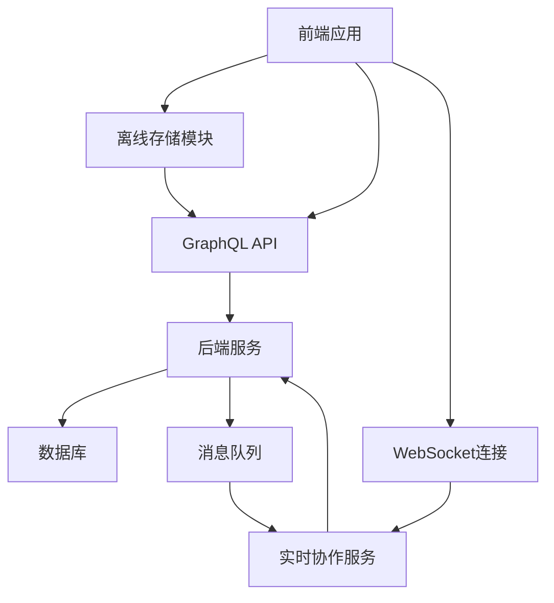

# 离线同步与协作编辑功能完善设计文档

## 1. 概述

本文档旨在设计和完善博客平台的离线同步功能和协作编辑功能。通过分析现有代码结构和功能实现，提出改进方案以提升用户体验和功能完整性。

### 1.1 当前状态分析

- **离线同步功能**：已实现基础的离线存储和同步机制，但缺少完善的冲突解决和同步策略
- **协作编辑功能**：前端已创建协作面板组件，但后端缺少实时通信支持和协同编辑机制

### 1.2 设计目标

1. 完善离线同步功能，实现更可靠的本地存储和服务器同步机制
2. 实现完整的协作编辑功能，支持多用户实时协同编辑
3. 提升用户体验，提供清晰的状态反馈和错误处理

### 1.3 设计原则

1. **向后兼容**：确保现有功能不受影响
2. **模块化设计**：便于维护和扩展
3. **高内聚低耦合**：降低组件间依赖

### 1.3 非功能性需求

1. **可靠性**：确保在网络不稳定情况下数据不丢失
2. **实时性**：协作编辑的延迟应控制在100ms以内
3. **兼容性**：支持主流浏览器的最新两个版本
4. **安全性**：确保协作会话的数据传输安全

## 2. 架构设计

### 2.1 系统架构图



### 2.2 技术栈

- **前端**：React + TypeScript + Apollo Client
- **后端**：Go + Gin + GORM + gqlgen
- **实时通信**：WebSocket
- **状态管理**：React Context + Apollo Cache
- **离线存储**：localStorage + IndexedDB

## 3. 离线同步功能完善

### 3.1 当前实现分析

当前离线同步功能已在`src/utils/offlineStorage.ts`中实现，包括：
- 本地文章存储和管理
- 离线状态检测
- 网络恢复后自动同步

### 3.2 功能完善方案

#### 3.2.1 离线存储优化

1. **存储结构优化**：
   - 使用IndexedDB替代localStorage，支持更大容量和更好性能
   - 实现存储配额管理，避免无限制增长

2. **同步策略改进**：
   - 实现增量同步机制，只同步变更部分
   - 添加同步冲突解决策略
   - 支持手动触发同步操作

3. **数据压缩**：
   - 对存储内容进行压缩，减少存储空间占用
   - 实现智能缓存清理机制

#### 3.2.2 状态管理增强

1. **同步状态追踪**：
   - 添加详细的同步状态（待同步、同步中、同步成功、同步失败）
   - 提供同步进度反馈

2. **错误处理机制**：
   - 实现重试机制
   - 提供详细的错误信息和解决建议

3. **用户提示优化**：
   - 提供友好的状态提示
   - 支持离线模式切换提醒

### 3.3 接口设计

#### 3.3.1 离线存储接口

```typescript
interface OfflineStorage {
  savePost(post: OfflinePost): Promise<string>;
  updatePost(id: string, updates: Partial<OfflinePost>): Promise<void>;
  getPost(id: string): Promise<OfflinePost | null>;
  getAllPosts(): Promise<OfflinePost[]>;
  deletePost(id: string): Promise<void>;
  markAsSynced(id: string, syncTime: string): Promise<void>;
  hasUnsyncedPosts(): boolean;
  syncWithServer(): Promise<SyncResult>;
}
```

## 4. 协作编辑功能实现

### 4.1 当前实现分析

协作编辑功能已在前端创建了`CollaborationPanel.tsx`组件，但缺少后端支持。

### 4.2 功能设计方案

#### 4.2.1 实时通信架构

1. **WebSocket连接管理**：
   - 建立专门的协作编辑WebSocket服务
   - 实现连接状态管理和重连机制

2. **消息协议设计**：
   - 用户加入/离开通知
   - 光标位置更新
   - 内容变更同步
   - 冲突解决消息

3. **心跳机制**：
   - 实现心跳检测，确保连接有效性
   - 自动断线重连机制

#### 4.2.2 协作编辑核心功能

1. **实时光标追踪**：
   - 显示其他协作者的光标位置
   - 使用不同颜色区分不同用户

2. **内容同步机制**：
   - 实现操作转换（Operation Transformation）或冲突避免（Conflict-free Replicated Data Types）
   - 支持实时内容更新

3. **权限管理**：
   - 实现协作者权限控制
   - 支持只读和读写权限

4. **变更历史**：
   - 记录协作者的操作历史
   - 支持撤销/重做功能

### 4.3 后端服务设计

#### 4.3.1 WebSocket服务

```go
type CollaborationService struct {
    connections map[string]*websocket.Conn
    rooms       map[string]*CollaborationRoom
}

type CollaborationRoom struct {
    roomId    string
    clients   map[string]*Client
    document  *Document
}

type Client struct {
    id       string
    userId   uint
    username string
    conn     *websocket.Conn
}
```

#### 4.3.2 消息格式

```json
{
  "type": "cursor_move",
  "userId": "user123",
  "position": {
    "line": 10,
    "ch": 5
  },
  "timestamp": "2023-01-01T00:00:00Z"
}
```

## 5. 数据模型设计

### 5.1 离线同步相关模型

#### 5.1.1 离线文章模型

```typescript
interface OfflinePost {
  id: string;
  title: string;
  content: string;
  tags: string[];
  categories: string[];
  createdAt: string;
  updatedAt: string;
  lastSyncedAt?: string;
  syncStatus: 'pending' | 'syncing' | 'success' | 'failed';
}
```

### 5.2 协作编辑相关模型

#### 5.2.1 协作会话模型

```go
type CollaborationSession struct {
    ID          uint      `gorm:"primaryKey"`
    PostID      uint      `gorm:"not null"`
    SessionID   string    `gorm:"unique;not null"`
    CreatedBy   uint      `gorm:"not null"`
    IsActive    bool      `gorm:"default:true"`
    CreatedAt   time.Time `gorm:"autoCreateTime"`
    UpdatedAt   time.Time `gorm:"autoUpdateTime"`
}
```

#### 5.2.2 协作者模型

```go
type Collaborator struct {
    ID          uint      `gorm:"primaryKey"`
    SessionID   string    `gorm:"not null"`
    UserID      uint      `gorm:"not null"`
    JoinTime    time.Time `gorm:"autoCreateTime"`
    LastActive  time.Time `gorm:"autoUpdateTime"`
    Permission  string    `gorm:"default:'read_write'"`
}
```

## 6. API接口设计

### 6.1 GraphQL接口扩展

#### 6.1.1 查询接口

```graphql
type Query {
  collaborationSession(postId: ID!): CollaborationSession
  collaborators(sessionId: ID!): [Collaborator!]!
}
```

#### 6.1.2 变更接口

```graphql
type Mutation {
  startCollaboration(postId: ID!): CollaborationSession!
  joinCollaboration(sessionId: ID!): GeneralResponse!
  leaveCollaboration(sessionId: ID!): GeneralResponse!
}
```

### 6.2 WebSocket接口

#### 6.2.1 连接建立

```
WebSocket连接地址: ws://server/graphql/collaboration/{sessionId}
```

#### 6.2.2 消息类型

- `join`: 用户加入协作
- `leave`: 用户离开协作
- `cursor`: 光标位置更新
- `content`: 内容变更
- `sync`: 同步请求

## 7. 前端组件设计

### 7.1 现有组件分析

当前已实现的组件：
- `RealTimeEditor.tsx`: 实时编辑器组件
- `CollaborationPanel.tsx`: 协作面板组件

### 7.2 组件增强方案

#### 7.2.1 RealTimeEditor组件增强

1. **协作状态显示**：
   - 添加协作者光标显示
   - 实现内容变更高亮

2. **网络状态优化**：
   - 增强离线状态提示
   - 提供同步进度显示

3. **用户体验优化**：
   - 添加协作模式切换
   - 提供操作反馈提示

#### 7.2.2 CollaborationPanel组件完善

1. **协作者列表**：
   - 显示在线协作者
   - 提供协作者操作（踢出、权限设置等）

2. **协作控制**：
   - 开始/结束协作会话
   - 邀请协作者功能

3. **会话管理**：
   - 显示协作会话信息
   - 提供会话历史记录

## 8. 测试策略

### 8.1 离线同步测试

1. **网络断开测试**：
   - 验证离线编辑功能
   - 检查数据持久化

2. **网络恢复测试**：
   - 验证自动同步机制
   - 检查同步冲突处理

3. **边界条件测试**：
   - 存储空间不足情况处理
   - 长时间离线后同步测试

### 8.2 协作编辑测试

1. **多用户协作测试**：
   - 验证实时同步功能
   - 检查光标追踪准确性

2. **冲突处理测试**：
   - 验证冲突解决机制
   - 检查数据一致性

3. **性能测试**：
   - 多用户并发编辑性能
   - 网络延迟对协作的影响

## 9. 安全考虑

### 9.1 认证与授权

1. **协作会话权限**：
   - 验证用户对文章的访问权限
   - 控制协作者操作权限

2. **数据安全**：
   - 确保传输数据加密
   - 防止未授权访问

3. **会话安全**：
   - 实现会话超时机制
   - 支持会话踢出功能

### 9.2 输入验证

1. **消息验证**：
   - 验证WebSocket消息格式
   - 防止恶意数据注入

2. **内容过滤**：
   - 实现内容安全过滤
   - 防止XSS攻击

## 10. 性能优化

### 10.1 离线存储优化

1. **存储策略**：
   - 实现LRU缓存机制
   - 定期清理过期数据

2. **索引优化**：
   - 为常用查询字段建立索引
   - 优化查询性能

### 10.2 实时通信优化

1. **消息压缩**：
   - 实现消息压缩传输
   - 减少网络带宽占用

2. **连接管理**：
   - 实现连接池管理
   - 优化资源使用

3. **批量处理**：
   - 合并多个小消息为批量消息
   - 减少网络请求次数

## 11. 部署考虑

### 11.1 服务部署

1. **WebSocket服务**：
   - 需要支持WebSocket协议的服务器
   - 考虑负载均衡和集群部署

2. **容器化部署**：
   - 支持Docker容器化部署
   - 实现Kubernetes编排

### 11.2 监控与日志

1. **协作会话监控**：
   - 记录协作会话状态
   - 监控同步性能指标

2. **错误追踪**：
   - 集成错误追踪系统
   - 实现自动告警机制