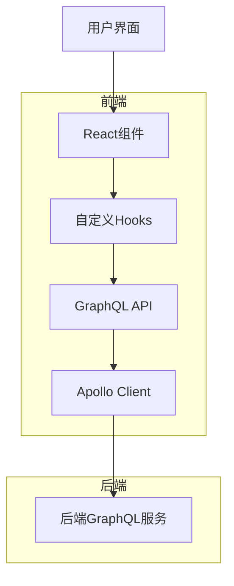
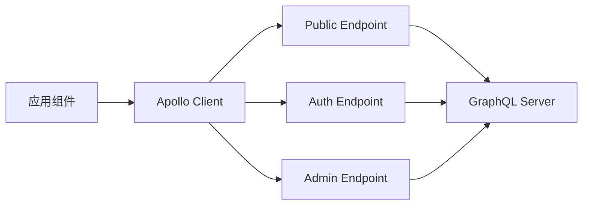
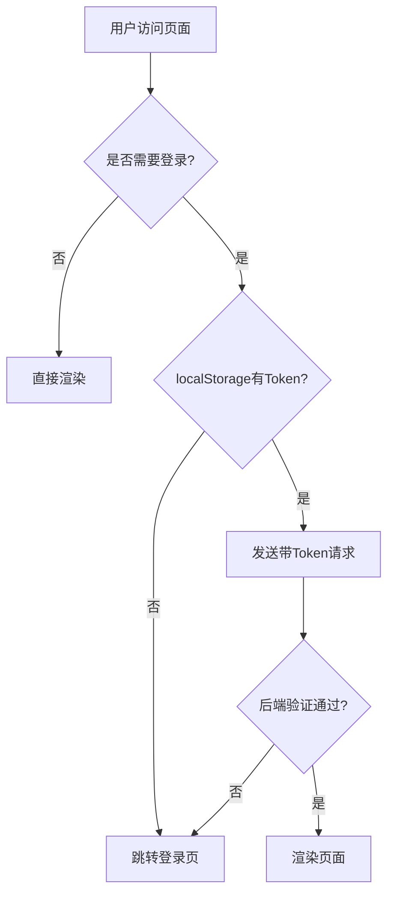

# 前端项目全面代码审查与错误分析报告

## 1. 概述

本文档对 playground 项目的前端代码进行了全面的审查和错误分析。项目采用 React + TypeScript + Vite 技术栈，使用 Ant Design 作为 UI 组件库，通过 GraphQL 与后端进行数据交互。

审查范围包括：
- 项目结构与架构
- 组件设计与实现
- 状态管理
- API 交互与错误处理
- 路由系统
- 样式与主题管理
- 测试策略

## 2. 项目结构分析

### 2.1 目录结构

```
src/
├── api/              # API 封装
├── components/       # 可复用组件
├── contexts/         # React Context
├── generated/        # GraphQL 生成代码
├── graphql/          # GraphQL 相关文件
├── hooks/            # 自定义 Hooks
├── layouts/          # 布局组件
├── pages/            # 页面组件
├── styles/           # 样式文件
├── test/             # 测试配置
├── theme/            # 主题配置
├── utils/            # 工具函数
└── App.tsx           # 应用根组件
```

### 2.2 技术架构



## 3. 组件设计分析

### 3.1 组件架构

项目采用模块化组件设计，主要组件包括：

1. **布局组件** (`AppLayout.tsx`) - 提供应用整体布局
2. **页面组件** (`pages/`) - 实现具体业务功能
3. **功能组件** (`components/`) - 可复用的 UI 组件
4. **上下文组件** (`contexts/`) - 状态管理

### 3.2 核心组件分析

#### MarkdownEditor 组件

**功能**：提供 Markdown 编辑和预览功能

**优点**：
- 实现了内容变化检测
- 提供全屏编辑模式
- 支持自动保存提示
- 集成 Ant Design UI 组件

**潜在问题**：
- 自动保存功能未完全实现
- 缺少键盘快捷键支持
- 未处理复杂的光标位置操作

#### RealTimeEditor 组件

**功能**：实时编辑器，支持自动保存和离线编辑

**优点**：
- 实现了网络状态监听
- 支持离线编辑模式
- 集成版本历史管理
- 提供协作编辑准备

**潜在问题**：
- 离线同步功能未完全实现
- 协作编辑功能尚未完成
- 复杂状态管理可能影响性能

### 3.3 组件设计规范遵循情况

项目较好地遵循了组件设计规范：
- 实现了防抖保存机制
- 提供了保存状态反馈
- 实现了网络状态监听
- 使用本地存储提高用户体验
- 包含错误处理机制

## 4. 状态管理分析

### 4.1 Context API 使用

项目使用 React Context 进行全局状态管理，主要实现：

1. **主题管理** (`ThemeContext.tsx`) - 管理应用主题
2. **应用状态** (`useAppState.tsx`) - 管理全局应用状态

### 4.2 自定义 Hooks

项目封装了多个自定义 Hooks 来管理业务逻辑：

1. `useBlog.ts` - 博客相关操作
2. `useFile.ts` - 文件管理操作
3. `useAdmin.ts` - 管理员功能
4. `useAppState.tsx` - 应用状态管理

### 4.3 GraphQL 状态管理

使用 Apollo Client 进行 GraphQL 状态管理：

1. **缓存配置** (`cache-config.ts`) - 定义缓存策略
2. **客户端配置** (`client.ts`, `multiClient.ts`) - 配置 Apollo Client
3. **错误处理** - 集成统一错误处理机制

## 5. API 交互与错误处理

### 5.1 GraphQL 客户端架构

项目采用多端点 Apollo Client 架构：



### 5.2 错误处理机制

#### 认证错误处理

```typescript
// 处理认证错误
if (extensions?.code === 'UNAUTHENTICATED' || extensions?.code === 'FORBIDDEN') {
  localStorage.removeItem('token');
  // 重定向到登录页
  window.location.href = '/login';
}
```

#### 网络错误处理

```typescript
// 处理网络错误
if (networkError) {
  // 显示网络错误提示
  notification.error({
    message: '网络错误',
    description: '网络连接异常，请检查网络设置',
  });
}
```

### 5.3 错误处理规范遵循情况

项目较好地遵循了错误处理规范：
- 实现了认证失败自动跳转
- 提供了用户友好的错误提示
- 区分处理不同类型的错误
- 添加了公共路由检查

## 6. 路由系统分析

### 6.1 路由配置

项目使用 React Router 进行路由管理，主要页面包括：
- 首页 (`/`)
- 登录页 (`/login`)
- 注册页 (`/register`)
- 编辑器页 (`/editor`)
- 文件查看页 (`/posts/:folder/:file`)
- 文件夹管理页 (`/folders`)
- 管理员页面 (`/admin/*`)

### 6.2 认证路由保护



## 7. 样式与主题管理

### 7.1 样式架构

项目采用以下样式方案：
- Tailwind CSS - 原子化样式
- Ant Design - UI 组件库
- CSS Modules - 局部样式

### 7.2 主题管理

通过 `ThemeContext` 实现主题管理：
- 支持亮色和暗色主题
- 自动检测系统偏好
- 持久化主题设置
- 同步第三方库主题

## 8. 测试策略分析

### 8.1 测试结构

项目包含以下测试文件：
- `__tests__/` - 组件测试
- `test/` - 测试配置
- `*.test.tsx` - 单个组件测试

### 8.2 测试覆盖率

当前测试覆盖情况：
- MarkdownEditor 组件测试
- EditorPage 组件测试
- HomePage 组件测试

### 8.3 测试改进建议

1. 增加更多组件的单元测试
2. 实现集成测试
3. 添加端到端测试
4. 提高测试覆盖率

## 9. 发现的问题与改进建议

### 9.1 已识别问题

1. **自动保存功能不完整**
   - MarkdownEditor 中的自动保存仅是占位符
   - RealTimeEditor 中的离线同步未完全实现

2. **键盘快捷键缺失**
   - 缺少 Ctrl+S/Cmd+S 保存快捷键
   - 缺少 Ctrl+Enter/Cmd+Enter 发布快捷键

3. **协作编辑功能未实现**
   - CollaborationPanel 组件已创建但未集成实际功能

4. **错误处理可以优化**
   - 部分错误处理使用了 console.warn 而非用户提示
   - 缺少全局错误提示组件的完整集成

### 9.2 改进建议

1. **完善自动保存机制**
   ```typescript
   // 实现真正的自动保存功能
   useEffect(() => {
     const autoSaveTimer = setTimeout(() => {
       if (isDirty && !isSaving) {
         handleInternalSave();
       }
     }, 30000); // 30秒自动保存
   
     return () => clearTimeout(autoSaveTimer);
   }, [isDirty, isSaving]);
   ```

2. **添加键盘快捷键支持**
   ```typescript
   // 添加键盘事件监听
   useEffect(() => {
     const handleKeyDown = (e: KeyboardEvent) => {
       if ((e.ctrlKey || e.metaKey) && e.key === 's') {
         e.preventDefault();
         handleSave();
       }
     };
   
     document.addEventListener('keydown', handleKeyDown);
     return () => document.removeEventListener('keydown', handleKeyDown);
   }, []);
   ```

3. **完善离线同步功能**
   - 实现离线更改的持久化存储
   - 添加网络恢复后的同步机制
   - 提供离线状态的用户反馈

4. **优化错误处理**
   - 替换所有的 console.warn 为用户可见的提示
   - 实现统一的错误提示组件
   - 添加错误边界组件

## 10. 总结

本次代码审查发现项目整体架构清晰，组件设计合理，遵循了大部分设计规范。但在自动保存、键盘快捷键、协作编辑和错误处理方面还有改进空间。

主要优势：
- 良好的组件化设计
- 完整的 GraphQL 集成
- 有效的状态管理
- 响应式设计实现

需要改进的方面：
- 完善自动保存和离线编辑功能
- 添加键盘快捷键支持
- 实现协作编辑功能
- 优化错误处理机制

通过实施改进建议，可以进一步提升用户体验和代码质量。        D
        E
    end
    
    subgraph 后端
        F
    end
```

## 3. 组件设计分析

### 3.1 组件架构

项目采用模块化组件设计，主要组件包括：

1. **布局组件** (`AppLayout.tsx`) - 提供应用整体布局
2. **页面组件** (`pages/`) - 实现具体业务功能
3. **功能组件** (`components/`) - 可复用的 UI 组件
4. **上下文组件** (`contexts/`) - 状态管理

### 3.2 核心组件分析

#### MarkdownEditor 组件

**功能**：提供 Markdown 编辑和预览功能

**优点**：
- 实现了内容变化检测
- 提供全屏编辑模式
- 支持自动保存提示
- 集成 Ant Design UI 组件

**潜在问题**：
- 自动保存功能未完全实现
- 缺少键盘快捷键支持
- 未处理复杂的光标位置操作

#### RealTimeEditor 组件

**功能**：实时编辑器，支持自动保存和离线编辑

**优点**：
- 实现了网络状态监听
- 支持离线编辑模式
- 集成版本历史管理
- 提供协作编辑准备

**潜在问题**：
- 离线同步功能未完全实现
- 协作编辑功能尚未完成
- 复杂状态管理可能影响性能

### 3.3 组件设计规范遵循情况

项目较好地遵循了组件设计规范：
- 实现了防抖保存机制
- 提供了保存状态反馈
- 实现了网络状态监听
- 使用本地存储提高用户体验
- 包含错误处理机制

## 4. 状态管理分析

### 4.1 Context API 使用

项目使用 React Context 进行全局状态管理，主要实现：

1. **主题管理** (`ThemeContext.tsx`) - 管理应用主题
2. **应用状态** (`useAppState.tsx`) - 管理全局应用状态

### 4.2 自定义 Hooks

项目封装了多个自定义 Hooks 来管理业务逻辑：

1. `useBlog.ts` - 博客相关操作
2. `useFile.ts` - 文件管理操作
3. `useAdmin.ts` - 管理员功能
4. `useAppState.tsx` - 应用状态管理

### 4.3 GraphQL 状态管理

使用 Apollo Client 进行 GraphQL 状态管理：

1. **缓存配置** (`cache-config.ts`) - 定义缓存策略
2. **客户端配置** (`client.ts`, `multiClient.ts`) - 配置 Apollo Client
3. **错误处理** - 集成统一错误处理机制

## 5. API 交互与错误处理

### 5.1 GraphQL 客户端架构

项目采用多端点 Apollo Client 架构：


### 5.2 错误处理机制

#### 认证错误处理

```typescript
// 处理认证错误
if (extensions?.code === 'UNAUTHENTICATED' || extensions?.code === 'FORBIDDEN') {
  localStorage.removeItem('token');
  // 重定向到登录页
  window.location.href = '/login';
}
```

#### 网络错误处理

```typescript
// 处理网络错误
if (networkError) {
  // 显示网络错误提示
  notification.error({
    message: '网络错误',
    description: '网络连接异常，请检查网络设置',
  });
}
```

### 5.3 错误处理规范遵循情况

项目较好地遵循了错误处理规范：
- 实现了认证失败自动跳转
- 提供了用户友好的错误提示
- 区分处理不同类型的错误
- 添加了公共路由检查

## 6. 路由系统分析

### 6.1 路由配置

项目使用 React Router 进行路由管理，主要页面包括：
- 首页 (`/`)
- 登录页 (`/login`)
- 注册页 (`/register`)
- 编辑器页 (`/editor`)
- 文件查看页 (`/posts/:folder/:file`)
- 文件夹管理页 (`/folders`)
- 管理员页面 (`/admin/*`)

### 6.2 认证路由保护


## 7. 样式与主题管理

### 7.1 样式架构

项目采用以下样式方案：
- Tailwind CSS - 原子化样式
- Ant Design - UI 组件库
- CSS Modules - 局部样式

### 7.2 主题管理

通过 `ThemeContext` 实现主题管理：
- 支持亮色和暗色主题
- 自动检测系统偏好
- 持久化主题设置
- 同步第三方库主题

## 8. 测试策略分析

### 8.1 测试结构

项目包含以下测试文件：
- `__tests__/` - 组件测试
- `test/` - 测试配置
- `*.test.tsx` - 单个组件测试

### 8.2 测试覆盖率

当前测试覆盖情况：
- MarkdownEditor 组件测试
- EditorPage 组件测试
- HomePage 组件测试

### 8.3 测试改进建议

1. 增加更多组件的单元测试
2. 实现集成测试
3. 添加端到端测试
4. 提高测试覆盖率

## 9. 发现的问题与改进建议

### 9.1 已识别问题

1. **自动保存功能不完整**
   - MarkdownEditor 中的自动保存仅是占位符
   - RealTimeEditor 中的离线同步未完全实现

2. **键盘快捷键缺失**
   - 缺少 Ctrl+S/Cmd+S 保存快捷键
   - 缺少 Ctrl+Enter/Cmd+Enter 发布快捷键

3. **协作编辑功能未实现**
   - CollaborationPanel 组件已创建但未集成实际功能

4. **错误处理可以优化**
   - 部分错误处理使用了 console.warn 而非用户提示
   - 缺少全局错误提示组件的完整集成

### 9.2 改进建议

1. **完善自动保存机制**
   ```typescript
   // 实现真正的自动保存功能
   useEffect(() => {
     const autoSaveTimer = setTimeout(() => {
       if (isDirty && !isSaving) {
         handleInternalSave();
       }
     }, 30000); // 30秒自动保存
   
     return () => clearTimeout(autoSaveTimer);
   }, [isDirty, isSaving]);
   ```

2. **添加键盘快捷键支持**
   ```typescript
   // 添加键盘事件监听
   useEffect(() => {
     const handleKeyDown = (e: KeyboardEvent) => {
       if ((e.ctrlKey || e.metaKey) && e.key === 's') {
         e.preventDefault();
         handleSave();
       }
     };
   
     document.addEventListener('keydown', handleKeyDown);
     return () => document.removeEventListener('keydown', handleKeyDown);
   }, []);
   ```

3. **完善离线同步功能**
   - 实现离线更改的持久化存储
   - 添加网络恢复后的同步机制
   - 提供离线状态的用户反馈

4. **优化错误处理**
   - 替换所有的 console.warn 为用户可见的提示
   - 实现统一的错误提示组件
   - 添加错误边界组件

## 10. 总结

本次代码审查发现项目整体架构清晰，组件设计合理，遵循了大部分设计规范。但在自动保存、键盘快捷键、协作编辑和错误处理方面还有改进空间。

主要优势：
- 良好的组件化设计
- 完整的 GraphQL 集成
- 有效的状态管理
- 响应式设计实现

需要改进的方面：
- 完善自动保存和离线编辑功能
- 添加键盘快捷键支持
- 实现协作编辑功能
- 优化错误处理机制

通过实施改进建议，可以进一步提升用户体验和代码质量。


