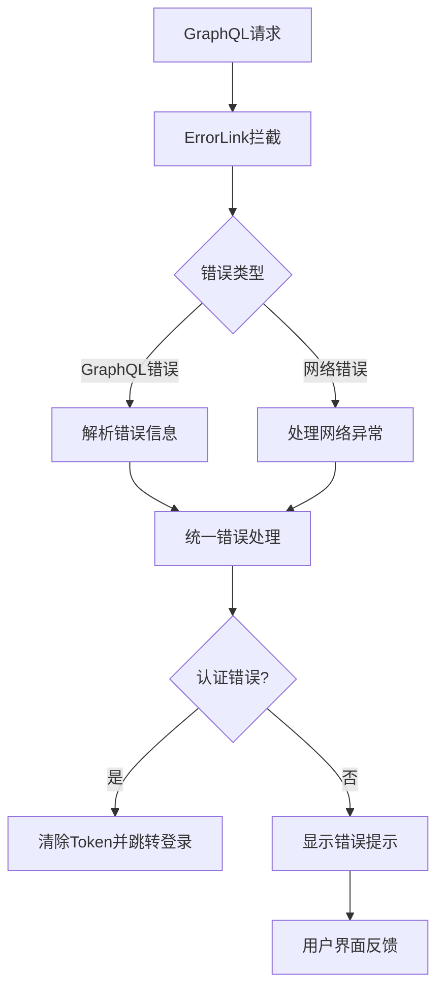
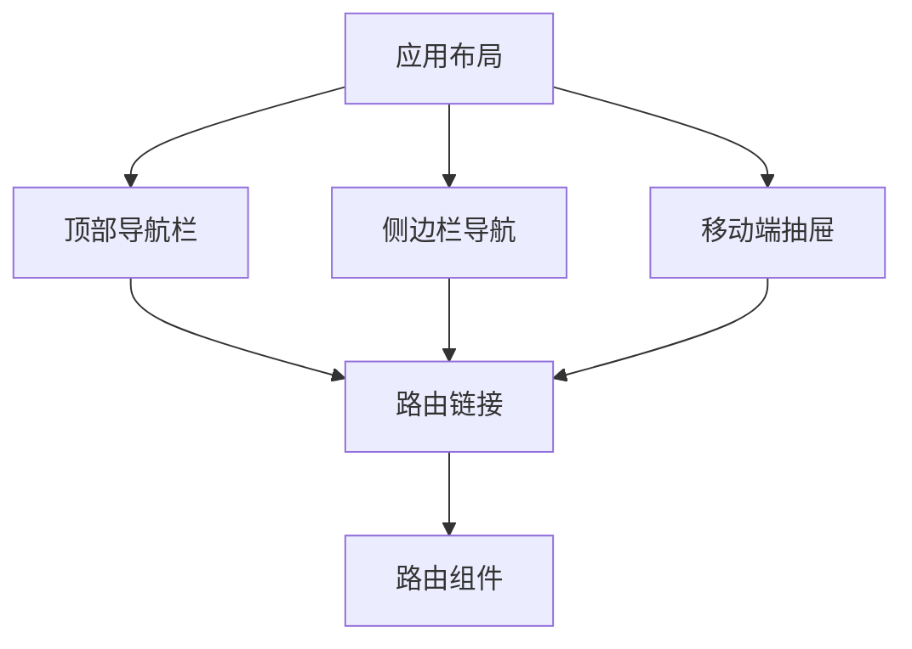
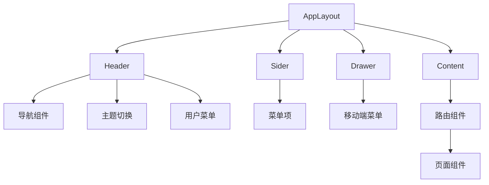

# 错误处理和路由优化设计文档

## 0. 文档版本

| 版本 | 日期 | 作者 | 描述 |
|------|------|------|------|
| 1.0 | 2025-04-05 | Qoder | 初始版本 |

## 1. 概述

### 1.1 背景
当前前端应用在错误处理方面存在以下问题：
- GraphQL错误信息未正确显示给用户
- 未授权访问时未正确跳转到登录页面
- 缺乏统一的错误提示机制

同时在路由和导航方面也存在优化空间：
- 导航栏需要完善，包含所有路由链接
- 昼夜切换功能需要简化，仅保留左上角按钮

### 1.2 目标
- 实现全面的前端错误提示和错误处理机制
- 优化路由系统，完善导航栏功能
- 简化主题切换功能，仅保留左上角按钮

## 2. 架构设计

### 2.1 错误处理架构


### 2.2 路由架构


### 2.3 组件架构


## 3. 错误处理优化

### 3.1 GraphQL错误处理增强
当前的错误处理机制存在以下问题：
1. 错误信息仅在控制台输出，未向用户展示
2. 未授权访问时的跳转逻辑不完善
3. 缺乏统一的错误提示组件

### 3.2 错误处理改进方案
1. 增强`multiClient.ts`中的错误处理逻辑
2. 实现全局错误提示组件
3. 完善认证错误的跳转逻辑

## 4. 路由和导航优化

### 4.1 导航栏优化
当前导航栏需要完善：
1. 顶部导航栏需要包含所有路由链接
2. 侧边栏需要根据用户权限动态显示菜单项
3. 移动端抽屉菜单需要与桌面端保持一致

### 4.2 主题切换优化
当前主题切换功能过于复杂：
1. 多个位置都有主题切换按钮
2. 需要简化为仅在左上角保留一个切换按钮

## 5. 实现方案

### 5.1 错误处理实现
#### 5.1.1 增强GraphQL客户端错误处理
修改`src/graphql/multiClient.ts`文件，增强错误处理逻辑：
1. 添加错误信息的用户提示
2. 完善认证错误的处理逻辑
3. 优化错误跳转逻辑

修改内容：
- 在`errorLink`中增加错误信息的用户提示
- 完善未授权访问时的跳转逻辑
- 确保错误信息能正确传递到UI层

#### 5.1.2 创建全局错误提示组件
创建统一的错误提示组件，用于显示各类错误信息：
1. 创建`ErrorNotification`组件
2. 集成到应用根布局中
3. 提供全局错误提示API

#### 5.1.3 完善认证错误跳转逻辑
确保未授权访问时正确跳转到登录页面：
1. 识别所有需要认证的路由
2. 在认证失败时自动跳转
3. 保存用户访问的原始页面以便登录后跳转

### 5.2 路由和导航实现
#### 5.2.1 完善导航栏链接
在顶部导航栏和侧边栏中添加所有必要的路由链接：
1. 添加文章管理链接
2. 添加个人资料链接
3. 根据权限动态显示管理员链接

#### 5.2.2 简化主题切换功能
移除多余的切换按钮，仅保留左上角的切换按钮：
1. 移除顶部导航栏中的主题切换按钮
2. 移除侧边栏底部的主题切换组件
3. 保留左上角logo旁的主题切换按钮

### 5.3 组件优化
#### 5.3.1 登录页面优化
增强登录页面的错误处理：
1. 添加表单验证错误提示
2. 显示后端返回的错误信息
3. 优化加载状态显示

#### 5.3.2 导航组件优化
优化导航组件的用户体验：
1. 统一移动端和桌面端的导航体验
2. 优化菜单项的显示逻辑
3. 增强响应式设计

## 6. 测试策略

### 6.1 错误处理测试
- 验证GraphQL错误信息能正确显示给用户
- 验证未授权访问时能正确跳转到登录页面
- 验证网络错误时的用户提示
- 验证表单验证错误提示
- 验证错误信息清除机制

### 6.2 路由导航测试
- 验证所有导航链接能正确跳转
- 验证移动端和桌面端导航功能一致性
- 验证主题切换功能正常工作
- 验证权限路由保护机制
- 验证登录状态下的导航显示

### 6.3 单元测试
- 测试错误处理Hook
- 测试认证相关Hook
- 测试路由守卫逻辑
- 测试主题切换功能

### 6.4 集成测试
- 测试完整的登录流程
- 测试认证错误处理流程
- 测试导航菜单显示逻辑
- 测试响应式导航功能

## 7. API端点参考

### 7.1 GraphQL端点
- `/graphql` - 公共GraphQL端点
- `/graphql/auth` - 认证GraphQL端点
- `/graphql/admin` - 管理员GraphQL端点

### 7.2 认证相关
- `login` - 用户登录
- `me` - 获取当前用户信息
- `logout` - 用户登出

## 8. 状态管理

### 8.1 应用状态
- 用户认证状态
- 主题状态
- 错误状态
- 加载状态

### 8.2 状态管理方案
使用React Context API和自定义Hook管理应用状态：
- `useAppState` - 全局应用状态
- `useAppUser` - 用户相关状态
- `useAppTheme` - 主题相关状态
- `useAppUI` - UI相关状态

## 9. 业务逻辑层

### 9.1 认证逻辑
- 用户登录/登出
- Token管理
- 权限验证

### 9.2 错误处理逻辑
- 错误拦截
- 错误分类
- 用户提示

### 9.3 路由逻辑
- 权限路由保护
- 导航菜单管理
- 路由守卫

## 10. 数据模型

### 10.1 错误信息模型
```typescript
interface GraphQLError {
  message: string;
  locations?: Array<{ line: number; column: number }>;
  path?: string[];
  extensions?: {
    code: string;
    [key: string]: any;
  };
}
```

### 10.2 用户认证模型
```typescript
interface User {
  id: string;
  username: string;
  email: string;
  role: 'USER' | 'ADMIN';
  isVerified: boolean;
  isActive: boolean;
}
```2. 显示后端返回的错误信息
3. 优化加载状态显示

#### 5.3.2 导航组件优化
优化导航组件的用户体验：
1. 统一移动端和桌面端的导航体验
2. 优化菜单项的显示逻辑
3. 增强响应式设计

## 6. 测试策略

### 6.1 错误处理测试
- 验证GraphQL错误信息能正确显示给用户
- 验证未授权访问时能正确跳转到登录页面
- 验证网络错误时的用户提示
- 验证表单验证错误提示
- 验证错误信息清除机制

### 6.2 路由导航测试
- 验证所有导航链接能正确跳转
- 验证移动端和桌面端导航功能一致性
- 验证主题切换功能正常工作
- 验证权限路由保护机制
- 验证登录状态下的导航显示

### 6.3 单元测试
- 测试错误处理Hook
- 测试认证相关Hook
- 测试路由守卫逻辑
- 测试主题切换功能

### 6.4 集成测试
- 测试完整的登录流程
- 测试认证错误处理流程
- 测试导航菜单显示逻辑
- 测试响应式导航功能

## 7. API端点参考

### 7.1 GraphQL端点
- `/graphql` - 公共GraphQL端点
- `/graphql/auth` - 认证GraphQL端点
- `/graphql/admin` - 管理员GraphQL端点

### 7.2 认证相关
- `login` - 用户登录
- `me` - 获取当前用户信息
- `logout` - 用户登出

## 8. 状态管理

### 8.1 应用状态
- 用户认证状态
- 主题状态
- 错误状态
- 加载状态

### 8.2 状态管理方案
使用React Context API和自定义Hook管理应用状态：
- `useAppState` - 全局应用状态
- `useAppUser` - 用户相关状态
- `useAppTheme` - 主题相关状态
- `useAppUI` - UI相关状态

## 9. 业务逻辑层

### 9.1 认证逻辑
- 用户登录/登出
- Token管理
- 权限验证

### 9.2 错误处理逻辑
- 错误拦截
- 错误分类
- 用户提示

### 9.3 路由逻辑
- 权限路由保护
- 导航菜单管理
- 路由守卫

## 10. 数据模型

### 10.1 错误信息模型
```typescript
interface GraphQLError {
  message: string;
  locations?: Array<{ line: number; column: number }>;
  path?: string[];
  extensions?: {
    code: string;
    [key: string]: any;
  };
}
```

### 10.2 用户认证模型
```typescript
interface User {
  id: string;
  username: string;
  email: string;
  role: 'USER' | 'ADMIN';
  isVerified: boolean;
  isActive: boolean;
}
```1. 移除顶部导航栏中的主题切换按钮
2. 移除侧边栏底部的主题切换组件
3. 保留左上角logo旁的主题切换按钮

### 5.3 组件优化
#### 5.3.1 登录页面优化
增强登录页面的错误处理：
1. 添加表单验证错误提示
2. 显示后端返回的错误信息
3. 优化加载状态显示

#### 5.3.2 导航组件优化
优化导航组件的用户体验：
1. 统一移动端和桌面端的导航体验
2. 优化菜单项的显示逻辑
3. 增强响应式设计

## 6. 测试策略

### 6.1 错误处理测试
- 验证GraphQL错误信息能正确显示给用户
- 验证未授权访问时能正确跳转到登录页面
- 验证网络错误时的用户提示

### 6.2 路由导航测试
- 验证所有导航链接能正确跳转
- 验证移动端和桌面端导航功能一致性
- 验证主题切换功能正常工作

## 7. API端点参考

### 7.1 GraphQL端点
- `/graphql` - 公共GraphQL端点
- `/graphql/auth` - 认证GraphQL端点
- `/graphql/admin` - 管理员GraphQL端点

### 7.2 认证相关
- `login` - 用户登录
- `me` - 获取当前用户信息
- `logout` - 用户登出

## 8. 状态管理

### 8.1 应用状态
- 用户认证状态
- 主题状态
- 错误状态
- 加载状态

### 8.2 状态管理方案
使用React Context API和自定义Hook管理应用状态：
- `useAppState` - 全局应用状态
- `useAppUser` - 用户相关状态
- `useAppTheme` - 主题相关状态
- `useAppUI` - UI相关状态

## 9. 业务逻辑层

### 9.1 认证逻辑
- 用户登录/登出
- Token管理
- 权限验证

### 9.2 错误处理逻辑
- 错误拦截
- 错误分类
- 用户提示

### 9.3 路由逻辑
- 权限路由保护
- 导航菜单管理
- 路由守卫

## 10. 数据模型

### 10.1 错误信息模型
```typescript
interface GraphQLError {
  message: string;
  locations?: Array<{ line: number; column: number }>;
  path?: string[];
  extensions?: {
    code: string;
    [key: string]: any;
  };
}
```

### 10.2 用户认证模型
```typescript
interface User {
  id: string;
  username: string;
  email: string;
  role: 'USER' | 'ADMIN';
  isVerified: boolean;
  isActive: boolean;
}
```
#### 5.1.3 完善认证错误跳转逻辑
确保未授权访问时正确跳转到登录页面：
1. 识别所有需要认证的路由
2. 在认证失败时自动跳转
3. 保存用户访问的原始页面以便登录后跳转

### 5.2 路由和导航实现
#### 5.2.1 完善导航栏链接
在顶部导航栏和侧边栏中添加所有必要的路由链接：
1. 添加文章管理链接
2. 添加个人资料链接
3. 根据权限动态显示管理员链接

#### 5.2.2 简化主题切换功能
移除多余的切换按钮，仅保留左上角的切换按钮：
1. 移除顶部导航栏中的主题切换按钮
2. 移除侧边栏底部的主题切换组件
3. 保留左上角logo旁的主题切换按钮

### 5.3 组件优化
#### 5.3.1 登录页面优化
增强登录页面的错误处理：
1. 添加表单验证错误提示
2. 显示后端返回的错误信息
3. 优化加载状态显示

#### 5.3.2 导航组件优化
优化导航组件的用户体验：
1. 统一移动端和桌面端的导航体验
2. 优化菜单项的显示逻辑
3. 增强响应式设计

## 6. 测试策略

### 6.1 错误处理测试
- 验证GraphQL错误信息能正确显示给用户
- 验证未授权访问时能正确跳转到登录页面
- 验证网络错误时的用户提示

### 6.2 路由导航测试
- 验证所有导航链接能正确跳转
- 验证移动端和桌面端导航功能一致性
- 验证主题切换功能正常工作

## 7. API端点参考

### 7.1 GraphQL端点
- `/graphql` - 公共GraphQL端点
- `/graphql/auth` - 认证GraphQL端点
- `/graphql/admin` - 管理员GraphQL端点

### 7.2 认证相关
- `login` - 用户登录
- `me` - 获取当前用户信息
- `logout` - 用户登出

## 8. 数据模型

### 8.1 错误信息模型
```typescript
interface GraphQLError {
  message: string;
  locations?: Array<{ line: number; column: number }>;
  path?: string[];
  extensions?: {
    code: string;
    [key: string]: any;
  };
}
```

### 8.2 用户认证模型
```typescript
interface User {
  id: string;
  username: string;
  email: string;
  role: 'USER' | 'ADMIN';
  isVerified: boolean;
  isActive: boolean;
}
```### 4.2 主题切换优化
当前主题切换功能过于复杂：
1. 多个位置都有主题切换按钮
2. 需要简化为仅在左上角保留一个切换按钮

## 5. 实现方案

### 5.1 错误处理实现
#### 5.1.1 增强GraphQL客户端错误处理
修改`src/graphql/multiClient.ts`文件，增强错误处理逻辑：
1. 添加错误信息的用户提示
2. 完善认证错误的处理逻辑
3. 优化错误跳转逻辑

修改内容：
- 在`errorLink`中增加错误信息的用户提示
- 完善未授权访问时的跳转逻辑
- 确保错误信息能正确传递到UI层

#### 5.1.2 创建全局错误提示组件
创建统一的错误提示组件，用于显示各类错误信息：
1. 创建`ErrorNotification`组件
2. 集成到应用根布局中
3. 提供全局错误提示API

#### 5.1.3 完善认证错误跳转逻辑
确保未授权访问时正确跳转到登录页面：
1. 识别所有需要认证的路由
2. 在认证失败时自动跳转
3. 保存用户访问的原始页面以便登录后跳转

### 5.2 路由和导航实现
#### 5.2.1 完善导航栏链接
在顶部导航栏和侧边栏中添加所有必要的路由链接：
1. 添加文章管理链接
2. 添加个人资料链接
3. 根据权限动态显示管理员链接

#### 5.2.2 简化主题切换功能
移除多余的切换按钮，仅保留左上角的切换按钮：
1. 移除顶部导航栏中的主题切换按钮
2. 移除侧边栏底部的主题切换组件
3. 保留左上角logo旁的主题切换按钮

### 5.3 组件优化
#### 5.3.1 登录页面优化
增强登录页面的错误处理：
1. 添加表单验证错误提示
2. 显示后端返回的错误信息
3. 优化加载状态显示

#### 5.3.2 导航组件优化
优化导航组件的用户体验：
1. 统一移动端和桌面端的导航体验
2. 优化菜单项的显示逻辑
3. 增强响应式设计

## 6. 测试策略

### 6.1 错误处理测试
- 验证GraphQL错误信息能正确显示给用户
- 验证未授权访问时能正确跳转到登录页面
- 验证网络错误时的用户提示

### 6.2 路由导航测试
- 验证所有导航链接能正确跳转
- 验证移动端和桌面端导航功能一致性
- 验证主题切换功能正常工作

## 7. 数据模型

### 7.1 错误信息模型
```typescript
interface GraphQLError {
  message: string;
  locations?: Array<{ line: number; column: number }>;
  path?: string[];
  extensions?: {
    code: string;
    [key: string]: any;
  };
}
```

### 7.2 用户认证模型
```typescript
interface User {
  id: string;
  username: string;
  email: string;
  role: 'USER' | 'ADMIN';
  isVerified: boolean;
  isActive: boolean;
}
```当前的错误处理机制存在以下问题：
1. 错误信息仅在控制台输出，未向用户展示
2. 未授权访问时的跳转逻辑不完善
3. 缺乏统一的错误提示组件

### 3.2 错误处理改进方案
1. 增强`multiClient.ts`中的错误处理逻辑
2. 实现全局错误提示组件
3. 完善认证错误的跳转逻辑

## 4. 路由和导航优化

### 4.1 导航栏优化
当前导航栏需要完善：
1. 顶部导航栏需要包含所有路由链接
2. 侧边栏需要根据用户权限动态显示菜单项
3. 移动端抽屉菜单需要与桌面端保持一致

### 4.2 主题切换优化
当前主题切换功能过于复杂：
1. 多个位置都有主题切换按钮
2. 需要简化为仅在左上角保留一个切换按钮

## 5. 实现方案

### 5.1 错误处理实现
#### 5.1.1 增强GraphQL客户端错误处理
修改`src/graphql/multiClient.ts`文件，增强错误处理逻辑：

#### 5.1.2 创建全局错误提示组件
创建统一的错误提示组件，用于显示各类错误信息

#### 5.1.3 完善认证错误跳转逻辑
确保未授权访问时正确跳转到登录页面

### 5.2 路由和导航实现
#### 5.2.1 完善导航栏链接
在顶部导航栏和侧边栏中添加所有必要的路由链接

#### 5.2.2 简化主题切换功能
移除多余的切换按钮，仅保留左上角的切换按钮

## 6. 测试策略

### 6.1 错误处理测试
- 验证GraphQL错误信息能正确显示给用户
- 验证未授权访问时能正确跳转到登录页面
- 验证网络错误时的用户提示

### 6.2 路由导航测试
- 验证所有导航链接能正确跳转
- 验证移动端和桌面端导航功能一致性
- 验证主题切换功能正常工作

## 7. 数据模型

### 7.1 错误信息模型
```typescript
interface GraphQLError {
  message: string;
  locations?: Array<{ line: number; column: number }>;
  path?: string[];
  extensions?: {
    code: string;
    [key: string]: any;
  };
}
```

### 7.2 用户认证模型
```typescript
interface User {
  id: string;
  username: string;
  email: string;
  role: 'USER' | 'ADMIN';
  isVerified: boolean;
  isActive: boolean;
}
```    B --> C{错误类型}
    C -->|GraphQL错误| D[解析错误信息]
    C -->|网络错误| E[处理网络异常]
    D --> F[统一错误处理]
    E --> F
    F --> G{认证错误?}
    G -->|是| H[清除Token并跳转登录]
    G -->|否| I[显示错误提示]
    I --> J[用户界面反馈]
```

### 2.2 路由架构


## 3. 错误处理优化

### 3.1 GraphQL错误处理增强
当前的错误处理机制存在以下问题：
1. 错误信息仅在控制台输出，未向用户展示
2. 未授权访问时的跳转逻辑不完善
3. 缺乏统一的错误提示组件

### 3.2 错误处理改进方案
1. 增强`multiClient.ts`中的错误处理逻辑
2. 实现全局错误提示组件
3. 完善认证错误的跳转逻辑

## 4. 路由和导航优化

### 4.1 导航栏优化
当前导航栏需要完善：
1. 顶部导航栏需要包含所有路由链接
2. 侧边栏需要根据用户权限动态显示菜单项
3. 移动端抽屉菜单需要与桌面端保持一致

### 4.2 主题切换优化
当前主题切换功能过于复杂：
1. 多个位置都有主题切换按钮
2. 需要简化为仅在左上角保留一个切换按钮

## 5. 实现方案

### 5.1 错误处理实现
#### 5.1.1 增强GraphQL客户端错误处理
修改`src/graphql/multiClient.ts`文件，增强错误处理逻辑：

#### 5.1.2 创建全局错误提示组件
创建统一的错误提示组件，用于显示各类错误信息

#### 5.1.3 完善认证错误跳转逻辑
确保未授权访问时正确跳转到登录页面

### 5.2 路由和导航实现
#### 5.2.1 完善导航栏链接
在顶部导航栏和侧边栏中添加所有必要的路由链接

#### 5.2.2 简化主题切换功能
移除多余的切换按钮，仅保留左上角的切换按钮

## 6. 测试策略

### 6.1 错误处理测试
- 验证GraphQL错误信息能正确显示给用户
- 验证未授权访问时能正确跳转到登录页面
- 验证网络错误时的用户提示

### 6.2 路由导航测试
- 验证所有导航链接能正确跳转
- 验证移动端和桌面端导航功能一致性
- 验证主题切换功能正常工作

## 7. 数据模型

### 7.1 错误信息模型
```typescript
interface GraphQLError {
  message: string;
  locations?: Array<{ line: number; column: number }>;
  path?: string[];
  extensions?: {
    code: string;
    [key: string]: any;
  };
}
```

### 7.2 用户认证模型
```typescript
interface User {
  id: string;
  username: string;
  email: string;
  role: 'USER' | 'ADMIN';
  isVerified: boolean;
  isActive: boolean;
}
```


