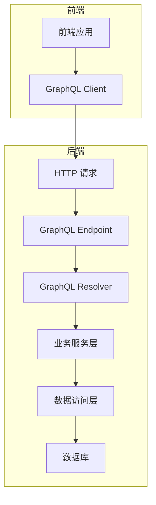
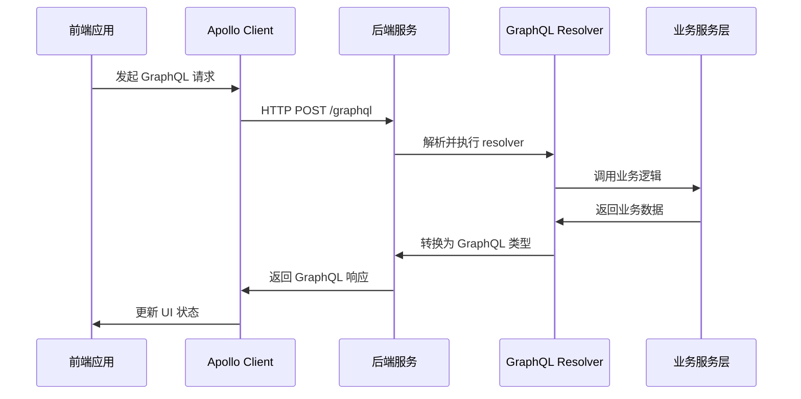
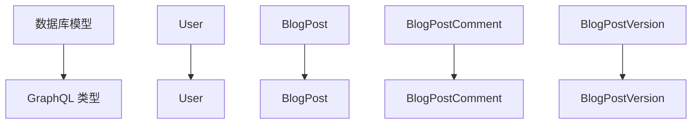
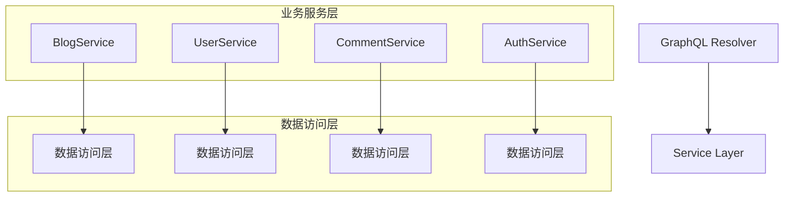

# GraphQL Schema Resolver 和前后端通信修复设计文档

## 1. 概述

本设计文档旨在全面修复 GraphQL Schema Resolver 的问题，并确保前后端之间的 GraphQL 通信完全正常。通过分析现有代码，发现主要问题集中在 Schema Resolver 实现不完整、前后端类型不匹配以及通信配置不当等方面。

## 2. 问题分析

### 2.1 后端 Schema Resolver 问题

1. **Resolver 实现不完整**：部分 GraphQL 查询和变更的 resolver 方法未正确实现或存在编译错误
2. **上下文传递问题**：Gin 上下文未正确传递到 GraphQL resolver 中
3. **类型转换不一致**：数据库模型与 GraphQL 类型之间的转换存在潜在问题
4. **错误处理不完善**：缺乏统一的错误处理机制

### 2.2 前端 GraphQL 通信问题

1. **API 端点配置**：可能存在 GraphQL 端点配置不正确的问题
2. **认证机制**：JWT token 传递可能存在问题
3. **类型定义不匹配**：前端生成的 GraphQL 类型与后端 Schema 不一致
4. **缓存策略**：Apollo Client 缓存配置可能需要优化

### 2.3 前后端通信问题

1. **CORS 配置**：可能存在跨域访问限制
2. **认证中间件**：JWT 认证中间件可能未正确应用
3. **错误处理**：前后端错误处理机制不一致

## 3. 架构设计

### 3.1 整体架构图



### 3.2 GraphQL 通信流程



## 4. 修复方案

### 4.1 后端 Schema Resolver 修复

#### 4.1.1 完善 Resolver 实现

需要检查并修复以下 resolver 方法：
- `Post` 查询 resolver
- `Posts` 查询 resolver
- `CreatePost` 变更 resolver
- `UpdatePost` 变更 resolver
- `DeletePost` 变更 resolver
- `LikePost` 变更 resolver
- `UnlikePost` 变更 resolver
- 所有评论相关 resolver
- 所有用户认证相关 resolver

#### 4.1.2 优化上下文传递

```go
// 在 routes/routes.go 中改进上下文传递
r.POST("/graphql", middleware.OptionalJWTAuthMiddleware(), func(c *gin.Context) {
    // 将Gin上下文注入到GraphQL上下文中
    ctx := context.WithValue(c.Request.Context(), "GinContext", c)
    // 同时注入数据库实例
    ctx = context.WithValue(ctx, "DB", db)
    c.Request = c.Request.WithContext(ctx)
    srv.ServeHTTP(c.Writer, c.Request)
})
```

#### 4.1.3 统一错误处理

在 resolver 中实现统一的错误处理机制：

```go
// 示例：统一错误处理包装器
func handleResolverError(ctx context.Context, err error) error {
    logger := middleware.GetLogger()
    logger.Errorw("Resolver执行错误", "error", err)
    
    // 根据错误类型返回不同的GraphQL错误
    switch err.(type) {
    case *models.ValidationError:
        return fmt.Errorf("输入验证失败: %w", err)
    case *models.AuthorizationError:
        return fmt.Errorf("权限不足: %w", err)
    default:
        return fmt.Errorf("内部服务器错误: %w", err)
    }
}
```

### 4.2 前端 GraphQL 通信修复

#### 4.2.1 优化 Apollo Client 配置

```typescript
// src/graphql/client.ts
const client = new ApolloClient({
  link: from([
    errorLink,
    authLink.concat(httpLink),
  ]),
  cache: new InMemoryCache(cacheConfig),
  defaultOptions: {
    watchQuery: {
      errorPolicy: 'all',
      notifyOnNetworkStatusChange: true,
    },
    query: {
      errorPolicy: 'all',
    },
    mutate: {
      errorPolicy: 'all',
    },
  },
});
```

#### 4.2.2 完善类型定义

确保前端生成的 GraphQL 类型与后端 Schema 完全匹配：

```bash
# 重新生成 GraphQL 类型定义
pnpm codegen
```

#### 4.2.3 改进认证机制

```typescript
// src/api/graphql/auth.ts
const authLink = setContext((_, { headers }) => {
  const token = localStorage.getItem('token');
  return {
    headers: {
      ...headers,
      authorization: token && token !== 'undefined' ? `Bearer ${token}` : "",
    }
  };
});
```

### 4.3 前后端通信优化

#### 4.3.1 CORS 配置优化

```go
// backend/routes/routes.go
func setupCORS(r *gin.Engine, cfg *config.Config) {
    r.Use(cors.New(cors.Config{
        AllowOrigins:     cfg.AllowedOrigins,
        AllowMethods:     []string{"GET", "POST", "PUT", "DELETE", "OPTIONS"},
        AllowHeaders:     []string{"Origin", "Content-Type", "Authorization"},
        AllowCredentials: true,
        MaxAge:           24 * time.Hour,
    }))
}
```

#### 4.3.2 认证中间件优化

```go
// 确保 OptionalJWTAuthMiddleware 正确处理认证状态
func OptionalJWTAuthMiddleware() gin.HandlerFunc {
    return func(c *gin.Context) {
        // 尝试解析 JWT token
        tokenString := extractTokenFromHeader(c)
        if tokenString != "" {
            claims, err := models.ParseJWT(tokenString)
            if err == nil {
                // Token 有效，将用户信息存入上下文
                c.Set("user_claims", claims)
            }
        }
        c.Next()
    }
}
```

## 5. 数据模型与 ORM 映射

### 5.1 核心数据模型

#### 5.1.1 用户模型 (User)
- ID: uint64
- Username: string
- Email: string
- Role: string (USER/ADMIN)
- IsVerified: bool
- IsActive: bool

#### 5.1.2 博客文章模型 (BlogPost)
- ID: uint64
- Title: string
- Slug: string
- Content: string
- Status: string (DRAFT/PUBLISHED/ARCHIVED)
- AccessLevel: string (PUBLIC/PRIVATE/RESTRICTED)

#### 5.1.3 评论模型 (BlogPostComment)
- ID: uint64
- Content: string
- UserID: uint64
- BlogPostID: uint64
- ParentID: *uint64

### 5.2 GraphQL 类型映射



## 6. API 端点参考

### 6.1 GraphQL 端点

- **路径**: `/graphql`
- **方法**: POST (查询和变更), GET (仅开发环境的 Playground)
- **认证**: Bearer Token (JWT)
- **Content-Type**: application/json

### 6.2 核心查询示例

```graphql
# 获取文章列表
query GetPosts {
  posts(limit: 10, offset: 0) {
    id
    title
    slug
    excerpt
    tags
    categories
    author {
      id
      username
    }
    stats {
      likeCount
      viewCount
    }
  }
}

# 获取单个文章
query GetPost($id: ID) {
  post(id: $id) {
    id
    title
    content
    author {
      id
      username
    }
    stats {
      likeCount
      viewCount
    }
  }
}
```

### 6.3 核心变更示例

```graphql
# 创建文章
mutation CreatePost($input: CreatePostInput!) {
  createPost(input: $input) {
    id
    title
    slug
  }
}

# 点赞文章
mutation LikePost($id: ID!) {
  likePost(id: $id) {
    id
    stats {
      likeCount
    }
  }
}
```

## 7. 业务逻辑层架构

### 7.1 服务层设计



### 7.2 核心服务功能

#### 7.2.1 BlogService
- CreatePost: 创建文章
- UpdatePost: 更新文章
- DeletePost: 删除文章
- GetPosts: 获取文章列表
- GetPostByID: 根据ID获取文章
- LikePost: 点赞文章
- UnlikePost: 取消点赞

#### 7.2.2 UserService
- Register: 用户注册
- Login: 用户登录
- UpdateProfile: 更新用户资料
- ChangePassword: 修改密码

#### 7.2.3 CommentService
- CreateComment: 创建评论
- UpdateComment: 更新评论
- DeleteComment: 删除评论
- GetCommentsByPostID: 获取文章评论

## 8. 测试策略

### 8.1 单元测试

为每个 resolver 方法编写单元测试，确保：
- 正确处理有效输入
- 正确处理无效输入
- 正确处理认证和授权
- 正确处理错误情况

### 8.2 集成测试

编写端到端测试，验证：
- GraphQL 查询和变更的完整执行流程
- 前后端数据一致性
- 认证和授权机制
- 错误处理机制

### 8.3 性能测试

验证：
- GraphQL 查询性能
- 大量并发请求处理能力
- 数据库查询优化效果

## 9. 部署与监控

### 9.1 部署配置

确保生产环境配置：
- 正确的 CORS 设置
- 适当的 JWT 密钥
- 数据库连接池配置
- 日志级别设置

### 9.2 监控指标

监控以下关键指标：
- GraphQL 查询响应时间
- 错误率
- 数据库查询性能
- 内存和CPU使用情况```mermaid
sequenceDiagram
    participant Client as 前端应用
    participant Apollo as Apollo Client
    participant Server as 后端服务
    participant Resolver as GraphQL Resolver
    participant Service as 业务服务层

    Client->>Apollo: 发起 GraphQL 请求
    Apollo->>Server: HTTP POST /graphql
    Server->>Resolver: 解析并执行 resolver
    Resolver->>Service: 调用业务逻辑
    Service->>Resolver: 返回业务数据
    Resolver->>Server: 转换为 GraphQL 类型
    Server->>Apollo: 返回 GraphQL 响应
    Apollo->>Client: 更新 UI 状态
```

## 4. 修复方案

### 4.1 后端 Schema Resolver 修复

#### 4.1.1 完善 Resolver 实现

需要检查并修复以下 resolver 方法：
- `Post` 查询 resolver
- `Posts` 查询 resolver
- `CreatePost` 变更 resolver
- `UpdatePost` 变更 resolver
- `DeletePost` 变更 resolver
- `LikePost` 变更 resolver
- `UnlikePost` 变更 resolver
- 所有评论相关 resolver
- 所有用户认证相关 resolver

#### 4.1.2 优化上下文传递

```go
// 在 routes/routes.go 中改进上下文传递
r.POST("/graphql", middleware.OptionalJWTAuthMiddleware(), func(c *gin.Context) {
    // 将Gin上下文注入到GraphQL上下文中
    ctx := context.WithValue(c.Request.Context(), "GinContext", c)
    // 同时注入数据库实例
    ctx = context.WithValue(ctx, "DB", db)
    c.Request = c.Request.WithContext(ctx)
    srv.ServeHTTP(c.Writer, c.Request)
})
```

#### 4.1.3 统一错误处理

在 resolver 中实现统一的错误处理机制：

```go
// 示例：统一错误处理包装器
func handleResolverError(ctx context.Context, err error) error {
    logger := middleware.GetLogger()
    logger.Errorw("Resolver执行错误", "error", err)
    
    // 根据错误类型返回不同的GraphQL错误
    switch err.(type) {
    case *models.ValidationError:
        return fmt.Errorf("输入验证失败: %w", err)
    case *models.AuthorizationError:
        return fmt.Errorf("权限不足: %w", err)
    default:
        return fmt.Errorf("内部服务器错误: %w", err)
    }
}
```

### 4.2 前端 GraphQL 通信修复

#### 4.2.1 优化 Apollo Client 配置

```typescript
// src/graphql/client.ts
const client = new ApolloClient({
  link: from([
    errorLink,
    authLink.concat(httpLink),
  ]),
  cache: new InMemoryCache(cacheConfig),
  defaultOptions: {
    watchQuery: {
      errorPolicy: 'all',
      notifyOnNetworkStatusChange: true,
    },
    query: {
      errorPolicy: 'all',
    },
    mutate: {
      errorPolicy: 'all',
    },
  },
});
```

#### 4.2.2 完善类型定义

确保前端生成的 GraphQL 类型与后端 Schema 完全匹配：

```bash
# 重新生成 GraphQL 类型定义
pnpm codegen
```

#### 4.2.3 改进认证机制

```typescript
// src/api/graphql/auth.ts
const authLink = setContext((_, { headers }) => {
  const token = localStorage.getItem('token');
  return {
    headers: {
      ...headers,
      authorization: token && token !== 'undefined' ? `Bearer ${token}` : "",
    }
  };
});
```

### 4.3 前后端通信优化

#### 4.3.1 CORS 配置优化

```go
// backend/routes/routes.go
func setupCORS(r *gin.Engine, cfg *config.Config) {
    r.Use(cors.New(cors.Config{
        AllowOrigins:     cfg.AllowedOrigins,
        AllowMethods:     []string{"GET", "POST", "PUT", "DELETE", "OPTIONS"},
        AllowHeaders:     []string{"Origin", "Content-Type", "Authorization"},
        AllowCredentials: true,
        MaxAge:           24 * time.Hour,
    }))
}
```

#### 4.3.2 认证中间件优化

```go
// 确保 OptionalJWTAuthMiddleware 正确处理认证状态
func OptionalJWTAuthMiddleware() gin.HandlerFunc {
    return func(c *gin.Context) {
        // 尝试解析 JWT token
        tokenString := extractTokenFromHeader(c)
        if tokenString != "" {
            claims, err := models.ParseJWT(tokenString)
            if err == nil {
                // Token 有效，将用户信息存入上下文
                c.Set("user_claims", claims)
            }
        }
        c.Next()
    }
}
```

## 5. 数据模型与 ORM 映射

### 5.1 核心数据模型

#### 5.1.1 用户模型 (User)
- ID: uint64
- Username: string
- Email: string
- Role: string (USER/ADMIN)
- IsVerified: bool
- IsActive: bool

#### 5.1.2 博客文章模型 (BlogPost)
- ID: uint64
- Title: string
- Slug: string
- Content: string
- Status: string (DRAFT/PUBLISHED/ARCHIVED)
- AccessLevel: string (PUBLIC/PRIVATE/RESTRICTED)

#### 5.1.3 评论模型 (BlogPostComment)
- ID: uint64
- Content: string
- UserID: uint64
- BlogPostID: uint64
- ParentID: *uint64

### 5.2 GraphQL 类型映射


## 6. API 端点参考

### 6.1 GraphQL 端点

- **路径**: `/graphql`
- **方法**: POST (查询和变更), GET (仅开发环境的 Playground)
- **认证**: Bearer Token (JWT)
- **Content-Type**: application/json

### 6.2 核心查询示例

```graphql
# 获取文章列表
query GetPosts {
  posts(limit: 10, offset: 0) {
    id
    title
    slug
    excerpt
    tags
    categories
    author {
      id
      username
    }
    stats {
      likeCount
      viewCount
    }
  }
}

# 获取单个文章
query GetPost($id: ID) {
  post(id: $id) {
    id
    title
    content
    author {
      id
      username
    }
    stats {
      likeCount
      viewCount
    }
  }
}
```

### 6.3 核心变更示例

```graphql
# 创建文章
mutation CreatePost($input: CreatePostInput!) {
  createPost(input: $input) {
    id
    title
    slug
  }
}

# 点赞文章
mutation LikePost($id: ID!) {
  likePost(id: $id) {
    id
    stats {
      likeCount
    }
  }
}
```

## 7. 业务逻辑层架构

### 7.1 服务层设计


### 7.2 核心服务功能

#### 7.2.1 BlogService
- CreatePost: 创建文章
- UpdatePost: 更新文章
- DeletePost: 删除文章
- GetPosts: 获取文章列表
- GetPostByID: 根据ID获取文章
- LikePost: 点赞文章
- UnlikePost: 取消点赞

#### 7.2.2 UserService
- Register: 用户注册
- Login: 用户登录
- UpdateProfile: 更新用户资料
- ChangePassword: 修改密码

#### 7.2.3 CommentService
- CreateComment: 创建评论
- UpdateComment: 更新评论
- DeleteComment: 删除评论
- GetCommentsByPostID: 获取文章评论

## 8. 测试策略

### 8.1 单元测试

为每个 resolver 方法编写单元测试，确保：
- 正确处理有效输入
- 正确处理无效输入
- 正确处理认证和授权
- 正确处理错误情况

### 8.2 集成测试

编写端到端测试，验证：
- GraphQL 查询和变更的完整执行流程
- 前后端数据一致性
- 认证和授权机制
- 错误处理机制

### 8.3 性能测试

验证：
- GraphQL 查询性能
- 大量并发请求处理能力
- 数据库查询优化效果

## 9. 部署与监控

### 9.1 部署配置

确保生产环境配置：
- 正确的 CORS 设置
- 适当的 JWT 密钥
- 数据库连接池配置
- 日志级别设置

### 9.2 监控指标

监控以下关键指标：
- GraphQL 查询响应时间
- 错误率
- 数据库查询性能
- 内存和CPU使用情况


