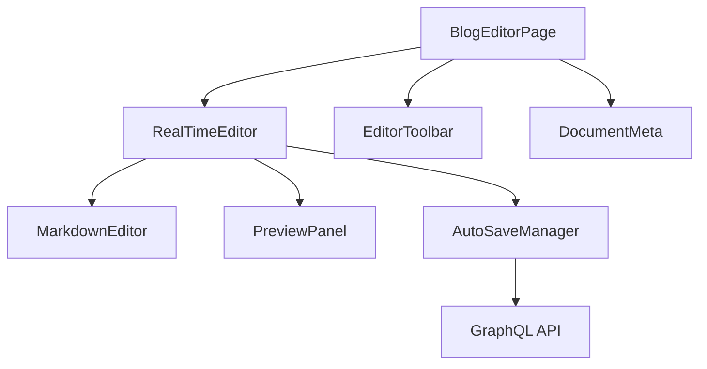

# 前端优化与后端集成设计文档

## 1. 概述

### 1.1 项目背景
本项目是一个前后端分离的博客平台，前端使用 React + TypeScript + Vite，后端使用 Go + GraphQL。当前需要对前端进行优化，实现类似 Notion 的在线实时编辑功能，提供在线实时编辑文章保存到后端的能力。

### 1.2 目标
- 实现文章的实时编辑和自动保存功能
- 优化前端编辑器体验，提供流畅的写作环境
- 完善与后端 GraphQL API 的集成
- 提供良好的用户体验和性能优化
- 支持文章的创建、编辑、发布、归档等全生命周期管理

## 2. 技术架构

### 2.1 前端技术栈
- React v19.1.0
- TypeScript
- Vite 6.3.5
- Apollo Client (GraphQL)
- Ant Design 组件库
- @uiw/react-md-editor (Markdown 编辑器)

### 2.2 后端技术栈
- Go 1.24+
- gqlgen GraphQL 框架
- GORM ORM
- SQLite (开发环境)

## 3. 功能设计

### 3.1 实时编辑功能
- 提供所见即所得的 Markdown 编辑体验
- 实现自动保存草稿功能
- 支持手动保存和发布文章
- 提供版本历史管理
- 支持实时协作编辑（未来扩展）

### 3.2 编辑器优化
- 分屏预览模式（编辑/预览/双栏）
- 实时语法高亮
- 快捷键支持
- 撤销/重做功能
- 代码块语法高亮
- 表格编辑支持

### 3.3 数据同步
- 与后端 GraphQL API 完美集成
- 离线编辑支持
- 冲突解决机制
- 加载状态和错误处理
- 实时保存状态反馈

## 4. 组件架构设计

### 4.1 核心组件

### 4.2 组件说明
1. **BlogEditorPage**: 文章编辑页面主组件，负责整体布局和状态管理
2. **RealTimeEditor**: 实时编辑器核心组件，集成编辑和预览功能
3. **EditorToolbar**: 编辑器工具栏，提供格式化、保存、发布等操作按钮
4. **DocumentMeta**: 文档元信息组件，显示和编辑文章标题、标签、分类、封面图片等信息
5. **MarkdownEditor**: Markdown 编辑器组件，基于 @uiw/react-md-editor 实现，支持实时编辑和预览
6. **PreviewPanel**: 实时预览面板，实时渲染 Markdown 内容
7. **AutoSaveManager**: 自动保存管理器，负责定时保存草稿和处理保存状态
8. **VersionHistory**: 版本历史管理组件，展示和恢复历史版本
9. **CollaborationPanel**: 协作面板（未来扩展），显示当前协作者和编辑状态

## 5. API 接口设计

### 5.1 GraphQL 查询
- `post(id: ID, slug: String)`: 获取文章详情
- `posts(...)`: 获取文章列表
- `postVersions(postId: ID!)`: 获取文章版本历史
- `me`: 获取当前用户信息
- `searchPosts(query: String!, limit: Int, offset: Int)`: 搜索文章

### 5.2 GraphQL 变更
- `createPost(input: CreatePostInput!)`: 创建文章
- `updatePost(id: ID!, input: UpdatePostInput!)`: 更新文章
- `deletePost(id: ID!)`: 删除文章
- `publishPost(id: ID!)`: 发布文章
- `archivePost(id: ID!)`: 归档文章
- `likePost(id: ID!)`: 点赞文章
- `unlikePost(id: ID!)`: 取消点赞
- `uploadImage(file: Upload!)`: 上传图片

## 6. 状态管理设计

### 6.1 编辑状态
- `content`: 当前编辑内容
- `isDirty`: 是否有未保存的更改
- `isSaving`: 是否正在保存
- `lastSavedAt`: 上次保存时间
- `autoSaveEnabled`: 是否启用自动保存
- `saveStatus`: 保存状态（成功、失败、保存中）
- `wordCount`: 文档字数统计
- `readingTime`: 预估阅读时间

### 6.2 Apollo Client 缓存策略
- 使用 Apollo Client 的缓存更新机制
- 实现乐观更新以提升用户体验
- 合理设置缓存失效策略
- 使用 Apollo 的 refetchQueries 和 update 选项保持数据一致性
- 实现本地状态管理与服务器状态分离

## 7. 性能优化方案

### 7.1 编辑器性能
- 使用防抖技术减少不必要的更新（如自动保存）
- 实现虚拟滚动处理长文档
- 优化 Markdown 渲染性能
- 使用 Web Workers 处理复杂计算
- 实现代码块语法高亮延迟加载
- 优化图片懒加载

### 7.2 网络优化
- 实现智能重试机制
- 使用 GraphQL 批量请求减少网络开销
- 合理设置缓存策略
- 实现离线编辑和同步机制
- 使用 HTTP/2 提升传输效率

## 8. 错误处理与用户体验

### 8.1 错误处理
- 网络错误重试机制
- 数据验证和错误提示
- 优雅降级处理
- 本地存储备份防止数据丢失
- 版本冲突检测和解决

### 8.2 用户体验
- 加载状态提示
- 保存状态反馈（自动保存提示、手动保存确认）
- 操作成功/失败提示
- 快捷键支持和键盘导航
- 响应式设计适配不同设备
- 实时字数统计和阅读时间估算
- 编辑历史时间线展示

## 9. 安全考虑

### 9.1 数据安全
- 内容输入验证和清理
- 防止 XSS 攻击
- 权限控制检查
- 敏感信息保护
- 防止 SQL 注入

### 9.2 认证授权
- JWT Token 管理
- 操作权限验证（作者或管理员才能编辑）
- 会话过期处理
- CSRF 保护
- 内容访问控制（公开、私有、受限）

## 10. 测试策略

### 10.1 单元测试
- 编辑器核心功能测试
- 自动保存逻辑测试
- API 调用测试
- 状态管理测试
- 防抖和性能优化测试

### 10.2 集成测试
- 与后端 GraphQL API 集成测试
- 数据同步测试
- 错误处理测试
- 权限控制测试
- 版本历史功能测试

### 10.3 端到端测试
- 完整编辑流程测试
- 发布和归档流程测试
- 用户体验测试
- 离线编辑和同步测试

## 11. 实时编辑与自动保存机制

### 11.1 自动保存策略
- **防抖保存**: 使用防抖技术，用户停止输入后延迟保存（如3秒）
- **定时保存**: 设置固定间隔自动保存（如每30秒）
- **状态变化保存**: 当文档状态发生重要变化时触发保存
- **网络状态适配**: 网络异常时保存到本地，网络恢复后同步

### 11.2 保存状态管理
- **保存队列**: 管理待保存的变更队列
- **冲突解决**: 检测和解决多端编辑冲突
- **版本控制**: 保存历史版本，支持回滚
- **本地缓存**: 离线状态下缓存编辑内容

### 11.3 用户反馈机制
- **保存状态提示**: 显示保存中、已保存、保存失败等状态
- **网络状态提示**: 网络异常时给出明确提示
- **离线编辑提示**: 提示用户当前处于离线编辑状态

## 12. 部署与监控

### 12.1 部署方案
- 前端静态资源部署
- 环境变量配置
- CDN 加速优化

### 12.2 监控方案
- 前端性能监控
- 错误日志收集
- 用户行为分析
- 编辑器使用统计
- 自动保存成功率监控

### 12.3 CI/CD
- 自动化测试和部署
- 代码质量检查
- 版本管理和回滚机制
- A/B 测试支持

## 13. 扩展功能设计

### 13.1 协作编辑（未来扩展）
- **实时光标位置**: 显示其他协作者的光标位置
- **实时编辑同步**: 多人同时编辑时实时同步变更
- **冲突高亮**: 高亮显示编辑冲突区域
- **聊天功能**: 内置协作用聊天功能

### 13.2 高级编辑功能
- **模板系统**: 提供文章模板
- **快捷短语**: 支持自定义快捷短语
- **AI 辅助写作**: 集成 AI 辅助写作功能
- **导出功能**: 支持导出为 PDF、Word 等格式
