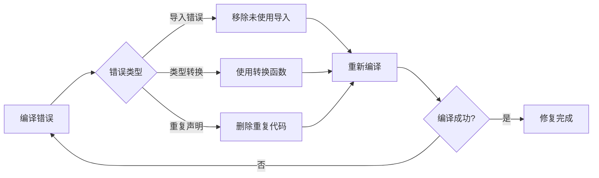

# Go GraphQL 解析器代码错误修复方案

## 概述
本设计文档针对 GraphQL 解析器文件 `schema.resolvers.go` 中的编译错误进行分析和修复。错误主要涉及：
- 未使用的包导入
- 类型转换错误  
- 重复方法声明
- 重复类型声明

## 错误分析

### 1. 导入错误
```
graph/schema.resolvers.go:9:2: "errors" imported and not used
```

**问题描述：** `errors` 包被导入但未在代码中使用。

### 2. 类型转换错误
```
graph/schema.resolvers.go:1594:15: cannot use post.ID (variable of type uint) as string value in struct literal
graph/schema.resolvers.go:1599:15: cannot use post.Author (variable of struct type models.User) as *User value in struct literal  
graph/schema.resolvers.go:1600:15: cannot use post.Tags (variable of type string) as []string value in struct literal
```

**问题描述：** 在转换 `models.BlogPost` 到 GraphQL `BlogPost` 类型时，存在类型不匹配：
- `post.ID` (uint) 不能直接赋值给 string 字段
- `post.Author` (models.User) 不能直接赋值给 *User 字段
- `post.Tags` (string) 不能直接赋值给 []string 字段

### 3. 重复方法和类型声明
```
graph/schema.resolvers.go:1791:25: method queryResolver.GetTrendingTags already declared at graph/schema.resolvers.go:1608:25
graph/schema.resolvers.go:1816:25: method queryResolver.Folders already declared at graph/schema.resolvers.go:1633:25
graph/schema.resolvers.go:1855:20: method Resolver.Mutation already declared at graph/schema.resolvers.go:1742:20
graph/schema.resolvers.go:1858:20: method Resolver.Query already declared at graph/schema.resolvers.go:1745:20
graph/schema.resolvers.go:1860:6: mutationResolver redeclared in this block
graph/schema.resolvers.go:1861:6: queryResolver redeclared in this block
```

**问题描述：** 存在重复的方法和类型声明，可能由于代码合并或生成时产生重复。

## 修复架构设计

### 数据类型映射架构
```mermaid
graph TD
    A[models.BlogPost] --> B[convertToGraphQLBlogPost函数]
    B --> C[GraphQL BlogPost类型]
    
    D[models.User] --> E[convertToGraphQLUser函数]
    E --> F[GraphQL User类型]
    
    G[uint ID] --> H[strconv.FormatUint]
    H --> I[string ID]
    
    J[string Tags] --> K[strings.Split]
    K --> L[[]string Tags]
```

### 错误处理流程


## 修复方案

### 1. 移除未使用的导入
**位置：** 第9行
**修复：** 删除 `"errors"` 导入

### 2. 修复类型转换错误
**位置：** 约第1590-1600行的BlogPost转换代码
**修复：** 使用现有的 `convertToGraphQLBlogPost` 函数替代直接赋值

**原有错误代码结构：**
```go
result[i] = &BlogPost{
    ID:        post.ID,           // uint -> string 错误
    Title:     post.Title,
    Content:   post.Content,
    CreatedAt: post.CreatedAt,
    UpdatedAt: post.UpdatedAt,
    Author:    post.Author,       // models.User -> *User 错误
    Tags:      post.Tags,         // string -> []string 错误
}
```

**修复后：**
```go
result[i] = convertToGraphQLBlogPost(post)
```

### 3. 删除重复声明
**影响范围：** 第1608行后的重复方法和类型声明
**修复：** 删除以下重复内容：
- 重复的 `GetTrendingTags` 方法 (约第1791行)
- 重复的 `Folders` 方法 (约第1816行) 
- 重复的 `Mutation()` 方法 (约第1855行)
- 重复的 `Query()` 方法 (约第1858行)
- 重复的 `mutationResolver` 类型声明 (约第1860行)
- 重复的 `queryResolver` 类型声明 (约第1861行)

### 4. 代码结构优化
**原则：**
- 保留第一次声明的方法和类型
- 删除所有重复声明
- 确保使用标准的类型转换函数
- 维护代码的一致性

## 修复验证

### 编译测试
```bash
cd /Users/shenyufei/WebstormProjects/playground/backend 
go run main.go
```

### 预期结果
- 无编译错误
- GraphQL服务正常启动
- 所有解析器方法可正常调用

## 类型转换函数说明

### convertToGraphQLBlogPost 函数
**功能：** 将 `models.BlogPost` 转换为 GraphQL `BlogPost` 类型
**处理：**
- ID: `uint` → `string` (使用 strconv.FormatUint)
- Author: `models.User` → `*User` (使用 convertToGraphQLUser)
- Tags: `string` → `[]string` (使用 strings.Split)
- Categories: `string` → `[]string` (使用 strings.Split)
- AccessLevel: `string` → `AccessLevel` 枚举
- Status: `string` → `PostStatus` 枚举

### convertToGraphQLUser 函数  
**功能：** 将 `models.User` 转换为 GraphQL `User` 类型
**处理：**
- ID: `uint` → `string`
- Role: `string` → `UserRole` 枚举

## 代码质量保证

### 修复后的代码特点
- 类型安全：所有类型转换通过专门函数处理
- 无重复：清理所有重复的方法和类型声明
- 一致性：使用统一的转换函数
- 可维护性：集中的类型转换逻辑

### 测试建议
1. 编译测试：确保无编译错误
2. 功能测试：验证 GraphQL 查询正常工作
3. 类型测试：确保所有数据类型转换正确
4. 集成测试：验证与前端的数据交互
