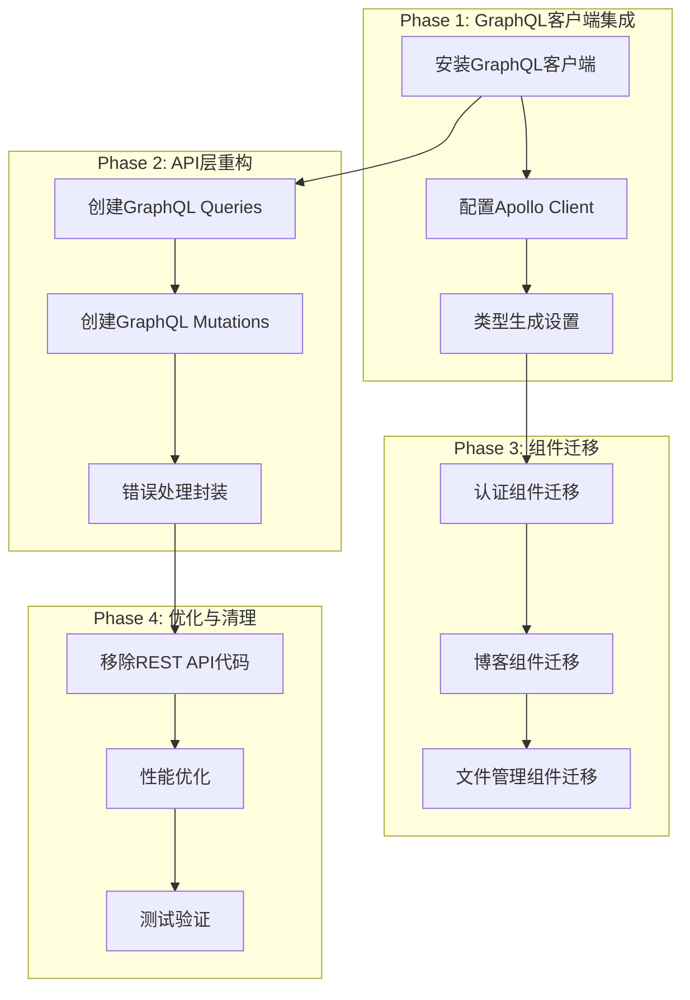
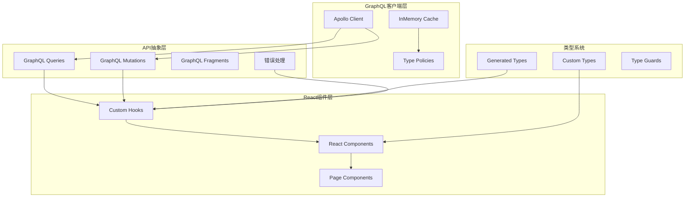

# 前端GraphQL迁移设计文档

## 概述

本文档详细说明了将现有React前端应用从REST API全面迁移到GraphQL API的设计方案。迁移将保持现有功能的同时，利用GraphQL的优势提升数据获取效率和开发体验。

## 技术栈分析

### 现有前端技术栈
- **框架**: React 19.1.0 + TypeScript
- **构建工具**: Vite 6.3.5
- **HTTP客户端**: Axios 1.9.0
- **路由**: React Router 7.6.1
- **UI框架**: Tailwind CSS 4.1.8 + daisyUI 5.0.43
- **状态管理**: Redux Toolkit 2.8.2
- **Markdown处理**: react-markdown, highlight.js, katex

### 后端GraphQL接口
- **GraphQL端点**: `/graphql` (公开), `/graphql/auth` (认证), `/graphql/admin` (管理员)
- **认证方式**: JWT Bearer Token
- **支持功能**: 用户认证、博客管理、文件操作、管理员功能

## 架构设计

### 迁移策略



### 新架构组件



## 实现方案

### 1. GraphQL客户端设置

#### 依赖安装
```bash
pnpm add @apollo/client graphql
pnpm add -D @graphql-codegen/cli @graphql-codegen/typescript @graphql-codegen/typescript-operations @graphql-codegen/typescript-react-apollo
```

#### Apollo Client配置
创建 `src/graphql/client.ts`：
- 配置GraphQL端点
- 设置认证头
- 配置缓存策略
- 错误处理链路

#### 类型生成配置
创建 `codegen.yml`：
- 从GraphQL Schema生成TypeScript类型
- 生成Apollo Client Hooks
- 配置Fragment和Operation类型

### 2. API层重构

#### GraphQL操作定义

**用户认证操作**
```graphql
# 用户登录
mutation Login($input: LoginInput!) {
  login(input: $input) {
    token
    refreshToken
    user {
      id
      username
      email
      role
      isVerified
      isActive
      avatar
      bio
      lastLoginAt
      emailVerifiedAt
    }
    expiresAt
  }
}

# 邮箱登录
mutation EmailLogin($input: EmailLoginInput!) {
  emailLogin(input: $input) {
    success
    message
  }
}

# 验证邮箱并登录
mutation VerifyEmailAndLogin($input: VerifyEmailInput!) {
  verifyEmailAndLogin(input: $input) {
    token
    refreshToken
    user {
      id
      username
      email
      role
      isVerified
    }
    expiresAt
  }
}

# 用户注册
mutation Register($input: RegisterInput!) {
  register(input: $input) {
    token
    refreshToken
    user {
      id
      username
      email
      role
      isVerified
      isActive
    }
    expiresAt
  }
}

# 用户登出
mutation Logout {
  logout {
    success
    message
  }
}

# 刷新Token
mutation RefreshToken {
  refreshToken {
    token
    refreshToken
    user {
      id
      username
      email
      role
    }
    expiresAt
  }
}

# 发送验证码
mutation SendVerificationCode($email: String!, $type: VerificationType!) {
  sendVerificationCode(email: $email, type: $type) {
    success
    message
  }
}

# 验证邮箱
mutation VerifyEmail($input: VerifyEmailInput!) {
  verifyEmail(input: $input) {
    success
    message
  }
}

# 请求密码重置
mutation RequestPasswordReset($input: RequestPasswordResetInput!) {
  requestPasswordReset(input: $input) {
    success
    message
  }
}

# 确认密码重置
mutation ConfirmPasswordReset($input: ConfirmPasswordResetInput!) {
  confirmPasswordReset(input: $input) {
    success
    message
  }
}

# 更新个人资料
mutation UpdateProfile($input: UpdateProfileInput!) {
  updateProfile(input: $input) {
    id
    username
    email
    bio
    avatar
    updatedAt
  }
}

# 修改密码
mutation ChangePassword($currentPassword: String!, $newPassword: String!) {
  changePassword(currentPassword: $currentPassword, newPassword: $newPassword) {
    success
    message
  }
}

# 获取当前用户
query Me {
  me {
    id
    username
    email
    role
    isVerified
    isActive
    avatar
    bio
    lastLoginAt
    emailVerifiedAt
    createdAt
    updatedAt
    posts(limit: 5) {
      id
      title
      slug
      status
      publishedAt
    }
    postsCount
  }
}

# 获取指定用户
query User($id: ID!) {
  user(id: $id) {
    id
    username
    email
    role
    isVerified
    isActive
    avatar
    bio
    createdAt
    posts(limit: 10) {
      id
      title
      slug
      excerpt
      publishedAt
      stats {
        viewCount
        likeCount
      }
    }
    postsCount
  }
}

# 获取用户列表（管理员）
query Users($limit: Int, $offset: Int, $search: String, $role: UserRole, $isVerified: Boolean) {
  users(limit: $limit, offset: $offset, search: $search, role: $role, isVerified: $isVerified) {
    id
    username
    email
    role
    isVerified
    isActive
    lastLoginAt
    createdAt
    postsCount
  }
}
```

**博客操作**
```graphql
# 获取博客文章列表
query Posts($limit: Int, $offset: Int, $filter: PostFilterInput, $sort: PostSortInput) {
  posts(limit: $limit, offset: $offset, filter: $filter, sort: $sort) {
    id
    title
    slug
    excerpt
    content
    tags
    categories
    coverImageUrl
    accessLevel
    status
    publishedAt
    lastEditedAt
    createdAt
    updatedAt
    author {
      id
      username
      avatar
      bio
    }
    stats {
      viewCount
      likeCount
      shareCount
      commentCount
      lastViewedAt
    }
    versions {
      id
      versionNum
      changeLog
      createdAt
      createdBy {
        id
        username
      }
    }
  }
}

# 获取单个博客文章
query Post($id: ID, $slug: String) {
  post(id: $id, slug: $slug) {
    id
    title
    slug
    excerpt
    content
    tags
    categories
    coverImageUrl
    accessLevel
    status
    publishedAt
    lastEditedAt
    createdAt
    updatedAt
    author {
      id
      username
      avatar
      bio
    }
    stats {
      viewCount
      likeCount
      shareCount
      commentCount
      lastViewedAt
      updatedAt
    }
    versions {
      id
      versionNum
      title
      content
      changeLog
      createdAt
      createdBy {
        id
        username
      }
    }
  }
}

# 获取文章版本历史
query PostVersions($postId: ID!) {
  postVersions(postId: $postId) {
    id
    versionNum
    title
    content
    changeLog
    createdAt
    createdBy {
      id
      username
      avatar
    }
  }
}

# 搜索文章
query SearchPosts($query: String!, $limit: Int, $offset: Int) {
  searchPosts(query: $query, limit: $limit, offset: $offset) {
    posts {
      id
      title
      slug
      excerpt
      tags
      categories
      publishedAt
      author {
        id
        username
        avatar
      }
      stats {
        viewCount
        likeCount
      }
    }
    total
    took
  }
}

# 获取热门文章
query PopularPosts($limit: Int) {
  getPopularPosts(limit: $limit) {
    id
    title
    slug
    excerpt
    publishedAt
    author {
      id
      username
      avatar
    }
    stats {
      viewCount
      likeCount
    }
  }
}

# 获取最新文章
query RecentPosts($limit: Int) {
  getRecentPosts(limit: $limit) {
    id
    title
    slug
    excerpt
    publishedAt
    author {
      id
      username
      avatar
    }
    stats {
      viewCount
      likeCount
    }
  }
}

# 获取热门标签
query TrendingTags($limit: Int) {
  getTrendingTags(limit: $limit)
}

# 创建博客文章
mutation CreatePost($input: CreatePostInput!) {
  createPost(input: $input) {
    id
    title
    slug
    excerpt
    content
    tags
    categories
    coverImageUrl
    accessLevel
    status
    publishedAt
    createdAt
    author {
      id
      username
    }
  }
}

# 更新博客文章
mutation UpdatePost($id: ID!, $input: UpdatePostInput!) {
  updatePost(id: $id, input: $input) {
    id
    title
    slug
    excerpt
    content
    tags
    categories
    coverImageUrl
    accessLevel
    status
    lastEditedAt
    updatedAt
  }
}

# 删除博客文章
mutation DeletePost($id: ID!) {
  deletePost(id: $id) {
    success
    message
  }
}

# 发布文章
mutation PublishPost($id: ID!) {
  publishPost(id: $id) {
    id
    status
    publishedAt
  }
}

# 归档文章
mutation ArchivePost($id: ID!) {
  archivePost(id: $id) {
    id
    status
  }
}

# 点赞文章
mutation LikePost($id: ID!) {
  likePost(id: $id) {
    id
    stats {
      likeCount
    }
  }
}

# 取消点赞
mutation UnlikePost($id: ID!) {
  unlikePost(id: $id) {
    id
    stats {
      likeCount
    }
  }
}
```

**文件管理操作**
```graphql
# 获取文件夹列表
query Folders {
  folders {
    name
    path
    createdAt
    fileCount
  }
}

# 获取文件列表
query Files($folder: String!) {
  files(folder: $folder) {
    name
    folder
    size
    createdAt
    updatedAt
  }
}

# 获取文件内容
query FileContent($folder: String!, $fileName: String!) {
  fileContent(folder: $folder, fileName: $fileName) {
    name
    folder
    content
    size
    createdAt
    updatedAt
  }
}

# 创建文件夹
mutation CreateFolder($input: CreateFolderInput!) {
  createFolder(input: $input) {
    name
    path
    createdAt
    fileCount
  }
}

# 上传Markdown文件
mutation UploadMarkdownFile($input: UploadMarkdownFileInput!) {
  uploadMarkdownFile(input: $input) {
    success
    message
    filePath
    fileName
  }
}

# 更新文件
mutation UpdateFile($input: UpdateFileInput!) {
  updateFile(input: $input) {
    name
    folder
    content
    size
    updatedAt
  }
}

# 删除文件
mutation DeleteFile($folder: String!, $fileName: String!) {
  deleteFile(folder: $folder, fileName: $fileName) {
    success
    message
  }
}

# 删除文件夹
mutation DeleteFolder($name: String!) {
  deleteFolder(name: $name) {
    success
    message
  }
}

# 上传图片
mutation UploadImage($file: Upload!) {
  uploadImage(file: $file) {
    imageUrl
    deleteUrl
    filename
    size
  }
}
```

**管理员操作**
```graphql
# 获取服务器仪表盘
query ServerDashboard {
  serverDashboard {
    serverTime
    hostname
    goVersion
    cpuCount
    goroutines
    memory {
      alloc
      totalAlloc
      sys
      heapAlloc
      heapSys
    }
    uptime
    userCount
    postCount
    todayRegistrations
    todayPosts
  }
}

# 获取邀请码列表
query InviteCodes($limit: Int, $offset: Int, $isActive: Boolean) {
  inviteCodes(limit: $limit, offset: $offset, isActive: $isActive) {
    id
    code
    createdBy {
      id
      username
    }
    usedBy {
      id
      username
    }
    usedAt
    expiresAt
    maxUses
    currentUses
    isActive
    description
    createdAt
  }
}

# 管理员创建用户
mutation AdminCreateUser($input: AdminCreateUserInput!) {
  adminCreateUser(input: $input) {
    id
    username
    email
    role
    isVerified
    isActive
    createdAt
  }
}

# 管理员更新用户
mutation AdminUpdateUser(
  $id: ID!
  $username: String
  $email: String
  $role: UserRole
  $isVerified: Boolean
  $isActive: Boolean
) {
  adminUpdateUser(
    id: $id
    username: $username
    email: $email
    role: $role
    isVerified: $isVerified
    isActive: $isActive
  ) {
    id
    username
    email
    role
    isVerified
    isActive
    updatedAt
  }
}

# 管理员删除用户
mutation AdminDeleteUser($id: ID!) {
  adminDeleteUser(id: $id) {
    success
    message
  }
}

# 创建邀请码
mutation CreateInviteCode($input: CreateInviteCodeInput!) {
  createInviteCode(input: $input) {
    id
    code
    expiresAt
    maxUses
    description
    createdAt
  }
}

# 停用邀请码
mutation DeactivateInviteCode($id: ID!) {
  deactivateInviteCode(id: $id) {
    success
    message
  }
}

# 清理缓存
mutation ClearCache {
  clearCache {
    success
    message
  }
}

# 重建搜索索引
mutation RebuildSearchIndex {
  rebuildSearchIndex {
    success
    message
  }
}
```

#### 自定义Hooks创建

**认证相关Hooks**
- `useAuth()`: 处理登录、注册、退出
- `useCurrentUser()`: 获取当前用户信息
- `useAuthStatus()`: 管理认证状态
- `useEmailLogin()`: 邮箱登录功能
- `usePasswordReset()`: 密码重置功能
- `useEmailVerification()`: 邮箱验证功能
- `useProfileUpdate()`: 个人资料更新
- `usePasswordChange()`: 密码修改

**博客相关Hooks**
- `usePosts()`: 博客列表获取和分页
- `usePost()`: 单个博客文章
- `useCreatePost()`: 创建文章
- `useUpdatePost()`: 更新文章
- `useDeletePost()`: 删除文章
- `usePostVersions()`: 文章版本历史
- `useSearchPosts()`: 搜索文章
- `usePopularPosts()`: 热门文章
- `useRecentPosts()`: 最新文章
- `useTrendingTags()`: 热门标签
- `usePostActions()`: 文章操作（点赞、发布、归档）

**文件管理Hooks**
- `useFolders()`: 文件夹管理
- `useFiles()`: 文件列表操作
- `useFileContent()`: 文件内容获取
- `useFileUpload()`: 文件上传
- `useImageUpload()`: 图片上传
- `useFileOperations()`: 文件CRUD操作

**管理员功能Hooks**
- `useServerDashboard()`: 服务器仪表盘
- `useUserManagement()`: 用户管理
- `useInviteCodeManagement()`: 邀请码管理
- `useSystemOperations()`: 系统操作（缓存清理等）

### 3. 组件迁移方案

#### 认证组件迁移

#### 认证组件迁移

**LoginPage组件重构**
```typescript
// 迁移前: 使用REST API
const handleLogin = async (formData) => {
  const response = await API.post('/auth/login', formData);
  // 处理响应...
};

// 迁移后: 使用GraphQL
const [loginMutation] = useLoginMutation();
const [emailLoginMutation] = useEmailLoginMutation();
const [verifyEmailAndLoginMutation] = useVerifyEmailAndLoginMutation();

const handleLogin = async (formData) => {
  const result = await loginMutation({
    variables: { input: formData }
  });
  // 处理结果...
};

const handleEmailLogin = async (email) => {
  await emailLoginMutation({
    variables: { input: { email } }
  });
};
```

**RegisterPage组件重构**
- 替换REST API调用为GraphQL Mutation
- 集成Apollo Client错误处理
- 优化表单验证和状态管理
- 支持邮箱验证流程
- 集成邀请码验证

**密码重置功能**
- 实现密码重置请求流程
- 密码重置确认功能
- 邮箱验证码发送和验证

**个人资料管理**
- 个人信息更新界面
- 头像上传功能
- 密码修改功能

#### 博客组件迁移

#### 博客组件迁移

**HomePage组件重构**
- 使用`usePostsQuery`替换REST API
- 实现GraphQL分页策略
- 集成实时缓存更新
- 支持文章筛选和排序
- 实现搜索功能
- 显示热门文章和最新文章
- 集成热门标签展示

**EditorPage组件重构**
- 使用GraphQL Mutations进行CRUD操作
- 实现乐观更新策略
- 集成文件上传GraphQL接口
- 支持文章版本管理
- 实现草稿保存功能
- 支持文章发布和归档
- 集成标签和分类管理

**PostDetailPage组件（新增）**
- 文章详情展示
- 版本历史查看
- 点赞功能实现
- 作者信息展示
- 相关文章推荐

**PostListPage组件重构**
- 文章列表展示
- 分页加载功能
- 筛选和排序功能
- 搜索结果展示
- 标签云功能

**MarkdownList组件重构**
- 使用GraphQL查询替换文件API
- 实现高效的数据获取
- 优化列表渲染性能
- 支持文件预览功能

#### 文件管理组件迁移

#### 文件管理组件迁移

**FoldersPage组件重构**
- 迁移到GraphQL文件夹查询
- 实现文件夹创建和管理
- 集成错误处理和加载状态
- 支持文件夹删除功能
- 显示文件夹统计信息

**FilePage组件重构**
- 使用GraphQL文件操作
- 实现文件上传和下载
- 优化用户体验
- 支持文件内容编辑
- 实现文件删除功能

**FileUploadComponent组件（新增）**
- Markdown文件上传
- 图片文件上传
- 拖拽上传功能
- 上传进度显示
- 批量上传支持

**FileEditorComponent组件（新增）**
- 在线文件编辑
- 实时预览功能
- 语法高亮支持
- 自动保存功能

### 5. 管理员功能组件

#### AdminDashboard组件（新增）
- 服务器状态监控
- 系统统计信息
- 用户活动概览
- 文章发布统计

#### UserManagement组件（新增）
- 用户列表管理
- 用户信息编辑
- 用户权限管理
- 用户状态控制

#### InviteCodeManagement组件（新增）
- 邀请码生成
- 邀请码列表
- 邀请码状态管理
- 使用统计查看

#### SystemManagement组件（新增）
- 缓存管理
- 搜索索引管理
- 系统配置
- 日志查看

### 4. 状态管理优化

#### Apollo Client缓存策略

**缓存配置**
```typescript
const cache = new InMemoryCache({
  typePolicies: {
    Query: {
      fields: {
        blogPosts: {
          keyArgs: ['searchTerm'],
          merge(existing = [], incoming, { args }) {
            // 实现分页合并逻辑
            if (args?.offset === 0) {
              return incoming;
            }
            return [...existing, ...incoming];
          }
        }
      }
    },
    BlogPost: {
      fields: {
        stats: {
          merge: true
        }
      }
    }
  }
});
```

**乐观更新策略**
- 创建文章时的即时UI反馈
- 点赞功能的乐观更新
- 用户信息更新的本地缓存

#### Redux集成方案

**保留Redux用于**
- 全局UI状态(主题、侧边栏状态)
- 用户首选项设置
- 复杂表单状态管理

**移除Redux处理**
- 服务器数据状态(由Apollo Client接管)
- API加载状态(使用GraphQL hooks)
- 缓存数据管理

### 5. 错误处理和加载状态

#### 统一错误处理

**GraphQL错误类型处理**
```typescript
const ErrorHandler = {
  // 网络错误
  handleNetworkError: (error: NetworkError) => {
    // 显示网络连接错误
  },
  
  // GraphQL错误
  handleGraphQLErrors: (errors: GraphQLError[]) => {
    errors.forEach(error => {
      switch(error.extensions?.code) {
        case 'UNAUTHENTICATED':
          // 重定向到登录页
          break;
        case 'FORBIDDEN':
          // 显示权限错误
          break;
        default:
          // 显示通用错误
      }
    });
  }
};
```

#### 加载状态管理

**统一Loading组件**
- 骨架屏加载效果
- 全局加载指示器
- 按钮级别的加载状态

**错误边界实现**
- GraphQL错误边界组件
- 网络错误重试机制
- 用户友好的错误展示

### 6. 性能优化策略

#### 查询优化

**Fragment复用**
```graphql
fragment UserBasic on User {
  id
  username
  email
  avatar
}

fragment BlogPostPreview on BlogPost {
  id
  title
  slug
  excerpt
  publishedAt
  author {
    ...UserBasic
  }
}
```

**按需加载**
- 路由级别的代码分割
- 组件级别的懒加载
- GraphQL查询的字段选择

#### 缓存优化

**缓存持久化**
- Apollo Client持久化缓存
- 离线数据访问
- 智能缓存失效策略

**数据预取**
- 路由变化时的数据预加载
- 用户交互的预测性数据获取
- 关键路径的数据预取

## 实施计划

### 第一阶段：基础设施搭建（第1周）
1. 安装和配置GraphQL客户端
2. 设置类型生成工具链
3. 创建基础Apollo Client配置
4. 建立错误处理框架
5. 配置开发环境和构建脚本

### 第二阶段：核心功能迁移（第2-3周）
1. 迁移用户认证功能（登录、注册、邮箱验证）
2. 迁移博客核心功能（CRUD、搜索、统计）
3. 迁移文件管理功能（文件夹、文件操作）
4. 实施基础测试用例
5. 实现密码重置和个人资料管理

### 第三阶段：高级功能和管理员功能（第4周）
1. 实现管理员仪表盘
2. 用户管理功能
3. 邀请码管理系统
4. 系统管理功能
5. 高级缓存策略实现
6. 性能优化和代码分割

### 第四阶段：优化和完善（第5周）
1. 错误处理完善
2. 用户体验优化
3. 全面功能测试
4. 性能测试和调优
5. 文档更新和代码审查

### 第五阶段：清理和发布（第6周）
1. 移除遗留REST API代码
2. 代码重构和优化
3. 最终测试验证
4. 部署准备和发布

## 风险评估和缓解方案

### 主要风险
1. **数据获取模式变化**: 从RESTful到GraphQL的思维转换
2. **缓存复杂性**: Apollo Client缓存管理的学习曲线
3. **类型安全**: GraphQL类型生成的正确配置
4. **性能影响**: 迁移过程中可能的暂时性能下降

### 缓解方案
1. **分阶段迁移**: 逐步替换而非一次性重写
2. **并行运行**: 迁移期间保持REST API可用
3. **全面测试**: 每个阶段都进行充分测试
4. **回滚计划**: 准备快速回滚到原有实现的方案

## 验收标准

### 功能完整性
- [ ] 所有现有功能在GraphQL版本中正常工作
- [ ] 用户认证和授权功能完整（登录、注册、邮箱验证、密码重置）
- [ ] 博客CRUD操作正常
- [ ] 文章版本管理功能
- [ ] 文章搜索和统计功能
- [ ] 文件管理功能完整
- [ ] 图片上传功能
- [ ] 管理员功能正常（用户管理、邀请码管理、系统管理）
- [ ] 服务器监控仪表盘
- [ ] 缓存和搜索索引管理

### 性能标准
- [ ] 页面加载时间不超过原版本的120%
- [ ] API响应时间平均提升15%以上
- [ ] 网络请求数量减少30%以上
- [ ] 缓存命中率达到80%以上

### 代码质量
- [ ] TypeScript类型覆盖率达到95%
- [ ] 单元测试覆盖率不低于80%
- [ ] 无遗留的REST API代码
- [ ] 代码符合项目规范和最佳实践

### 用户体验
- [ ] 加载状态和错误处理用户友好
- [ ] 离线功能基本可用
- [ ] 响应式设计保持良好
- [ ] 无明显的用户体验倒退

## 测试策略

### 单元测试
- GraphQL操作的Mock测试
- Custom Hooks的行为测试
- 组件渲染和交互测试

### 集成测试
- Apollo Client与组件的集成
- 端到端的用户流程测试
- GraphQL与后端的集成测试

### 性能测试
- 页面加载性能对比
- 内存使用情况监控
- 网络请求效率测试
