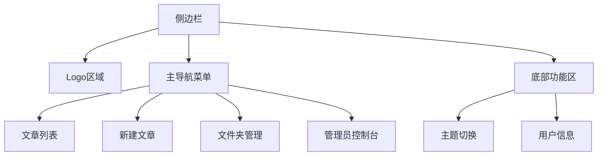
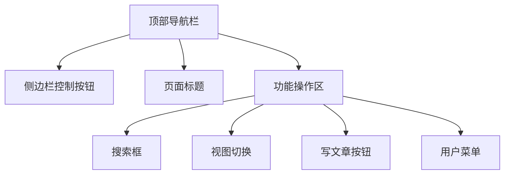
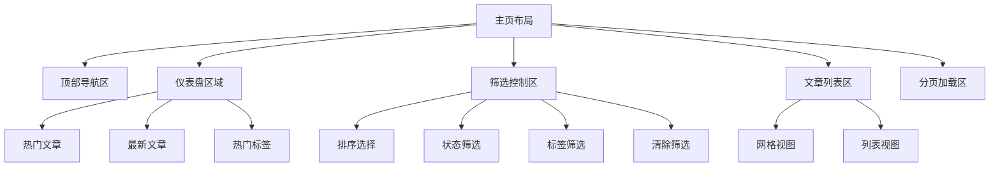
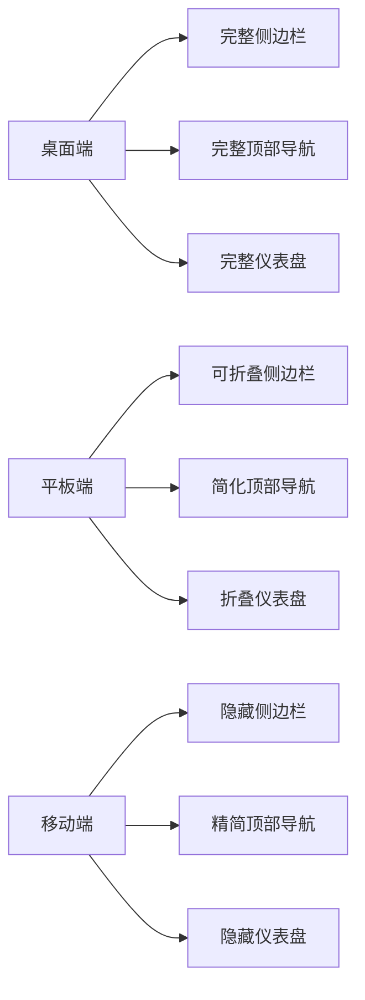

# 导航栏与主页设计优化方案

## 1. 概述

本文档旨在优化博客系统的导航栏和主页设计，提升用户体验和界面美观度。优化将重点关注导航栏的响应式设计、交互体验改进，以及主页内容布局和视觉呈现的优化。

## 2. 当前设计分析

### 2.1 导航栏现状

当前导航栏分为两部分：
1. 侧边栏(Sider)：包含主要导航菜单（文章列表、新建文章、文件夹管理、管理员控制台）
2. 顶部导航栏(Header)：包含侧边栏展开/收起按钮、用户信息、主题切换

存在的问题：
- 侧边栏在移动端显示不够友好
- 顶部导航栏功能较为简单，缺少搜索入口
- 用户操作入口不够直观

### 2.2 主页现状

主页包含以下功能模块：
1. 顶部导航栏（搜索框、视图切换、写文章按钮）
2. 仪表盘区域（热门文章、最新文章、热门标签）
3. 筛选和排序功能
4. 文章列表（网格视图和列表视图）

存在的问题：
- 导航栏与主页内容存在重复功能（搜索框）
- 仪表盘区域信息密度较高，可能影响主要文章列表的展示
- 筛选功能位置不够突出

## 3. 优化设计方案

### 3.1 导航栏优化

#### 3.1.1 侧边栏优化

优化点：
1. 增强移动端适配，侧边栏在小屏幕下默认收起
2. 优化菜单图标和文字显示，提升可读性
3. 添加底部功能区，将主题切换移至侧边栏底部

#### 3.1.2 顶部导航栏优化

优化点：
1. 重新设计搜索框，提升视觉层次
2. 将搜索框移至顶部导航栏中央位置，提高可见性
3. 优化用户菜单显示，增加头像和用户名显示

### 3.2 主页优化

#### 3.2.1 布局结构调整

优化点：
1. 重新组织仪表盘区域，使用更清晰的卡片布局
2. 优化筛选控制区，使其更加直观易用
3. 改进文章列表的视觉呈现，提升阅读体验

#### 3.2.2 响应式设计优化

优化点：
1. 针对不同屏幕尺寸提供不同的布局方案
2. 移动端隐藏侧边栏，默认使用汉堡菜单
3. 移动端隐藏仪表盘，可通过按钮展开

## 4. 详细设计说明

### 4.1 导航栏详细设计

#### 4.1.1 侧边栏设计
- Logo区域：保持现有设计，增加品牌识别度
- 主导航菜单：
  - 使用更大图标和清晰文字
  - 根据用户权限动态显示菜单项
  - 添加菜单项的活跃状态指示
- 底部功能区：
  - 主题切换开关
  - 用户信息显示（头像、用户名）
  - 退出登录按钮

#### 4.1.2 顶部导航栏设计
- 侧边栏控制按钮：
  - 桌面端：正常显示展开/收起按钮
  - 移动端：显示汉堡菜单按钮
- 页面标题：
  - 根据当前页面动态显示标题
  - 在小屏幕设备上可自动隐藏
- 功能操作区：
  - 搜索框：居中显示，增加搜索建议功能
  - 视图切换：使用图标按钮，保持现有设计
  - 写文章按钮：保持现有设计，增加明显标识
  - 用户菜单：显示用户头像和用户名，下拉菜单包含个人资料、管理员控制台(管理员)、退出登录等选项

### 4.2 主页详细设计

#### 4.2.1 仪表盘区域设计
- 热门文章卡片：
  - 显示文章标题和浏览量
  - 点击可直接跳转到文章详情
  - 限制显示数量为3条
- 最新文章卡片：
  - 显示文章标题和发布时间
  - 点击可直接跳转到文章详情
  - 限制显示数量为3条
- 热门标签卡片：
  - 以标签云形式展示热门标签
  - 点击标签可直接筛选相关文章
  - 限制显示数量为8个

#### 4.2.2 筛选控制区设计
- 排序选择：
  - 下拉菜单选择排序字段（创建时间、发布时间、浏览量、点赞数）
  - 默认按发布时间倒序排列
- 状态筛选：
  - 下拉菜单选择文章状态（全部、已发布、草稿、已归档）
  - 仅管理员可见草稿和已归档选项
- 标签筛选：
  - 通过热门标签卡片进行快速筛选
  - 支持多标签筛选
- 清除筛选：
  - 当存在筛选条件时显示
  - 点击可清除所有筛选条件

#### 4.2.3 文章列表区设计
- 网格视图：
  - 使用卡片形式展示文章
  - 显示文章封面、标题、摘要、标签、作者信息、统计数据
  - 响应式网格布局，自动适配不同屏幕尺寸
- 列表视图：
  - 使用列表形式展示文章
  - 显示文章封面、标题、摘要、作者信息、统计数据
  - 更适合内容较多的场景

## 5. 交互优化

### 5.1 导航交互优化
1. 侧边栏动画效果优化，提供更流畅的展开/收起体验
2. 菜单项增加悬停效果，提升交互反馈
3. 用户菜单增加快捷操作，如快速跳转到个人资料页

### 5.2 搜索交互优化
1. 搜索框增加实时搜索建议功能
2. 支持快捷键（Ctrl/Cmd+K）快速聚焦搜索框
3. 搜索结果页面优化，提供更清晰的结果展示

### 5.3 响应式交互优化
1. 移动端使用汉堡菜单替代完整侧边栏
2. 触摸友好的按钮和链接设计
3. 屏幕旋转时自动适配布局

## 6. 视觉设计优化

### 6.1 颜色方案
- 主色调：保持Ant Design默认主题
- 导航栏背景：使用半透明毛玻璃效果
- 卡片组件：增加阴影和圆角，提升层次感

### 6.2 字体和排版
- 标题使用更大字号，增强视觉层次
- 正文使用合适的行高和字间距，提升可读性
- 重要信息使用加粗或不同颜色突出显示

### 6.3 图标和图像
- 统一使用Ant Design图标库
- 文章封面图增加占位符和加载状态
- 优化图标大小和颜色，确保在不同背景下清晰可见

## 7. 性能优化

### 7.1 加载性能
- 仪表盘数据懒加载，优先加载文章列表
- 图片懒加载，提升首屏渲染速度
- 组件按需加载，减少初始包大小

### 7.2 响应性能
- 使用React.memo优化组件重渲染
- 减少不必要的状态更新
- 优化列表渲染，使用虚拟滚动处理大量数据

## 8. 可访问性优化

### 8.1 键盘导航
- 支持Tab键在导航元素间切换
- 支持Enter键激活当前焦点元素
- 提供键盘快捷键操作

### 8.2 屏幕阅读器支持
- 为所有交互元素添加适当的ARIA标签
- 确保页面结构语义化
- 提供足够的颜色对比度

## 9. 测试策略

### 9.1 功能测试
- 验证导航栏各功能按钮正常工作
- 验证主页各模块正确显示和交互
- 验证不同用户权限下的显示差异

### 9.2 兼容性测试
- 测试不同浏览器下的显示效果
- 测试不同屏幕尺寸下的响应式表现
- 测试移动端触摸操作的流畅性

### 9.3 性能测试
- 测试页面加载速度
- 测试大量数据下的渲染性能
- 测试交互响应时间
