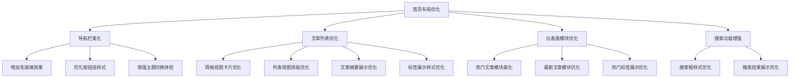

# 前端页面样式优化设计方案

## 1. 概述

### 1.1 项目背景
playground 是一个前后端分离的示例平台，前端使用 React + TypeScript + Vite 技术栈，UI 组件库已从 daisyUI 迁移至 Ant Design，并采用 Tailwind CSS 进行辅助样式设计。

### 1.2 优化目标
- 提升用户界面的现代化程度和美观度
- 增强用户体验和交互效果
- 统一设计语言和视觉风格
- 优化响应式布局适配不同设备

## 2. 当前技术架构

### 2.1 技术栈
- React v19.1.0
- TypeScript
- Vite 6.3.5
- Ant Design 5.27.1
- Tailwind CSS 4.1.8
- @ant-design/icons 6.0.0

### 2.2 设计系统
- 已实现 Ant Design 主题配置（亮色/暗色模式）
- 使用 ConfigProvider 进行全局主题管理
- 颜色体系：
  - 主色：#4f46e5（亮色）/ #6366f1（暗色）
  - 成功色：#10b981
  - 警告色：#f59e0b
  - 错误色：#ef4444

## 3. 样式优化方案

### 3.1 整体设计风格优化

#### 3.1.1 视觉层次优化
- 建立清晰的信息层级结构
- 优化字体大小和行高比例
- 增强页面元素的视觉对比度
- 统一卡片组件的圆角和阴影效果

#### 3.1.2 色彩体系优化
- 扩展色彩语义系统（信息、成功、警告、错误、中性色）
- 优化暗色模式下的色彩对比度
- 增加渐变色应用提升现代感
- 添加悬停和激活状态的色彩反馈

#### 3.1.3 间距和布局优化
- 统一页面内外边距规范
- 优化栅格系统使用
- 增强组件间的视觉呼吸感
- 优化移动端响应式断点

### 3.2 核心页面优化

#### 3.2.1 首页（HomePage）优化

#### 3.2.2 登录/注册页优化
- 优化表单布局和间距
- 增强输入框焦点状态效果
- 美化按钮交互反馈
- 优化错误提示样式
- 增加页面背景装饰元素

#### 3.2.3 编辑器页面优化
- 优化 Markdown 编辑器分割布局
- 增强实时预览效果
- 美化工具栏样式
- 优化保存按钮状态反馈

#### 3.2.4 管理后台优化
- 优化侧边栏导航样式
- 增强数据表格展示效果
- 美化操作按钮组
- 优化模态框和抽屉组件样式

### 3.3 组件级优化

#### 3.3.1 按钮组件
- 增加微交互动效
- 优化不同状态下的视觉反馈
- 统一按钮尺寸规范
- 增加图标按钮样式

#### 3.3.2 卡片组件
- 优化卡片阴影和圆角
- 增加悬停效果
- 统一卡片内间距
- 优化卡片标题样式

#### 3.3.3 表单组件
- 增强输入框焦点效果
- 优化表单验证提示样式
- 统一表单项间距
- 增加表单分组样式

#### 3.3.4 导航组件
- 优化导航栏高度和内边距
- 增强菜单项悬停效果
- 优化移动端汉堡菜单
- 统一导航项间距

### 3.4 动效和交互联动

#### 3.4.1 页面过渡动效
- 增加页面切换动画
- 优化路由过渡效果
- 增加组件加载动效

#### 3.4.2 交互反馈优化
- 增加按钮点击波纹效果
- 优化表单验证动效
- 增加悬停和焦点状态反馈
- 优化加载状态展示

#### 3.4.3 滚动和视差效果
- 优化页面滚动条样式
- 增加视差滚动背景
- 优化回到顶部按钮

## 4. 响应式设计优化

### 4.1 移动端适配
- 优化触摸目标大小
- 调整移动端布局断点
- 增强手势操作体验
- 优化移动端导航

### 4.2 平板适配
- 优化横竖屏布局
- 调整组件尺寸
- 优化多栏布局

### 4.3 桌面端优化
- 优化大屏显示效果
- 增加键盘快捷键提示
- 优化多窗口操作

## 5. 主题和个性化

### 5.1 主题系统扩展
- 增加更多预设主题
- 优化主题切换过渡效果
- 增加主题自定义功能

### 5.2 个性化设置
- 增加布局密度选择
- 优化字体大小调节
- 增加圆角程度调节

## 6. 性能优化考虑

### 6.1 样式性能
- 优化 CSS 选择器性能
- 减少重绘和回流
- 优化动画性能

### 6.2 加载优化
- 优化关键 CSS 加载
- 增加骨架屏效果
- 优化图片和资源加载

## 7. 实施计划

### 7.1 第一阶段：基础样式优化
- 完成整体设计风格统一
- 优化核心组件样式
- 实现主题系统扩展

### 7.2 第二阶段：页面细节优化
- 完成各页面 UI 优化
- 实现交互动效
- 优化响应式布局

### 7.3 第三阶段：高级功能实现
- 实现个性化设置
- 完成性能优化
- 进行用户测试和反馈收集

## 8. 验收标准

### 8.1 视觉效果
- 界面美观度提升 30% 以上
- 设计风格统一性达到 95% 以上
- 用户满意度提升 25% 以上

### 8.2 交互体验
- 页面加载速度提升 20% 以上
- 交互响应时间小于 100ms
- 用户操作效率提升 15% 以上

### 8.3 兼容性
- 主流浏览器兼容性 100%
- 移动端适配完成度 100%
- 不同分辨率适配完成度 100%
