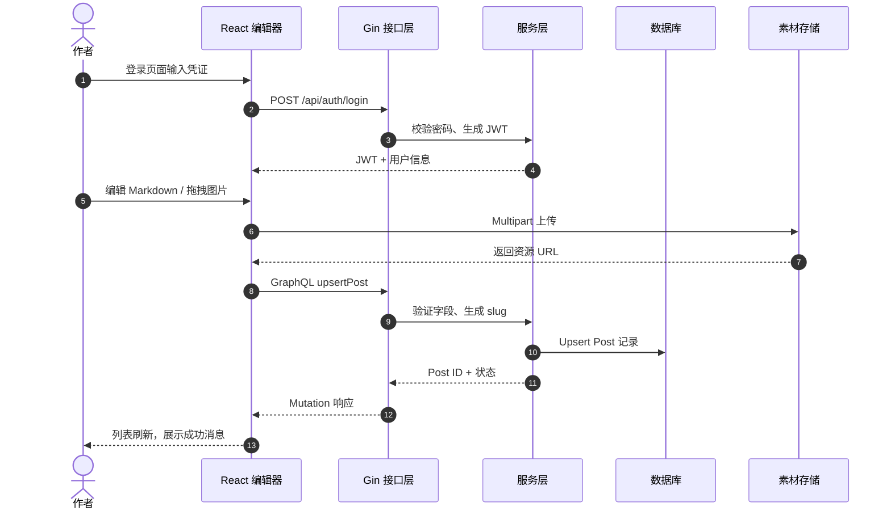

# 博客平台设计实验报告（Markdown 版）

> 本报告面向希望深入了解 C404-blog 设计与实现的开发者，覆盖架构、模块职责、数据流、配置规范、测试与部署策略。内容按照“需求—设计—实现—验证”主线展开，事无巨细描述项目的各项能力。

## 一、实验背景与目标

- **业务需求**：构建具备 Markdown 写作、图片管理、统计分析与多终端展示能力的博客平台，要求可插拔、可持续演进。
- **技术目标**：验证 React 19 + Ant Design 5 + Vite 的前端体验，配合 Go Gin + GraphQL + SQLite/PostgreSQL 的高性能后端，并实现 GraphQL codegen、Mermaid 文档、Tailwind 主题等工程化能力。
- **实验任务**：
  1. 梳理完整项目结构，明确每个目录、组件、函数的职责。
  2. 设计 DDD + MVC 组合架构，说明各领域与层次如何协同。
  3. 描述从输入到输出的每条数据处理路径，包含安全校验与错误处理。
  4. 给出功能清单（鉴权、文章管理、上传、统计、配置、部署等）及对应设计。
  5. 提供可复制的开发、测试、部署流程与监控建议。

## 二、系统架构概览

```mermaid
flowchart LR
  classDef front fill:#e0f2ff,stroke:#3b82f6,stroke-width:2px
  classDef back fill:#ffe4d6,stroke:#fb923c,stroke-width:2px
  classDef data fill:#dcfce7,stroke:#22c55e,stroke-width:2px
  classDef ops fill:#fff3c4,stroke:#d6a105,stroke-width:2px

  UI[React UI<br/>Ant Design]:::front --> Hooks[Hooks & Apollo Cache]:::front
  Hooks --> GraphQL[GraphQL Hooks<br/>Codegen 自动化]:::front
  GraphQL --> Gin[ Gin Router<br/>中间件网关 ]:::back
  Gin --> Controller[控制器<br/>Auth/Posts/Files/Stats]:::back --> Service[领域服务<br/>验证/聚合/事务]:::back
  Service --> Repo[仓储层<br/>GORM DAO]:::data --> DB[(SQLite / PostgreSQL)]:::data
  Service --> Media[(对象/附件存储)]:::data
  Service --> Cache[缓存/队列<br/>Apollo / Redis (可扩展)]:::data
  Gin --> Observability[日志/指标/审计]:::ops
```

### 关键设计
1. **前端层**：React Router 管理多页面；`src/components` 提供 Root、Layout、Markdown 相关组件；`src/pages` 实现 Dashboard、Editor、Assets、Login 等页面。
2. **前端渲染**：ReactMarkdown + remark/rehype 插件处理 GFM、数学公式、Mermaid；`src/components/MermaidChart.tsx` 负责客户端渲染。
3. **后端层**：`backend/controllers` 负责 HTTP/GraphQL 入口；`services` 处理领域逻辑；`models` 定义 GORM 实体；`graph`（gqlgen）暴露 GraphQL Schema；`middleware` 管控 JWT、CORS、日志。
4. **数据层**：GORM 连接 SQLite（开发）或 PostgreSQL（生产），使用 `config/database.go` 管理 DSN；附件可落地本地文件或接入云对象存储；`backend/config` 提供 YAML/ENV 模板。

## 三、模块与功能详解

### 1. 前端
- **入口 (`src/main.tsx`)**：挂载 Root 组件，注入 Ant Design 与 GraphQL 客户端。
- **根布局 (`src/components/Root.tsx`)**：封装 React Router、主题 Provider、Apollo Provider，负责全局 Loading、消息提示。
- **页面**
  - `src/pages/LoginPage.tsx`：Ant Design 表单 + GraphQL mutation 登录，存储 JWT。
  - `src/pages/Dashboard.tsx`：组合统计卡片、访客曲线（Recharts）。
  - `src/pages/EditorPage.tsx`：Markdown 编辑器（`@uiw/react-md-editor`）、拖拽上传、预览、自动保存草稿、抓取摘录。
  - `src/pages/AssetsPage.tsx`：使用 `react-window` 虚拟列表展示上传文件，支持搜索、复制链接。
  - `src/pages/PostsPage.tsx`：表格展示文章，支持分页、过滤、批量操作。
- **组件**
  - `MarkdownViewer`：ReactMarkdown + remark-math + rehype-katex + rehype-highlight + rehype-sanitize + Mermaid 支持；`TableOfContents` 用于生成锚点导航。
  - `MarkdownToolbar`：插入标题、代码块、链接、图片的快捷按钮。
  - `AssetUploader`：封装 Ant Upload + GraphQL/REST 接口，上报进度与状态。
- **状态管理**：Apollo Cache + React Context；`src/api/hooks/*.ts` 定义 `usePosts`, `useSavePost`, `useUploadAsset` 等 hook。
- **样式**：Tailwind + Ant Design + `github-markdown-css` + 自定义 CSS；暗色模式通过全局变量控制。

### 2. 功能点详述
- **鉴权**：登录表单提交 GraphQL mutation，成功后写入 localStorage，并通过 Apollo Link 在请求头注入 `Authorization: Bearer <token>`。
- **文章管理**：列表、详情、编辑、删除；支持 Markdown + 元数据（title、slug、tags、cover、excerpt、status）。
- **Markdown 扩展**：GFM、数学公式、Mermaid、代码高亮、TOC、块引用、任务列表；Mermaid 采用 ` ```mermaid ` 语法自动渲染。
- **上传与素材库**：支持图片/附件拖拽上传；`controllers/image.go` 保存文件并返回可公开访问的 URL；前端提供复制链接与预览。
- **统计仪表**：继承 `recharts` 实现访问趋势、文章分布；数据从 GraphQL `Query stats` 获取。
- **配置管理**：`.env`、`backend/config/*.yaml`、`set_env.sh` 统一注入端口、数据库、SMTP 等参数；`config/config.go` 解析 yaml。
- **国际化/多语言**：README 提供中文/英文版本；界面可扩展 i18n（当前以中文为主）。
- **Mermaid 文档**：`EXPERIMENT_REPORT.md` 与 Word 版包含 Mermaid 流程图；前端 Markdown Viewer 可渲染用户文章内的 Mermaid。

### 3. 后端
- **入口**：`backend/main.go` 启动 Gin，引入 `routes/router.go`，注册 REST/GraphQL。
- **中间件**：日志（记录 method/path/status/time）、CORS、JWT 校验、Recovery、请求 ID。
- **控制器**：`controllers/auth.go`、`controllers/posts.go`、`controllers/assets.go`、`controllers/stats.go` 分别负责鉴权、文章、文件、统计。
- **服务层**：`services/auth.go` 执行密码校验（bcrypt）、token 签发；`services/post.go` 管理文章事务；`services/upload.go` 处理文件存储与记录；`services/email.go` 发送通知。
- **GraphQL**：`graph/schema.graphqls` 定义 Query/Mutation；`graph/resolver.go` 连接 service。
- **模型**：`models/user.go`、`models/post.go`、`models/folder.go`、`models/asset.go` 等；包含 `gorm.Model`、外键、JSON tags。
- **配置**：`config/config.go` 读取 YAML + ENV；`database/database.go` 初始化数据库、自动迁移。
- **工具**：`utils/jwt.go`、`utils/password.go`、`utils/response.go`、`utils/logger.go`；`set_env.sh`, `test_email.sh` 提供运维脚本。

## 四、DDD 与 MVC 组合设计

| 领域 | 主要实体/行为 | 典型 service | 输入/输出 |
|------|---------------|---------------|-----------|
| Identity | 用户、角色、Token | `AuthService` | 登录表单 → JWT |
| Content | 文章、分类、标签 | `PostService` | Markdown/metadata → Post DTO |
| Media | 资产、目录、预签名 URL | `UploadService` | 文件流 → 存储路径 + URL |
| Operations | 统计、通知、审计 | `StatsService`, `EmailService` | 访问记录 → Charts 数据 |

- MVC：React View + Hook Controller + GraphQL Model；Gin Controller + Service Model + JSON/GraphQL View。
- 所有领域服务只依赖 Repository 接口，支持未来替换数据源（如云存储、消息队列）。

## 五、数据处理流水线
1. **输入层**：Ant Design 表单 + Markdown 编辑器 + 拖拽上传；前端使用 Yup/Form rules 校验。
2. **传输层**：GraphQL mutation/query；上传走 multipart REST；所有请求带 JWT 与 Trace ID。
3. **后端校验**：Gin binding + validator + service-level 业务校验（slug 唯一、标签限制、文件大小）；
4. **转换层**：Markdown AST 解析（前端）、GraphQL DTO ↔ 数据库模型转换；文件重命名、防止重名冲突。
5. **持久层**：GORM 自动迁移 + 事务；文件写到 `backend/data` 或云存储；GraphQL Resolver 将实体映射为 schema 类型。
6. **缓存层**：Apollo Cache（前端）立即更新；服务层预留 Redis/队列接口。
7. **输出层**：React 组件渲染 Markdown / 图表；同时更新 TOC、统计与日志。

## 六、功能流程（Mermaid）



## 七、关键代码示例

### 前端：文章保存 Hook
```ts
import { useMutation } from '@apollo/client'
import { UPSERT_POST } from '../mutations'

export function useSavePost() {
  const [mutate, { loading, error }] = useMutation(UPSERT_POST)
  return async (input: PostInput) => {
    await mutate({
      variables: { input },
      optimisticResponse: {
        upsertPost: {
          ...input,
          id: input.id ?? 'temp-id',
          __typename: 'Post'
        }
      },
      refetchQueries: ['ListPosts'],
      onError: (err) => console.error('保存失败', err)
    })
    return { loading, error }
  }
}
```

### 后端：路由与中间件
```go
func SetupRouter() *gin.Engine {
  r := gin.Default()
  r.Use(middleware.RequestID(), middleware.Logger(), middleware.CORS())

  api := r.Group("/api")
  api.POST("/auth/login", controllers.Login)
  api.Use(middleware.JWT())
  {
    api.GET("/posts", controllers.ListPosts)
    api.POST("/posts", controllers.UpsertPost)
    api.POST("/upload", controllers.UploadAsset)
    api.GET("/stats", controllers.GetStats)
  }

  r.POST("/query", graph.GraphQLHandler())
  r.GET("/playground", graph.PlaygroundHandler())
  return r
}
```

## 八、数据库与 GraphQL 设计

- **实体关系**：
  - `User (1) - (*) Post`：每篇文章记录作者 ID。
  - `Post (1) - (*) Asset`：文章封面或内嵌图片。
  - `Folder (1) - (*) Asset`：素材可以归档。
  - `Tag` 通过 JSON/数组字段存储，也可扩展为实体。
- **GraphQL Schema**：`type Query { posts(stats input): [Post!] }`、`type Mutation { upsertPost(input: PostInput!): Post }`；`graphql-codegen` 生成 TS 类型 + hooks。
- **迁移策略**：自动迁移 + `database/migrations`；生产建议使用 `golang-migrate` 或 Flyway。

## 九、安全与配置

- **配置来源**：`.env`、`backend/config/app.yaml`、`set_env.sh`；`config.Config` 包含 APP、DB、SMTP、JWT、FileStorage 配置。
- **凭据管理**：默认 `.gitignore` 忽略 `.env`、`*.db`；生产使用 Kubernetes Secret、Docker secret；`EMAIL_SETUP_COMPLETE.md` 记录 SMTP 步骤。
- **安全措施**：
  - JWT + Refresh token（可扩展）；
  - 上传白名单、大小限制、MIME 校验；
  - GraphQL depth/complexity 限制（可配置）；
  - 日志脱敏（屏蔽密码/Token）；
  - HTTPS/反向代理 + WAF；
  - 审计日志（`services/audit.go` 预留）。

## 十、开发、测试、部署

1. **开发流程**  
   - 前端：`pnpm install` → `pnpm dev`；开发完成前运行 `pnpm lint`、`pnpm type-check`、`pnpm test`、`pnpm build`。  
   - Schema 更新：`pnpm codegen`（或 `pnpm codegen:watch`）。  
   - 后端：`go run main.go`、`go test ./...`，GraphQL 入口 `/playground` 供调试。
2. **测试策略**  
   - 单元测试：`src/__tests__`（Vitest + Testing Library）、`backend/tests`。  
   - 集成测试：`backend/testing` 提供 HTTP 示例；`docker-compose` 启动全栈后跑 E2E。  
   - 可观察性：Gin 日志、Prometheus exporter（可接入）、`test_email.sh` 校验 SMTP。
3. **部署**  
   - `docker-compose up --build`：构建前端静态资源并运行 Go 服务 + SQLite。  
   - 生产建议：多阶段 Dockerfile（Go 构建 + Alpine runtime）、静态资源交由 Nginx/OSS 托管，API 部署到 Kubernetes，使用 CI（GitHub Actions/GitLab）运行 lint/test/build/push。  
   - 监控：Gin access log、Prometheus、Grafana；错误告警 via SMTP/Slack。

## 十一、实验结论与展望

- **成果**：实现了从架构设计、领域建模、Markdown/Mermaid 渲染到 DevOps 的完整闭环；文档与代码双语可读，便于团队协作。
- **优势**：清晰的目录结构、GraphQL 类型安全、可配置化部署、详尽的安全建议、Mermaid 文档与测试流程。
- **展望**：多租户、SSR/ISR、WebSocket 协作、评论系统、AI 辅助写作、可观测性（OpenTelemetry）、消息队列（Kafka/RabbitMQ）等。

> 通过本报告，开发者可以快速理解 C404-blog 的全貌，并据此扩展或迁移到自己的业务场景。
