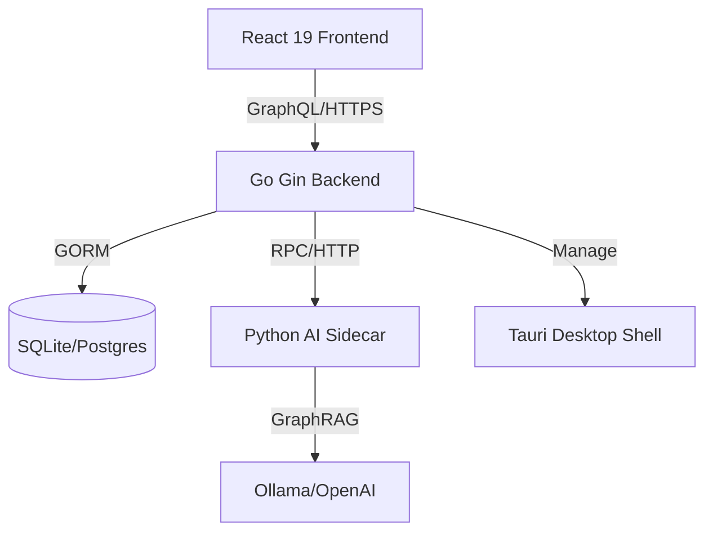

# C404-blog / Playground


A sophisticated full-stack blogging and knowledge management platform. Built with a modern architecture featuring a Go-powered GraphQL backend, a React 19 frontend with rich interactive visualizations, and an integrated Python AI sidecar.

---

## 🚀 Get Started in 5 Minutes

This tutorial will help you set up the development environment and run the project locally for the first time.

### 1. Prerequisites
Ensure you have the following installed:
- **Node.js** (v20+) & **pnpm** (v10+)
- **Go** (v1.25+)
- **Python** (v3.10+) with `uv` (recommended)
- **SQLite** (for local development)

### 2. Clone and Install
```bash
git clone https://github.com/your-repo/C404-blog.git
cd C404-blog
pnpm install
```

### 3. Initialize the Backend
```bash
cd backend
cp .env.example .env # Configure your local secrets
go run main.go
```
The backend will start at `http://localhost:11451`.

### 4. Start the Frontend
In a new terminal (root directory):
```bash
pnpm dev
```
Open `http://localhost:5173` to view the application.

---

## 🛠 How-to Guides

### How to Configure AI Features
The AI sidecar provides smart suggestions and graph RAG capabilities.
1. Navigate to `ai_service/`.
2. Install dependencies: `uv sync`.
3. Configure `.env` with your LLM provider (OpenAI/Ollama).
4. Run: `python main.py`.

### How to Synchronize GraphQL Types
Whenever you modify `backend/graph/schema.graphql`:
1. Generate Go code: `cd backend && go generate ./...`
2. Generate Frontend types: `pnpm codegen`

### How to Build for Desktop (Tauri)
This project supports native desktop builds:
```bash
pnpm tauri build
```

---

## 📚 Reference

### Tech Stack
| Layer | Technologies |
| :--- | :--- |
| **Frontend** | React 19, Vite, Tailwind CSS 4, Ant Design 5, Apollo Client |
| **Backend** | Go 1.25, Gin, Gorm (SQLite/Postgres), gqlgen (GraphQL) |
| **Desktop** | Tauri 2.0 (Rust) |
| **AI Sidecar** | Python, FastAPI/Flask, GraphRAG |
| **Database** | SQLite (Dev), PostgreSQL (Prod), Redis (Cache) |
| **Visualization** | @xyflow/react (Knowledge Graph), Mermaid, Recharts |

### Project Structure
- `/backend`: Core Go service and GraphQL resolvers.
- `/src`: React frontend application.
- `/ai_service`: Python-based AI microservice.
- `/src-tauri`: Rust configuration for desktop deployment.
- `/deploy`: Docker, Nginx, and Systemd deployment scripts.

### Environment Variables
Key variables required in `backend/.env`:
- `DB_TYPE`: `sqlite` or `postgres`
- `JWT_SECRET`: Secret for auth tokens
- `GITHUB_CLIENT_ID/SECRET`: For OAuth integration
- `NOTION_TOKEN`: For Notion sync features

---

## 🧠 Explanation

### System Architecture
The following diagram illustrates how the different components of C404-blog interact:



### Why GraphQL?
The project uses GraphQL to handle complex data relationships, especially for the **Knowledge Graph** features. This allows the frontend to request exactly the nested data needed (e.g., articles with their linked nodes and categories) in a single round-trip.

### Knowledge Graph Architecture
Unlike traditional blogs, C404-blog treats content as nodes in a graph.
1. **Nodes**: Represent articles or concepts.
2. **Edges**: Represent semantic relationships.
3. **Visualization**: Powered by `@xyflow/react`, allowing users to navigate content spatially.

### AI Integration Flow
The Go backend acts as an orchestrator. When a user requests an AI summary or graph analysis, the Go service forwards the request to the `ai_service`, which processes the data using LLMs and returns the result back through the GraphQL subscription or query.

---

## 🤝 Contributing
Please read `CONTRIBUTING.md` (if available) before submitting PRs. Follow the `gofmt` style for Go and `eslint` for React.

---

## 📄 License
This project is licensed under the MIT License - see the [LICENSE](LICENSE) file for details.
