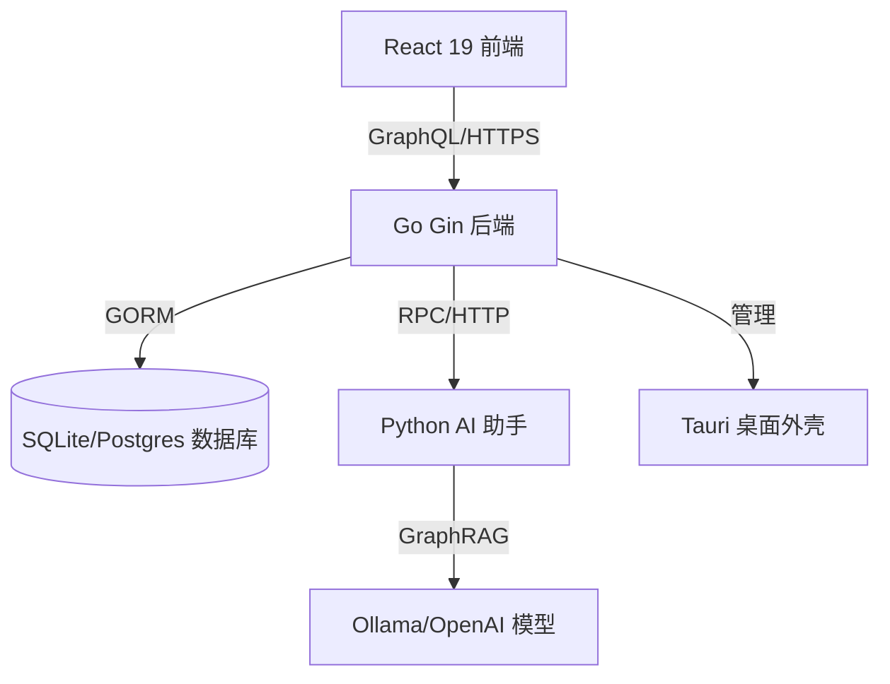

# C404-blog / Playground


一个先进的全栈博客与知识管理平台。采用现代化的架构设计：基于 Go 的 GraphQL 后端、React 19 交互式可视化前端，以及集成的 Python AI 助手。

---

## 🚀 5 分钟快速上手

本教程将引导您完成开发环境的搭建，并首次在本地运行项目。

### 1. 前置条件
请确保您的机器已安装以下工具：
- **Node.js** (v20+) & **pnpm** (v10+)
- **Go** (v1.25+)
- **Python** (v3.10+) 建议配合 `uv` 使用
- **SQLite** (用于本地开发)

### 2. 克隆与安装
```bash
git clone https://github.com/your-repo/C404-blog.git
cd C404-blog
pnpm install
```

### 3. 初始化后端
```bash
cd backend
cp .env.example .env # 根据需要配置您的本地环境变量
go run main.go
```
后端服务将运行在 `http://localhost:11451`。

### 4. 启动前端
在根目录下打开新终端：
```bash
pnpm dev
```
访问 `http://localhost:5173` 即可查看应用。

---

## 🛠 操作指南

### 如何配置 AI 功能
AI 侧边栏提供了智能建议和图谱 RAG（检索增强生成）能力。
1. 进入 `ai_service/` 目录。
2. 安装依赖：`uv sync`。
3. 在 `.env` 中配置您的 LLM 供应商（如 OpenAI 或 Ollama）。
4. 运行服务：`python main.py`。

### 如何同步 GraphQL 类型
每当您修改了 `backend/graph/schema.graphql` 后：
1. 生成 Go 代码：`cd backend && go generate ./...`
2. 生成前端类型：`pnpm codegen`

### 如何构建桌面端 (Tauri)
本项目支持构建原生桌面应用：
```bash
pnpm tauri build
```

---

## 📚 技术参考

### 技术栈
| 层级 | 技术选型 |
| :--- | :--- |
| **前端** | React 19, Vite, Tailwind CSS 4, Ant Design 5, Apollo Client |
| **后端** | Go 1.25, Gin, Gorm (SQLite/Postgres), gqlgen (GraphQL) |
| **桌面端** | Tauri 2.0 (Rust) |
| **AI 侧边栏** | Python, FastAPI/Flask, GraphRAG |
| **数据库** | SQLite (开发), PostgreSQL (生产), Redis (缓存) |
| **可视化** | @xyflow/react (知识图谱), Mermaid, Recharts |

### 项目结构
- `/backend`: 核心 Go 服务与 GraphQL Resolver。
- `/src`: React 前端应用。
- `/ai_service`: 基于 Python 的 AI 微服务。
- `/src-tauri`: 用于桌面端部署的 Rust 配置。
- `/deploy`: Docker、Nginx 和 Systemd 部署脚本。

---

## 🧠 深度解析

### 系统架构
下图展示了 C404-blog 各组件之间的交互流程：



### 为什么选择 GraphQL?
本项目使用 GraphQL 来处理复杂的数据关系，特别是 **知识图谱** 功能。这允许前端在单次请求中精确获取所需的嵌套数据（例如：获取文章及其关联的知识节点、分类信息），避免了传统 REST API 的多次往返请求。

### 知识图谱架构
与传统博客不同，C404-blog 将内容视为图中的节点：
1. **节点 (Nodes)**: 代表文章或核心概念。
2. **边 (Edges)**: 代表语义化的关联关系。
3. **可视化**: 基于 `@xyflow/react` 实现，允许用户在空间维度上导航内容。

---

## 🤝 参与贡献
在提交 PR 之前，请阅读 `CONTRIBUTING.md`。请遵循 Go 的 `gofmt` 代码规范和 React 的 `eslint` 规范。

---

## 📄 开源协议
本项目采用 MIT 协议开源 - 详见 [LICENSE](LICENSE) 文件。
